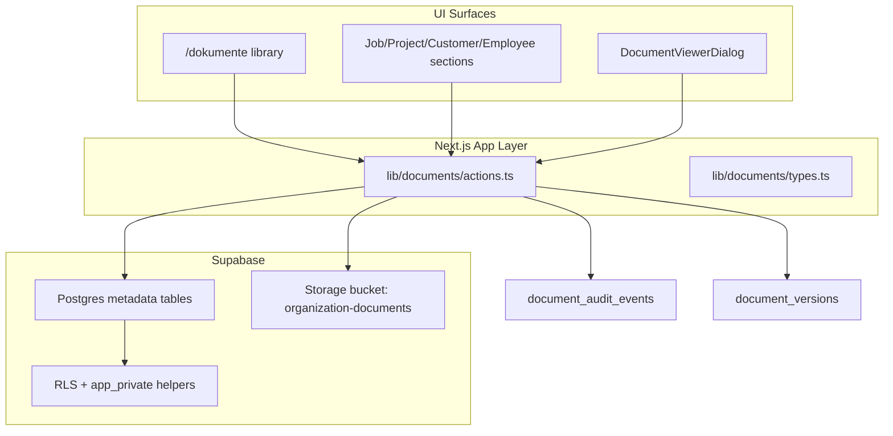

# Document Management

Document management gives SHK businesses a central digital place for job photos, contracts, invoices, offers, reports, and general business files. The goal is to reduce paper folders, scattered files, and disconnected customer/project documentation while staying practical for office staff and extremely simple for field workers.

This document describes the **current implementation** (Stages 1–4), the **major product/technical decisions** behind it, and **planned future work** (Stage 5+). For exact schema details, prefer live Supabase inspection and `lib/supabase/database.types.ts` over this file.

---

## Current Status (Stages 1–4 Implemented)

Document management is **substantially implemented**, not a placeholder anymore.

| Area | Status |
| --- | --- |
| Central manager library (`/dokumente`) | Implemented |
| Manual folder tree | Implemented |
| Logical linked-target overview (`Verknüpfungen`) | Implemented |
| File upload (single, batch, folder drag/drop) | Implemented |
| Contextual sections on job/project/customer/employee detail pages | Implemented |
| Metadata links to jobs, projects, customers, employees | Implemented |
| Drive-like library navigation + filters | Implemented |
| Attach existing library document to context | Implemented |
| Soft delete + Papierkorb + restore | Implemented |
| Permanent delete (with Storage cleanup) | Implemented |
| Audit history | Implemented |
| Versioning for selected business categories | Implemented |
| In-app PDF/image viewer | Implemented (large overlay viewer; no generated thumbnails yet) |
| Storage orphan cleanup report + guarded delete | Implemented |
| Advanced move/copy destination modal | Implemented |
| Auto folder creation on job/project/customer/employee create | **Not implemented** (deliberate) |
| OCR / invoice parsing / AI classification | **Not implemented** (Stage 5) |
| Thumbnail generation | **Not implemented** (Stage 5) |
| Dedicated offer/contract/invoice entities | **Not implemented** |

Implementation was delivered in four stages:

1. **Stage 1 — Core:** tables, Storage bucket, RLS, server actions, `/dokumente` page, contextual job/project sections.
2. **Stage 2 — UX polish:** feedback banners, search/sort, Drive-like library navigation, attach/link dialogs, drag-and-drop, batch actions, details dialog.
3. **Stage 3 — Deep integration:** categories, customer/employee links, upload progress modal, folder upload, refined Ordner-view drag/drop rules.
4. **Stage 4 — Production hardening:** audit history, trash/restore, versioning, in-app viewer, storage cleanup safeguards.

---

## Product Goal

Document management should:

- Reduce paper dependency and scattered local files.
- Make job/project/customer/employee documents easy to find from operational context.
- Let office/manager users organize files like a lightweight Drive/SharePoint.
- Keep field-worker flows upload/view/download simple on mobile.
- Preserve recoverability and traceability for business-critical files.

Before adding more scope, ask WerkFlow's three product questions:

- Does this reduce paperwork?
- Does this make work more organized?
- Does this save time?

---

## User Surfaces

### Manager library — `/dokumente`

Visible in the sidebar for `admin` and `buero` only (`managerOrAbove` in `app-shell.tsx`). Employees are redirected away from this route.

Capabilities:

- Browse manual folder tree with breadcrumbs.
- Drive-like library header with `Ordner`, `Verknüpfungen`, `Alle Dokumente`, a separated `Papierkorb`, and compact category/link filters.
- Search; table sorting happens from sortable table headers (name, uploader/creator, date, size, type, linked target).
- Create/rename/move/copy/delete folders.
- Upload files or entire folders from the top-right `Hochladen oder Erstellen` action (with progress modal).
- Rename, move, copy, delete (soft), batch move/copy/delete, multi-select, rectangle select, and drag-to-folder movement in the manager table.
- Move/copy uses a miniature folder browser modal with breadcrumbs, invalid target disabling for selected folders/their descendants, and on-the-fly folder creation via the same create-folder dialog as the main library.
- SharePoint/Drive-style desktop table interactions: single row click selects, double-click opens, name click opens directly, selection circles stay visible for selected rows, Ctrl/Cmd-click adds to selection, Shift-click adds the range to the nearest selected row, and lasso selection works from empty table/body space.
- Right-click does **not** change selection. For unselected/single rows it opens row-specific actions; for a selected row within a multi-selection, the context menu applies to all selected rows and exposes `Verschieben`, `Kopieren`, and `Löschen`. Opening a row's 3-dot menu on a selected multi-selection preserves that selection for move/copy so those actions can expand to the selected batch; opening it on an unselected row applies actions only to that row.
- Link a file to one or more jobs/projects/customers/employees from the library row actions; existing links are highlighted when reopening the link modal.
- Open files in a large in-app viewer (PDF/image) or download fallback.
- Details dialog: metadata, links, category edit, versions, audit history.
- Storage cleanup dry-run report and explicit orphan deletion, intentionally demoted to the `Weitere Aktionen` maintenance menu.

### Contextual sections — job / project / customer / employee detail pages

Reusable component: `ContextualDocumentsSection`.

| Context | Route integration | Who can upload | Who can manage links/metadata |
| --- | --- | --- | --- |
| Job (`Auftrag`) | Job detail page | Assigned employees + managers | Managers only |
| Project (`Projekt`) | Project detail page | Managers only | Managers only |
| Customer (`Kunde`) | Customer detail page | Managers only | Managers only |
| Employee (`Mitarbeiter`) | Employee detail page | Managers only | Managers only |

Field workers (`employee`) interact with documents **only through assigned job pages**. They do not see the central library, trash, versioning UI, audit history, or attach-existing flows.

Employee job flows are intentionally limited to: upload, open viewer, download.

---

## Architecture Overview



Key principle: **Postgres holds organization, folder structure, links, categories, trash state, versions, and audit events. Supabase Storage holds bytes.** The two are joined by immutable storage paths on document/version rows.

---

## Data Model

### Core tables

| Table | Purpose |
| --- | --- |
| `document_folders` | Manual folder tree per organization (`parent_folder_id`, soft-delete via `deleted_at`) |
| `documents` | Current document metadata + latest file pointer |
| `document_links` | Links a document to exactly one of: `job_id`, `project_id`, `client_id`, or `employee_id` |
| `document_audit_events` | Append-only operational history |
| `document_versions` | Previous file revisions for versioned business documents |

### Important `documents` columns

- `folder_id` — optional manual library folder (independent of job/project/customer/employee).
- `category` — `photo`, `contract`, `invoice`, `offer`, `report`, `other`.
- `display_name` — user-facing name (may differ from original filename).
- `storage_path` — immutable Storage object path for current version.
- `current_version_number` — latest version counter (starts at 1).
- `deleted_at`, `deleted_by`, `delete_reason` — trash semantics.
- `copied_from_document_id` — lineage when copying in library.

### Link model

`document_links` enforces **exactly one target** via check constraint:

```sql
num_nonnulls(job_id, project_id, client_id, employee_id) = 1
```

A document can have **multiple links** (e.g. linked to both a job and a project) by having multiple `document_links` rows. Each row still points to one target type.

Links are metadata only. They do **not** move Storage objects or change `folder_id`.

---

## Storage Model

- **Bucket:** `organization-documents` (private, org-scoped paths).
- **Path pattern:** `{organizationId}/{documentId}/{sanitizedFileName}`
- **Version path pattern:** `{organizationId}/{documentId}/versions/{versionNumber}-{sanitizedFileName}`

### Decision: immutable storage paths

When a document is uploaded, its Storage path is tied to `documentId` and does not change when the user renames the display name or moves the document between folders.

**Why:** Renames and folder moves stay cheap metadata updates. Avoids broken links, race conditions, and expensive Storage copy/delete cycles.

**Upsides:** Fast rename/move; simpler audit; safer concurrent edits.

**Downsides:** Display names can diverge from stored filenames; orphaned paths possible if metadata gets out of sync (mitigated by cleanup report).

Access uses **short-lived signed URLs**:

- View URLs — inline preview, no forced download.
- Download URLs — include download filename.

---

## Permissions and RLS

Authorization is enforced at two layers:

1. **Server actions** in `lib/documents/actions.ts` (`requireManager`, `ensureJobAccess`, etc.).
2. **Postgres RLS** using `app_private` helpers such as `is_document_manager` and `can_access_document`.

### Role behavior (effective product rules)

| Action | `admin` / `buero` | `employee` (Handwerker/in) |
| --- | --- | --- |
| View `/dokumente` library | Yes | No (redirect) |
| Browse all org folders/files | Yes | No |
| Upload to library folder | Yes | No |
| Upload on assigned job page | Yes | Yes (if assigned) |
| Upload on project/customer/employee page | Yes | No |
| View document on assigned job | Yes | Yes |
| View document not linked to assigned job | Yes | No |
| Rename/move/copy/delete in library | Yes | No |
| Attach existing doc to job/project/customer/employee | Yes | No |
| Unlink from context | Yes | No |
| Trash restore / permanent delete | Yes | No |
| Upload new version | Yes | No |
| View audit history / versions in details | Yes (library) | No (not exposed in contextual UI) |
| Storage cleanup tools | Yes | No |

### Employee access path

Field employees access documents only when:

1. A `document_links.job_id` exists for the document, and
2. The employee has a row in `job_assignments` for that job.

Project-only, customer-only, or employee-only links do **not** grant field-worker access. Employee links are manager-facing records on employee detail pages; field access stays aligned with assigned work rather than broad org visibility.

---

## Library vs Contextual Sync

### Decision: one document row, many views — no auto physical mirroring

Documents exist once in `documents`. Contextual pages show documents **linked** to that job/project/customer/employee. The library shows org documents through manual folders, `Alle Dokumente`, search, category filters, and link filters.

Upload from a job page:

1. Creates the `documents` row (+ Storage upload).
2. Inserts a `document_links` row with `job_id`.
3. Optionally sets `folder_id` if uploaded from library context.

The same file immediately appears in:

- The job's contextual section (via link).
- The central library, where it can be found through `Alle Dokumente`, search, category filters, and link filters.

**Why:** Avoids duplicate Storage objects and sync bugs. Matches how users think: "this photo belongs to Auftrag 123" is a relationship, not a second file.

**Upsides:** Single source of truth; attach-existing reuse; simpler trash/restore/versioning.

**Downsides:** A file can be "unorganized" in folder terms while still linked to a job; users must understand folders vs links.

---

## Auto Folder Creation (Not Implemented — Revisit Later)

### What we considered

When a job, project, customer, or employee is created, automatically create a matching folder in `/dokumente` (either in Postgres, Storage, or both).

### What we chose instead

**No automatic folder creation.** Jobs/projects/customers/employees do not spawn folders. Organization uses:

- Manual folders (office-created structure).
- Metadata-driven views and filters for linked targets, including the `Verknüpfungen` overview for Aufträge, Projekte, Kunden, and Mitarbeiter.

### Why we deferred auto folders

1. **Naming collisions and renames:** Job titles, project names, customer names, and employee names change. Physical/auto folders go stale or require sync jobs.
2. **Storage vs logical folders:** Physical Storage folder creation adds cleanup complexity on entity delete/rename and complicates multi-link documents.
3. **Different mental models:** Office staff may want their own taxonomy ("2026 Angebote", "Großkunden") unrelated to job numbering.
4. **Metadata filters are safer:** Link/category filters stay correct as long as links exist — no orphan folder maintenance.

### Upsides of current approach

- Less magic; fewer surprise folders.
- Rename job/project/customer/employee does not break folder paths.
- Attach-existing + links cover cross-context reuse cleanly.

### Downsides / open product questions

- Some users expect a ready-made folder per Auftrag.
- `Alle Dokumente` may grow large if office staff never adopts manual folders or filters.
- Onboarding may need guidance: "upload on the job page" vs "organize in library".

### Possible future direction (Stage 5 consideration)

Optional **logical** auto-views (not physical folders) per Auftrag/Projekt/Kunde/Mitarbeiter were the preferred direction. The current `/dokumente` library now includes a `Verknüpfungen` overview that groups linked documents by project, job, customer, and employee without creating folders. Physical Storage folders should only be considered if there is a hard operational need.

---

## Categories

Categories (`photo`, `contract`, `invoice`, `offer`, `report`, `other`) are stored on `documents.category`.

- Default inference on upload from filename/MIME (`inferDocumentCategory`).
- Managers can reclassify in details dialog.
- Library/category filters are available in the central manager library; contextual sections intentionally show the linked documents directly without category tabs.

Categories are **organizational labels**, not separate database entities. There is no structured invoice/contract schema yet.

---

## Operations Reference

### Upload

- Max file size: 50 MB (`DOCUMENT_MAX_FILE_SIZE_BYTES`).
- Uploads use Server Actions; `next.config.ts` sets `experimental.serverActions.bodySizeLimit` to `50mb` so Office/PDF uploads above Next's default 1 MB limit are accepted up to the app limit.
- Upload dialog shows per-file progress and errors.
- Folder upload creates nested folders when allowed (`allowFolderCreation`).
- OS drag/drop supports folder uploads. The manager table also supports dragging existing files/folders onto folders, breadcrumb path pills, or `Papierkorb`. Existing-file DnD uses a custom drag pill and suppresses the browser's native dashed drag ghost.

### Folder CRUD

Managers only. Deleting a folder soft-deletes contained documents (trash), records audit events, **does not** immediately delete Storage objects.

### Move / copy

Move is a metadata operation for files and folders. Moving files updates `documents.folder_id`; moving folders updates `document_folders.parent_folder_id`. Moving/copying folders into themselves or their own descendants is blocked in both UI validation and server actions.

Copy creates new rows and does **not** copy links automatically:

- File copy creates a new `documents` row and copies the Storage object. If Supabase Storage `.copy()` fails, the action falls back to download + upload for the same private bucket.
- Folder copy creates a copied folder tree and copied document rows for contained files, with the same Storage copy fallback for each copied file.
- Copied file and folder display names are prefixed with `Kopie von ` and still pass through collision-safe name generation in the target folder.

### Link / unlink

- `linkDocumentToJob/Project/Client/Employee` — attach existing library file to a context (single-link helpers; batch flows prefer the actions below).
- `updateDocumentLinks()` — batch add/remove links for one document from the **Verknüpfungen verwalten** modal (Aufträge, Projekte, Kunden, Mitarbeiter tabs; toggle off to remove).
- `linkDocumentsToTarget()` — batch attach multiple library files to one job, project, client, or employee from contextual detail pages.
- In `/dokumente`, managers use file row actions (**Verknüpfungen verwalten**) to add or remove links in one modal. Already linked targets are shown; deselecting removes the link on save.
- On job/project/customer/employee detail pages, **Verknüpfungen verwalten** uses the same modal; **Verknüpfung entfernen** only removes the link on that page (file stays in the library). **In Papierkorb verschieben** deletes the file everywhere.
- Project detail pages group **Projektdateien** and per-Auftrag document sections via `getProjectDocumentsOverview()`. The `/dokumente` `Verknüpfungen` tab groups linked files by projects/jobs, customers, and employees.
- `unlinkDocument` — removes one link row; does not delete document unless manager deletes separately.

### Delete / trash / restore

- Normal delete → soft delete (`deleted_at`, `deleted_by`, `delete_reason`); Storage retained.
- Papierkorb view → restore or permanent delete.
- Permanent delete → removes Storage objects (current + version paths) and document row.

### Versioning

Supported categories: `contract`, `invoice`, `offer`, `report`.

Uploading a new version:

1. Moves current file metadata into `document_versions`.
2. Uploads new bytes to version path.
3. Updates `documents` row as latest pointer.
4. Records audit event.

Previous versions: download via signed URL. Rollback UI not implemented (optional future).

### Viewer

`DocumentViewerDialog`:

- Images — inline preview in a large app overlay.
- PDFs — embedded iframe preview in a large app overlay.
- Other types — metadata + download.
- Viewer actions include compact/fullscreen sizing, open in new tab when previewable, and download.

### Storage cleanup

Manager-only `getDocumentStorageCleanupReport` compares:

- Orphaned Storage objects (bytes without metadata reference).
- Missing Storage objects (metadata without bytes).
- Deleted document paths still in Storage (Papierkorb candidates).

Orphan deletion requires explicit confirmation and only deletes paths validated as orphaned.

---

## Audit History

`document_audit_events` records:

`uploaded`, `renamed`, `moved`, `copied`, `category_changed`, `linked`, `unlinked`, `deleted`, `restored`, `version_uploaded`, `permanently_deleted`, `storage_cleanup`

Each event stores `actor_id`, optional `document_id`/`folder_id`, and JSON `event_payload`.

Managers see org-wide relevant events; employees see events only for documents they can access (via assigned jobs).

Audit is exposed in the manager details dialog (not in field-worker contextual UI).

---

## Realtime, Caching, and Freshness

- Realtime subscriptions: `document_folders`, `documents`, `document_links`, `document_audit_events`, `document_versions`.
- Cache tag: `CACHE_TAGS.documents(orgId)` invalidated via `updateTag` + `revalidatePath` in mutations.
- UI uses `useRealtimeRouterRefresh` for live updates after remote changes.

---

## Major Decisions Summary

| Decision | Why | Upsides | Downsides |
| --- | --- | --- | --- |
| Metadata links instead of duplicate files per context | Single source of truth | Attach-existing, consistent trash/version/audit | Users must learn links vs folders |
| No auto folder on job/project/customer/employee create | Avoid rename/sync pain | Flexible office taxonomy; less magic | No default per-Auftrag folder |
| Manual folders separate from links | Office structure ≠ operational links | Cross-link same file to multiple contexts | `Alle Dokumente` can grow without folder/filter discipline |
| Employees: job-context only, no library | Least privilege for Handwerker/in | Simple field UX; fewer permission bugs | Employees cannot browse org library |
| Soft delete before Storage delete | Recoverability | Papierkorb, audit trail | Storage used until permanent delete |
| Versioning only for business categories | Focus on contracts/invoices/offers/reports | Less noise for photos | Inconsistent versioning UX across categories |
| Signed URL viewer vs forced download | Professional inspection workflow | Better UX for PDFs/photos | URLs expire; re-fetch on reopen |
| Server actions + admin client + RLS | Matches existing WerkFlow patterns | Consistent auth; RLS defense in depth | Must keep action checks aligned with RLS |

---

## What Is Not Implemented Yet

- OCR for PDFs/scans.
- Structured invoice/offer/contract extraction.
- AI-based classification beyond filename/MIME heuristics.
- Background processing queue for heavy document jobs.
- Automatic logical or physical folders per Auftrag/Projekt/Kunde/Mitarbeiter.
- Generated thumbnails/pre-rendered preview assets for fast browsing.
- Mobile-native capture app (web upload works today).
- Document annotations, comments, or approval workflows.
- Integration with future dedicated invoice/offer modules.
- Employee access to project-only, customer-only, or employee-only documents.

---

## Future Additions (Stage 5 Guidance)

Stage 5 should focus on **intelligence and automation**, not reliability basics (audit, trash, versioning, viewer, and cleanup are in place).

Planned direction:

1. **OCR pipeline** for PDFs and images — searchable text, accessibility, future extraction input.
2. **Invoice parsing** — structured metadata (amount, date, vendor, line items) with human review before trusting values.
3. **Contract/offer extraction** — key fields with review UI; liability-sensitive, never fully silent automation early on.
4. **AI classification** beyond filename/MIME — suggest category, link targets, or folder placement; always allow manual override.
5. **Background processing jobs** — retries, failure states, progress for long OCR/extraction runs.
6. **Optional automatic logical folders/views** for every Auftrag, Projekt, Kunde, or Mitarbeiter — prefer metadata-driven smart collections over physical Storage folders unless a hard operational need appears.
7. **Thumbnail generation** for image/PDF library rows if the in-app viewer proves useful but large libraries feel slow.

When implementing Stage 5, preserve:

- Organization boundaries and RLS.
- Simple field-worker flows (suggestions should not complicate upload).
- Human review for financially or legally relevant extractions.

---

## Developer Reference

### Primary code locations

| Path | Role |
| --- | --- |
| `app/(app)/dokumente/page.tsx` | Manager library page |
| `components/dokumente/document-library-content.tsx` | Library UI |
| `components/dokumente/document-library-table.tsx` | Sortable/selectable manager table |
| `components/dokumente/contextual-documents-section.tsx` | Job/project/customer/employee sections |
| `components/dokumente/document-upload-dialog.tsx` | Upload progress modal |
| `components/dokumente/document-viewer-dialog.tsx` | In-app viewer |
| `components/dokumente/attach-document-dialog.tsx` | Attach existing file |
| `components/dokumente/document-link-dialog.tsx` | Link a library file to jobs/projects/customers/employees |
| `components/dokumente/document-row-actions.tsx` | Shared 3-dot and right-click row actions |
| `lib/documents/actions.ts` | Server actions, auth, mutations, audit |
| `lib/documents/types.ts` | Domain types and labels |
| `lib/supabase/database.types.ts` | Generated DB types |
| `lib/data/cached.ts` | `CACHE_TAGS.documents` |
| `components/realtime/realtime-provider.tsx` | Realtime table subscriptions |
| `components/sidebar/app-shell.tsx` | Sidebar nav (`/dokumente`, manager-only) |
| `proxy.ts` | Auth gate for protected routes including `/dokumente` |

### Contextual integrations

- `app/(app)/auftraege/[jobNumber]/page.tsx` → `getJobDocuments`
- `app/(app)/auftraege/projekt/[projectNumber]/page.tsx` → `getProjectDocumentsOverview`
- `app/(app)/kunden/[clientId]/page.tsx` → `getClientDocuments`
- `app/(app)/mitarbeiter/[userId]/page.tsx` → `getEmployeeDocuments`

### Related docs

- `docs/features/jobs-and-projects.md` — operational context for links.
- `docs/technical/data-model.md` — high-level domain model pointer.
- `AGENTS.md` — agent-facing product summary.

---

## Maintenance Notes

- Treat live Supabase schema and generated types as source of truth for column-level details.
- When changing permissions, update **both** server actions and RLS helpers.
- When adding document mutations, record audit events via `recordDocumentAuditEvent`.
- Prefer German UI copy; keep code/comments in English.
- Before auto folder creation or AI extraction, update this doc with the decided UX and data model.
