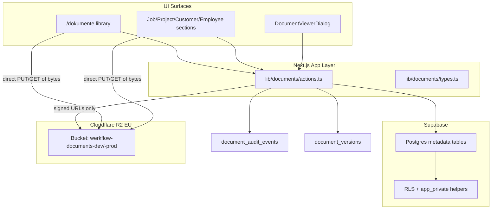

# Document Management

Document management gives SHK businesses a central digital place for job photos, contracts, invoices, offers, reports, and general business files. The goal is to reduce paper folders, scattered files, and disconnected customer/project documentation while staying practical for office staff and extremely simple for field workers.

This document describes the **current implementation** (Stages 1–4), the **major product/technical decisions** behind it, and the Phase 1/Phase 2 **future product build-out**. For exact schema details, prefer live Supabase inspection and `lib/supabase/database.types.ts` over this file.

---

## Current Product Baseline (Stages 1–4 Implemented)

Document management is **substantially implemented**, not a placeholder anymore.

| Area | Status |
| --- | --- |
| Central manager library (`/dokumente`) | Implemented |
| Manual folder tree | Implemented |
| Logical linked-target overview (`Verknüpfungen`) | Implemented |
| File upload (single, batch, folder, mixed file/folder drag/drop) | Implemented |
| Contextual sections on job/project/customer/employee detail pages | Implemented |
| Metadata links to jobs, projects, customers, employees | Implemented |
| Drive-like library navigation + filters | Implemented |
| Attach existing library document to context | Implemented |
| Soft delete + Papierkorb + restore | Implemented |
| Permanent delete (with Storage cleanup) | Implemented |
| Audit history | Implemented |
| Versioning for selected business categories | Implemented |
| In-app PDF/image viewer | Implemented (large overlay viewer; no generated thumbnails yet) |
| Storage orphan cleanup report + guarded delete | Implemented as server-side maintenance helpers; not exposed in the `/dokumente` UI |
| Advanced move/copy destination modal | Implemented |
| Auto folder creation on job/project/customer/employee create | **Not implemented** (deliberate) |
| OCR / invoice parsing / AI classification | **Not implemented** (future build-out; extraction and generative assistance have different phase boundaries below) |
| Thumbnail generation | **Not implemented** (Phase 1 build-out) |
| Dedicated offer/contract/invoice entities | **Not implemented** |

Implementation was delivered in four stages:

1. **Stage 1 — Core:** tables, Storage bucket, RLS, server actions, `/dokumente` page, contextual job/project sections.
2. **Stage 2 — UX polish:** feedback banners, search/sort, Drive-like library navigation, attach/link dialogs, drag-and-drop, batch actions, details dialog.
3. **Stage 3 — Deep integration:** categories, customer/employee links, upload progress modal, folder upload, refined Ordner-view drag/drop rules.
4. **Stage 4 — Production hardening:** audit history, trash/restore, versioning, in-app viewer, storage cleanup safeguards.

---

## Product Goal

Document management should:

- Reduce paper dependency and scattered local files.
- Make job/project/customer/employee documents easy to find from operational context.
- Let office/manager users organize files like a lightweight Drive/SharePoint.
- Keep field-worker flows upload/view/download simple on mobile.
- Preserve recoverability and traceability for business-critical files.

Before adding more scope, ask WerkFlow's three product questions:

- Does this reduce paperwork?
- Does this make work more organized?
- Does this save time?

---

## User Surfaces

### Manager library — `/dokumente`

Visible in the sidebar for `admin` and `buero` only (`managerOrAbove` in `app-shell.tsx`). Employees are redirected away from this route.

Capabilities:

- Browse manual folder tree with breadcrumbs.
- Drive-like library header with `Dokumente`, `Verknüpfungen`, `Alle Dateien`, a separated `Papierkorb`, and compact category/link filters.
- Search; table sorting happens from sortable table headers (name, uploader/creator, date, size, type, linked target).
- Create/rename/move/copy/delete folders.
- Upload files or entire folders from the top-right `Hochladen oder Erstellen` action (with progress modal). This action is disabled in `Verknüpfungen`; `Alle Dateien` supports file/folder upload to the root library, while manual folder creation is only offered in `Dokumente`.
- Rename, move, copy, delete (soft), batch move/copy/delete, multi-select, rectangle select, and drag-to-folder movement in the manager table.
- Move/copy uses a miniature folder browser modal with breadcrumbs, invalid target disabling for selected folders/their descendants, and on-the-fly folder creation via the same create-folder dialog as the main library.
- SharePoint/Drive-style desktop table interactions: single row click selects, double-click opens, name click opens directly, selection circles stay visible for selected rows, Ctrl/Cmd-click adds to selection, Shift-click adds the range to the nearest selected row, and lasso selection works from empty table/body space.
- Right-click does **not** change selection. For unselected/single rows it opens row-specific actions; for a selected row within a multi-selection, the context menu applies to all selected rows and exposes `Verschieben`, `Kopieren`, and `Löschen`. Opening a row's 3-dot menu on a selected multi-selection preserves that selection for move/copy so those actions can expand to the selected batch; opening it on an unselected row applies actions only to that row.
- Link a file to one or more jobs/projects/customers/employees from the library row actions; existing links are highlighted when reopening the link modal.
- Open files in a large in-app viewer (PDF/image) or download fallback.
- Details dialog: metadata, links, category edit, versions, audit history.
- Storage cleanup server actions exist for maintenance, but the normal user-facing library no longer exposes a storage cleanup modal.

### Contextual sections — job / project / customer / employee detail pages

Reusable component: `ContextualDocumentsSection`.

| Context | Route integration | Who can upload | Who can manage links/metadata |
| --- | --- | --- | --- |
| Job (`Auftrag`) | Job detail page | Assigned employees + managers | Managers only |
| Project (`Projekt`) | Project detail page | Managers only | Managers only |
| Customer (`Kunde`) | Customer detail page | Managers only | Managers only |
| Employee (`Mitarbeiter`) | Employee detail page | Managers only | Managers only |

Field workers (`employee`) interact with documents **only through assigned job pages**. They do not see the central library, trash, versioning UI, audit history, or attach-existing flows.

Employee job flows are intentionally limited to: upload, open viewer, download.

---

## Architecture Overview


```mermaid
flowchart TB
  subgraph ui [UI Surfaces]
    Library["/dokumente library"]
    Context["Job/Project/Customer/Employee sections"]
    Viewer["DocumentViewerDialog"]
  end

  subgraph app [Next.js App Layer]
    Actions["lib/documents/actions.ts"]
    Types["lib/documents/types.ts"]
  end

  subgraph data [Supabase]
    Meta["Postgres metadata tables"]
    RLS["RLS + app_private helpers"]
  end

  subgraph storage [Cloudflare R2 EU]
    R2["Bucket: werkflow-documents-dev/-prod"]
  end

  Library --> Actions
  Context --> Actions
  Viewer --> Actions
  Actions --> Meta
  Actions -->|"signed URLs only"| R2
  Library -->|"direct PUT/GET of bytes"| R2
  Context -->|"direct PUT/GET of bytes"| R2
  Meta --> RLS
  Actions --> Audit["document_audit_events"]
  Actions --> Versions["document_versions"]
```

Key principle: **Postgres holds organization, folder structure, links, categories, trash state, versions, and audit events. Cloudflare R2 (EU jurisdiction) holds bytes.** The two are joined by immutable storage paths on document/version rows. File bytes never pass through server compute — server actions authorize and sign URLs; the browser transfers bytes directly (`lib/storage/r2.ts`, [decision 0001](../../docs/decisions/0001-infrastructure-stack.md)).

---

## Data Model

### Core tables

| Table | Purpose |
| --- | --- |
| `document_folders` | Manual folder tree per organization (`parent_folder_id`, soft-delete via `deleted_at`) |
| `documents` | Current document metadata + latest file pointer |
| `document_links` | Links a document to exactly one of: `job_id`, `project_id`, `client_id`, `employee_id`, or `request_id` (P1-02) |
| `document_audit_events` | Append-only operational history |
| `document_versions` | Previous file revisions for versioned business documents |

### Important `documents` columns

- `folder_id` — optional manual library folder (independent of job/project/customer/employee).
- `category` — `photo`, `contract`, `invoice`, `offer`, `report`, `other`.
- `display_name` — user-facing name (may differ from original filename).
- `storage_path` — immutable Storage object path for current version.
- `current_version_number` — latest version counter (starts at 1).
- `deleted_at`, `deleted_by`, `delete_reason` — trash semantics.
- `copied_from_document_id` — lineage when copying in library.

### Link model

`document_links` enforces **exactly one target** via check constraint:

```sql
num_nonnulls(job_id, project_id, client_id, employee_id, request_id) = 1
```

A document can have **multiple links** (e.g. linked to both a job and a project) by having multiple `document_links` rows. Each row still points to one target type. Request (`Anfrage`) attachments use this mechanism (P1-02): uploading on a request detail creates a `request_id` link; converting the request adds a second link to the created job/project — same file, no copies. Request-linked documents are manager-only, like the request surface itself; attach-existing from the library targets jobs/projects/customers/employees only.

Links are metadata only. They do **not** move Storage objects or change `folder_id`.

---

## Storage Model

- **Provider:** Cloudflare R2, EU jurisdiction, private bucket selected via `R2_BUCKET_NAME`. Since the 2026-08-18 environment split ([decision 0003](../decisions/0003-dev-prod-environment-split.md)), each database has its own bucket: production (`jbgaqpdjauzoocplgdsn`) pairs with `werkflow-documents-prod`, and the dev database (`mbkkzuqjbdvzelqvuzcn`, serving local dev and the test harness) pairs with `werkflow-documents-dev` — metadata rows and bytes always live in the same environment. `documents.storage_bucket` keeps the logical value `organization-documents`; the physical bucket comes from the environment (`docs/technical/environments.md`).
- **Path pattern:** `{organizationId}/{documentId}/{sanitizedFileName}`
- **Version path pattern:** `{organizationId}/{documentId}/versions/{versionNumber}-{sanitizedFileName}`
- **Upload flow (direct, two-phase):** `createDocumentUploadTicket` authorizes (user, organization, target, folder) and returns a document id plus a short-lived signed PUT URL with the content type pinned into the signature → the browser PUTs the bytes directly to R2 → `finalizeDocumentUpload` re-authorizes, recomputes the storage path server-side (a client can never register a foreign key), verifies the object via HEAD (existence, size limit, content type), then inserts metadata, links, and audit events. Failed finalizes delete the uploaded object. Versions use the same pattern with a version-number conflict check.
- **Environment variables:** `R2_ACCOUNT_ID`, `R2_ACCESS_KEY_ID`, `R2_SECRET_ACCESS_KEY`, `R2_BUCKET_NAME` (plus optional `R2_JURISDICTION`, default `eu`).
- **Bucket CORS** must allow `GET`, `PUT`, `HEAD` with the `content-type` header from the app origins (see `scripts/setup-r2-cors.ts`; applying it needs a bucket-admin token or the dashboard, the runtime object token deliberately cannot change bucket settings).
- Orphaned uploads (PUT succeeded, finalize never ran) are invisible to users and are reconciled through the existing storage-cleanup report, which lists R2 objects against metadata.

### Decision: immutable storage paths

When a document is uploaded, its Storage path is tied to `documentId` and does not change when the user renames the display name or moves the document between folders.

**Why:** Renames and folder moves stay cheap metadata updates. Avoids broken links, race conditions, and expensive Storage copy/delete cycles.

**Upsides:** Fast rename/move; simpler audit; safer concurrent edits.

**Downsides:** Display names can diverge from stored filenames; orphaned paths possible if metadata gets out of sync (mitigated by cleanup report).

Access uses **short-lived signed URLs**:

- View URLs — inline preview, no forced download.
- Download URLs — include download filename.

### Migration note (`P1-00a`, 2026-08-04)

File bytes moved from Supabase Storage to R2 with direct uploads, fixing the production defect where Server-Action-buffered uploads hit Vercel's ~4.5 MB body limit, and eliminating download egress cost ([decision 0001](../../docs/decisions/0001-infrastructure-stack.md)). All pre-existing objects were copied to R2 under unchanged paths and verified; the old Supabase `organization-documents` bucket is retained untouched as a temporary fallback and can be emptied once the R2 path has proven itself in production. Retention-relevant categories will additionally get copies in an independent immutable archive (see Governance below).

---

## Permissions and RLS

Authorization is enforced at two layers:

1. **Server actions** in `lib/documents/actions.ts` (`requireManager`, `ensureJobAccess`, etc.).
2. **Postgres RLS** using `app_private` helpers such as `is_document_manager` and `can_access_document`.

### Role behavior (effective product rules)

| Action | `admin` / `buero` | `employee` (Handwerker/in) |
| --- | --- | --- |
| View `/dokumente` library | Yes | No (redirect) |
| Browse all org folders/files | Yes | No |
| Upload to library folder | Yes | No |
| Upload on assigned job page | Yes | Yes (if assigned) |
| Upload on project/customer/employee page | Yes | No |
| View document on assigned job | Yes | Yes |
| View document not linked to assigned job | Yes | No |
| Rename/move/copy/delete in library | Yes | No |
| Attach existing doc to job/project/customer/employee | Yes | No |
| Unlink from context | Yes | No |
| Trash restore / permanent delete | Yes | No |
| Upload new version | Yes | No |
| View audit history / versions in details | Yes (library) | No (not exposed in contextual UI) |
| Storage cleanup helpers | Server-side maintenance only; no normal library UI | No |

### Employee access path

Field employees access documents only when:

1. A `document_links.job_id` exists for the document, and
2. The employee has a row in `job_assignments` for that job.

Project-only, customer-only, or employee-only links do **not** grant field-worker access. Employee links are manager-facing records on employee detail pages; field access stays aligned with assigned work rather than broad org visibility.

---

## Library vs Contextual Sync

### Decision: one document row, many views — no auto physical mirroring

Documents exist once in `documents`. Contextual pages show documents **linked** to that job/project/customer/employee. The library shows org documents through manual folders, `Alle Dateien`, search, category filters, and link filters.

Upload from a job page:

1. Creates the `documents` row (+ Storage upload).
2. Inserts a `document_links` row with `job_id`.
3. Optionally sets `folder_id` if uploaded from library context.

The same file immediately appears in:

- The job's contextual section (via link).
- The central library, where it can be found through `Alle Dateien`, search, category filters, and link filters.

**Why:** Avoids duplicate Storage objects and sync bugs. Matches how users think: "this photo belongs to Auftrag 123" is a relationship, not a second file.

**Upsides:** Single source of truth; attach-existing reuse; simpler trash/restore/versioning.

**Downsides:** A file can be "unorganized" in folder terms while still linked to a job; users must understand folders vs links.

---

## Auto Folder Creation (Not Implemented — Revisit Later)

### What we considered

When a job, project, customer, or employee is created, automatically create a matching folder in `/dokumente` (either in Postgres, Storage, or both).

### What we chose instead

**No automatic folder creation.** Jobs/projects/customers/employees do not spawn folders. Organization uses:

- Manual folders (office-created structure).
- Metadata-driven views and filters for linked targets, including the `Verknüpfungen` overview for Aufträge, Projekte, Kunden, and Mitarbeiter.

### Why we deferred auto folders

1. **Naming collisions and renames:** Job titles, project names, customer names, and employee names change. Physical/auto folders go stale or require sync jobs.
2. **Storage vs logical folders:** Physical Storage folder creation adds cleanup complexity on entity delete/rename and complicates multi-link documents.
3. **Different mental models:** Office staff may want their own taxonomy ("2026 Angebote", "Großkunden") unrelated to job numbering.
4. **Metadata filters are safer:** Link/category filters stay correct as long as links exist — no orphan folder maintenance.

### Upsides of current approach

- Less magic; fewer surprise folders.
- Rename job/project/customer/employee does not break folder paths.
- Attach-existing + links cover cross-context reuse cleanly.

### Downsides / open product questions

- Some users expect a ready-made folder per Auftrag.
- `Alle Dateien` may grow large if office staff never adopts manual folders or filters.
- Onboarding may need guidance: "upload on the job page" vs "organize in library".

### Possible future direction (Stage 5 consideration)

Optional **logical** auto-views (not physical folders) per Auftrag/Projekt/Kunde/Mitarbeiter were the preferred direction. The current `/dokumente` library now includes a `Verknüpfungen` overview that groups linked documents by project, job, customer, and employee without creating folders. Physical Storage folders should only be considered if there is a hard operational need.

---

## Categories

Categories (`photo`, `contract`, `invoice`, `offer`, `report`, `other`) are stored on `documents.category`.

- Default inference on upload from filename/MIME (`inferDocumentCategory`).
- Managers can reclassify in details dialog.
- Library/category filters are available in the central manager library; contextual sections intentionally show the linked documents directly without category tabs.
- Authorized links to `/dokumente?document=<document-id>` load that exact document and open the existing viewer, so source-linked customer timeline entries resolve to the authoritative library record instead of a copied document event.

Categories are **organizational labels**, not separate database entities. There is no structured invoice/contract schema yet.

---

## Operations Reference

### Upload

- Max file size: 50 MB (`DOCUMENT_MAX_FILE_SIZE_BYTES`), enforced at ticket creation and re-verified against the actual object size at finalize.
- Uploads go directly from the browser to R2 via `lib/documents/upload-client.ts` (ticket → XHR PUT with real progress → finalize); file bytes never pass through Server Actions, so no body-size workaround exists or is needed.
- Upload dialog shows per-file progress and errors.
- Folder upload creates nested folders when allowed (`allowFolderCreation`).
- OS drag/drop supports single files, multiple files, folders, and mixed file/folder drops. Dropping on `Dokumente` uploads into the current folder; dropping on `Alle Dateien` uploads to the root library. The manager table also supports dragging existing files/folders onto folders, breadcrumb path pills, or `Papierkorb`. Existing-file DnD uses a custom drag pill and suppresses the browser's native dashed drag ghost.

### Folder CRUD

Managers only. Deleting a folder soft-deletes contained documents (trash), records audit events, **does not** immediately delete Storage objects.

### Move / copy

Move is a metadata operation for files and folders. Moving files updates `documents.folder_id`; moving folders updates `document_folders.parent_folder_id`. Moving/copying folders into themselves or their own descendants is blocked in both UI validation and server actions.

Copy creates new rows and does **not** copy links automatically:

- File copy creates a new `documents` row and copies the R2 object server-side (S3 `CopyObject`; no bytes travel through the app).
- Folder copy creates a copied folder tree and copied document rows for contained files, with the same server-side object copy for each copied file.
- Copied file and folder display names are prefixed with `Kopie von ` and still pass through collision-safe name generation in the target folder.

### Link / unlink

- `linkDocumentToJob/Project/Client/Employee` — attach existing library file to a context (single-link helpers; batch flows prefer the actions below).
- `updateDocumentLinks()` — batch add/remove links for one document from the **Verknüpfungen verwalten** modal (Aufträge, Projekte, Kunden, Mitarbeiter tabs; toggle off to remove).
- `linkDocumentsToTarget()` — batch attach multiple library files to one job, project, client, or employee from contextual detail pages.
- In `/dokumente`, managers use file row actions (**Verknüpfungen verwalten**) to add or remove links in one modal. Already linked targets are shown; deselecting removes the link on save.
- On job/project/customer/employee detail pages, **Verknüpfungen verwalten** uses the same modal; **Verknüpfung entfernen** only removes the link on that page (file stays in the library). **In Papierkorb verschieben** deletes the file everywhere.
- Project detail pages group **Projektdateien** and per-Auftrag document sections via `getProjectDocumentsOverview()`. The `/dokumente` `Verknüpfungen` tab groups linked files by projects/jobs, customers, and employees.
- `unlinkDocument` — removes one link row; does not delete document unless manager deletes separately.

### Delete / trash / restore

- Normal delete → soft delete (`deleted_at`, `deleted_by`, `delete_reason`); Storage retained.
- Papierkorb view → restore or permanent delete. Restoring a document keeps its folder when that folder still exists; if the original folder was deleted, restore moves the file to the root library and resolves display-name collisions there.
- Permanent delete → removes Storage objects (current + version paths) and document row.

### Versioning

Supported categories: `contract`, `invoice`, `offer`, `report`.

Uploading a new version:

1. Moves current file metadata into `document_versions`.
2. Uploads new bytes to version path.
3. Updates `documents` row as latest pointer.
4. Records audit event.

Previous versions: download via signed URL. Rollback UI not implemented (optional future).

### Viewer

`DocumentViewerDialog`:

- Images — inline preview in a large app overlay.
- PDFs — embedded iframe preview in a large app overlay.
- Other types — metadata + download.
- Viewer actions include compact/fullscreen sizing, open in new tab when previewable, and download.

### Storage cleanup

Server-side maintenance helpers `getDocumentStorageCleanupReport` and `deleteOrphanedStorageObjects` compare:

- Orphaned Storage objects (bytes without metadata reference).
- Missing Storage objects (metadata without bytes).
- Deleted document paths still in Storage (Papierkorb candidates).

Orphan deletion only deletes paths validated as orphaned by the report. These helpers are not currently exposed in the normal `/dokumente` user interface; add a dedicated admin/maintenance surface before using them as a product feature.

---

## Audit History

`document_audit_events` records:

`uploaded`, `renamed`, `moved`, `copied`, `category_changed`, `linked`, `unlinked`, `deleted`, `restored`, `version_uploaded`, `permanently_deleted`, `storage_cleanup`

Each event stores `actor_id`, optional `document_id`/`folder_id`, and JSON `event_payload`.

Managers see org-wide relevant events; employees see events only for documents they can access (via assigned jobs).

Audit is exposed in the manager details dialog (not in field-worker contextual UI).

---

## Realtime, Caching, and Freshness

- Realtime subscriptions: `document_folders`, `documents`, `document_links`, `document_audit_events`, `document_versions`.
- Cache tag: `CACHE_TAGS.documents(orgId)` invalidated via `updateTag` + `revalidatePath` in mutations.
- UI uses `useRealtimeRouterRefresh` for live updates after remote changes.

---

## Major Decisions Summary

| Decision | Why | Upsides | Downsides |
| --- | --- | --- | --- |
| Metadata links instead of duplicate files per context | Single source of truth | Attach-existing, consistent trash/version/audit | Users must learn links vs folders |
| No auto folder on job/project/customer/employee create | Avoid rename/sync pain | Flexible office taxonomy; less magic | No default per-Auftrag folder |
| Manual folders separate from links | Office structure ≠ operational links | Cross-link same file to multiple contexts | `Alle Dateien` can grow without folder/filter discipline |
| Employees: job-context only, no library | Least privilege for Handwerker/in | Simple field UX; fewer permission bugs | Employees cannot browse org library |
| Soft delete before Storage delete | Recoverability | Papierkorb, audit trail | Storage used until permanent delete |
| Versioning only for business categories | Focus on contracts/invoices/offers/reports | Less noise for photos | Inconsistent versioning UX across categories |
| Signed URL viewer vs forced download | Professional inspection workflow | Better UX for PDFs/photos | URLs expire; re-fetch on reopen |
| Server actions + admin client + RLS | Matches existing WerkFlow patterns | Consistent auth; RLS defense in depth | Must keep action checks aligned with RLS |

---

## Phase 1 — Complete Operational Core

Stages 1–4 established the reliability foundation: private storage, contextual links, manager organization, audit, trash, restore, versioning, viewer, and cleanup safeguards.

The complete operational core should extend that foundation in the following product areas.

### Capture And Inbound Documents

Users should be able to bring documents into WerkFlow from the way the business actually receives or creates them:

- web file/folder upload;
- mobile camera scan and photo capture;
- files shared from the future mobile operating system;
- approved email-to-WerkFlow or message attachment intake;
- generated reports, offers, invoices, contracts, and forms from other WerkFlow features;
- supplier and accounting documents received through supported integrations.

Every inbound path should show:

- organization and uploader/source;
- upload and processing state;
- duplicate or version warning where relevant;
- required review before a file becomes a trusted financial or legal record;
- a recoverable error when upload, processing, or linking fails.

### Findability And Large-Library Use

The manager library should remain usable at real business volume:

- generated image/PDF thumbnails where they materially improve scanning;
- full-text search across supported digital documents;
- OCR text for scans and photos;
- search by document metadata, linked context, date, category, participant, and business reference;
- saved filters or smart collections for recurring office work;
- visible processing and index state;
- bulk actions and export that remain understandable;
- performance that does not require the office user to know the storage layout.

OCR makes a document searchable. It does not by itself make extracted values financially correct.

### Structured Forms, Reports, And Signatures

WerkFlow should support structured operational artifacts without turning every form into a custom software project:

- reusable report and form templates;
- job, service, measurement, inspection, handover, defect, and site-diary outputs;
- required and conditional fields;
- original capture time and responsible person;
- photos and annotations;
- internal approval and customer signature where relevant;
- correction and version history;
- stable PDF/export output for external use.

The structured record and rendered file should remain linked so future changes do not create two unrelated sources of truth.

### Document Review And Approval

Selected documents should support:

- review owner and due state;
- comments or correction requests;
- approval, rejection, replacement, and superseded state;
- multi-step approval only where the business process requires it;
- clear distinction between internal review and customer signature;
- audit of who accepted financially or legally relevant extracted data.

The product should avoid imposing document approval on ordinary job photos or low-risk uploads.

### Commercial And Accounting Integration

Documents should connect to dedicated structured records:

- an uploaded supplier invoice can become the source for a reviewed incoming-bill draft;
- an offer, order confirmation, contract, invoice, credit, or service report generated by WerkFlow remains linked to its structured entity;
- delivery notes can be connected to purchase orders and receipts;
- customer and supplier files can be found from both their business context and the central library;
- commercial corrections create appropriate versions or successor records instead of mutating signed/final artifacts without trace.

Document categories remain useful for organization, but a file categorized as `invoice` is not automatically a structured invoice or an accounting transaction.

### Governance, Retention, And Portability

Complete document management needs policy-level clarity:

- organization retention rules by document type;
- legal-hold or deletion-block behavior where required;
- role and context access that stays understandable;
- external sharing with recipient, expiry, revocation, and download history where justified;
- complete organization export with files, metadata, versions, links, and audit context;
- import/migration that preserves meaningful folder and reference information;
- recoverability and deletion behavior aligned across structured records and stored files.

Infrastructure direction for retention ([decision 0001](../../docs/decisions/0001-infrastructure-stack.md), designed in slice `P1-45`): retention-relevant document categories get copies in a separate, independently administered S3 bucket with Object Lock in compliance mode, so not even an administrator can delete them during the retention period. German retention is per category (books/financial statements commonly 10 years, vouchers commonly 8, commercial correspondence commonly 6 — AO §147 / HGB §257 / UStG §14b), so retention policy must be category-aware rather than a blanket lock on every photo.

Claims such as `GoBD-konform`, `revisionssicher`, or legally sufficient electronic signature require qualified validation before they appear in product marketing.

### Smart Views Without Folder Duplication

The product may add metadata-driven views for:

- every customer, site, project, job, service asset, employee, supplier, purchase, or commercial record;
- missing-document and awaiting-approval work;
- recently generated or externally shared artifacts;
- retention or review exceptions.

These views should use the existing link model. Physical folder creation should remain optional and deliberate unless a validated operational need outweighs its rename, synchronization, and duplicate-file costs.

## Connected Workflow Contracts

| Feature area | Document management receives | Document management provides |
| --- | --- | --- |
| Customers and CRM | Customer, contact, site, request, and communication context | Findable customer files, correspondence artifacts, consent, and relationship evidence |
| Jobs and projects | Work scope, project/job identity, field artifacts, completion and handover state | Plans, photos, reports, forms, signatures, and document packs |
| Service and maintenance | Installed-equipment context, checklist/report type, measurement and signature requirements | Manuals, certificates, service reports, history artifacts, and customer handover |
| Employees and time | Employee identity, role, personnel-document context, and approved time exports | Restricted personnel files, certificates, contracts, and generated time evidence |
| Inventory and purchasing | Item, supplier, order, receipt, return, and stock-count context | Catalog files, delivery notes, supplier invoices, warranties, and equipment documents |
| Commercial and finance | Structured offer, contract, invoice, credit, expense, payment, and accounting state | Source files, rendered outputs, versions, signatures, and reviewed extraction evidence |
| AI automations | Authorized source scope, processing request, and review policy | Searchable content, source references, drafts, and document-trigger events |

No feature should store a private duplicate merely to display the same file in its context.

## Role And UX Principles

- `admin` and `buero` need the central library, governance, review, bulk organization, and export.
- `employee` users need only the documents, capture actions, and forms required for assigned work.
- Personnel, financial, contract, customer, and supplier documents need purpose-specific access rather than one broad `manager` assumption forever.
- Upload should remain fast; classification, linking, and extraction suggestions must not block simple field evidence.
- Document status, structured-record status, processing status, and approval status should be visually distinct.
- A failed upload, scan, OCR, extraction, share, or signature must remain visible with a recovery action.
- Mobile capture should make offline and synchronization state explicit.
- Destructive actions, link removal, permanent deletion, and version replacement must explain their cross-context impact.

## Phase 2 — Intelligence And Automation

Once the capture, search, structured-record, and review foundations are stable, intelligence can support:

- category, link-target, and smart-view suggestions;
- extraction of invoice, delivery-note, offer, contract, report, and form fields;
- comparison of versions or contract/offer changes;
- summaries of large document sets with source references;
- identification of missing signatures, required attachments, or inconsistent values;
- conversion of speech, notes, and photos into a report draft;
- routing a reviewed document into the correct job, service, procurement, or commercial workflow;
- document-triggered automations with explicit permissions and approvals.

Financially, legally, technically, or employment-relevant extraction remains a proposal until an authorized person reviews it. The original file and extracted source region should remain available.

## Boundaries And Decision Gates

- Document management is not a replacement for structured jobs, stock, employee, service, or finance records.
- A document category does not create commercial/accounting meaning on its own.
- Automatic physical folder creation remains deferred unless user research establishes a stronger need than metadata-driven views.
- Broad employee library access should not be introduced merely for convenience.
- External sharing and electronic signatures need security, identity, revocation, retention, and legal-validity decisions.
- Long-term archive and compliance claims require qualified German legal/accounting validation.
- AI may propose classification, extraction, links, summaries, and workflows; it must not silently alter signed or financially final records.

## Open Product Decisions

- Which Phase 1 workflows require OCR and full-text search first?
- Which document types need structured templates rather than uploaded files?
- Which review/approval patterns deserve a shared product workflow?
- What retention and deletion rules should be configurable by document category?
- Which external sharing and signature use cases provide enough value for the first complete product?
- What organization-wide export format preserves files, links, versions, and structured record relationships?
- Which personnel, financial, supplier, and customer documents require more granular permission groups?
- When should a newly uploaded file be treated as a duplicate, a new version, or a different business record?
- Which extracted fields may be accepted in bulk, and which always require individual review?

---

## Developer Reference

### Primary code locations

| Path | Role |
| --- | --- |
| `app/(app)/dokumente/page.tsx` | Manager library page |
| `components/dokumente/document-library-content.tsx` | Library UI |
| `components/dokumente/document-library-table.tsx` | Sortable/selectable manager table |
| `components/dokumente/contextual-documents-section.tsx` | Job/project/customer/employee sections |
| `components/dokumente/document-upload-dialog.tsx` | Upload progress modal |
| `components/dokumente/document-viewer-dialog.tsx` | In-app viewer |
| `components/dokumente/attach-document-dialog.tsx` | Attach existing file |
| `components/dokumente/document-link-dialog.tsx` | Link a library file to jobs/projects/customers/employees |
| `components/dokumente/document-row-actions.tsx` | Shared 3-dot and right-click row actions |
| `lib/documents/actions.ts` | Server actions, auth, mutations, audit |
| `lib/documents/types.ts` | Domain types and labels |
| `lib/supabase/database.types.ts` | Generated DB types |
| `lib/data/cached.ts` | `CACHE_TAGS.documents` |
| `components/realtime/realtime-provider.tsx` | Realtime table subscriptions |
| `components/sidebar/app-shell.tsx` | Sidebar nav (`/dokumente`, manager-only) |
| `proxy.ts` | Auth gate for protected routes including `/dokumente` |

### Contextual integrations

- `app/(app)/auftraege/[jobNumber]/page.tsx` → `getJobDocuments`
- `app/(app)/auftraege/projekt/[projectNumber]/page.tsx` → `getProjectDocumentsOverview`
- `app/(app)/kunden/[clientId]/page.tsx` → `getClientDocuments`
- `app/(app)/mitarbeiter/[userId]/page.tsx` → `getEmployeeDocuments`

## Related Docs

- [Product capability map](../product/product-capability-map.md) — product phases and cross-feature rules.
- [Phase 1 build roadmap](../plans/phase-1-build-roadmap.md) — active slice order, prerequisites, evidence, and golden-scenario gates.
- [Competitive landscape](../product/competitive-landscape.md) — external evidence and comparison method.
- [Jobs and projects](./jobs-and-projects.md) — operational context for links.
- [Customers and CRM](./customers-and-crm.md) — customer/site context.
- [Service and maintenance](./service-and-maintenance.md) — reports, equipment files, and service history.
- [Inventory](./inventory.md) — supplier, receipt, warranty, and asset documents.
- [Commercial and finance](./commercial-and-finance.md) — structured commercial records and document handoffs.
- [AI automations](./ai-automations.md) — extraction, drafting, review, and document-triggered workflows.
- [Conceptual data model](../technical/data-model.md) — high-level domain model pointer.
- `AGENTS.md` — agent-facing product summary.

---

## Maintenance Notes

- Treat live Supabase schema and generated types as source of truth for column-level details.
- When changing permissions, update **both** server actions and RLS helpers.
- When adding document mutations, record audit events via `recordDocumentAuditEvent`.
- Prefer German UI copy; keep code/comments in English.
- Before auto folder creation or AI extraction, update this doc with the decided UX and data model.
