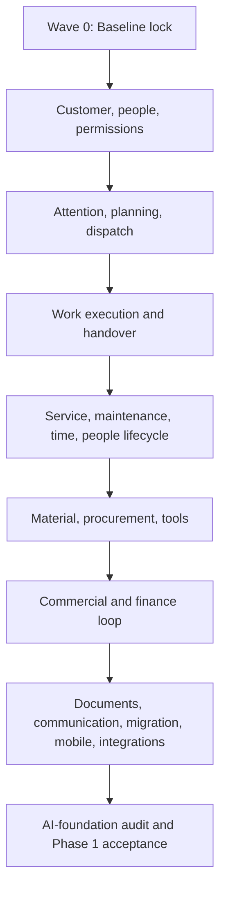

# Phase 1 Build Roadmap

This is the living execution roadmap for building WerkFlow's **complete operational core**. It translates the durable product direction in [`product-capability-map.md`](../product/product-capability-map.md) and the requirements in `docs/features/` into an ordered set of bounded vertical slices.

This file answers the implementation questions that the capability map intentionally does not:

1. What should be built next?
2. Which capabilities must exist before a slice starts?
3. Which feature owns each business rule?
4. What evidence is required before a slice is complete?
5. Which end-to-end scenarios must still work after related slices land?
6. How should agents keep the roadmap and feature documentation current?

This is a **living implementation index**, not a substitute for feature specifications, technical design, issue tracking, or acceptance evidence. Later slices may be split as discovery reveals safer boundaries, but their outcome, prerequisites, and coverage must not disappear silently.

> **Roadmap established:** 4 August 2026  
> **Current phase:** Phase 1 — Complete Operational Core  
> **Current checkpoint:** `P1-05` was accepted `complete` 2026-08-06; `P1-06` and `P1-09` are now `ready`, with `P1-06` next in roadmap sequence
> **Formally accepted roadmap slices:** 7 of 56 (`P1-00` and `P1-00a` through `P1-54`)
> **Phase 2 implementation:** Not authorized by this roadmap

The accepted infrastructure stack (database, auth, file storage, deployment, workers, AI hosting) and its sequencing are recorded in [decision 0001 — infrastructure stack](../decisions/0001-infrastructure-stack.md). Slices that touch file upload/download, retention, background processing, or auth must follow that record.

## Current Checkpoint

The current app already has meaningful foundations in organizations and roles, customers, jobs/projects, calendar, time tracking, document management, and Inventory V1. Those foundations predate this roadmap and are summarized in the feature documents' **Current Product Baseline** sections.

They do not make later roadmap slices complete automatically. `P1-00` must first verify the baseline against current code, generated types, live Supabase state, and regression tests. After that checkpoint, the first feature slice is `P1-01 — Customer contacts and work sites`.

| Field | Current value |
| --- | --- |
| Active slice | `P1-06` — vacation requests, decisions, balances, availability, calendar conflicts, target-time effects, and history (`in_progress` since 2026-08-06, this session) |
| Next slice | `P1-07` once `P1-06` completes (prerequisites `P1-02`/`P1-05` already `complete`) |
| Other ready slice | `P1-09` — teams, skills, certifications, and operational eligibility; deliberately not started in parallel because both slices touch employee/calendar boundaries |
| Current implementation wave | Wave 1 — Customer, people, planning, and shared coordination |
| Latest completed golden gate | Full suite 50/50 (`GG-00` + `GG-01` + `@P1-01` + `@P1-03` + `@P1-04` + new `@P1-05`) on a fresh production build, 2026-08-06 (`docs/plans/golden-gate-log.md`) |
| Known execution blocker | None — `P1-00` and `P1-00a` were accepted `complete` 2026-08-04 (owner confirmed `fra1` and the production R2 deploy) |
| Last roadmap review | 6 August 2026 |

Agents must update this table whenever a slice enters `in_progress`, `verification`, `complete`, or `decision_blocked`.

## Authority And Source Order

When sources disagree, use this order:

1. Current user instruction for the task.
2. `AGENTS.md` for durable product direction and repository-wide rules.
3. Current application behavior, generated Supabase types, and live Supabase inspection for implementation facts.
4. [`product-capability-map.md`](../product/product-capability-map.md) for product phases, feature ownership, shared objects, and decision gates.
5. The relevant `docs/features/*.md` specifications for intended feature behavior and cross-feature contracts.
6. This roadmap for execution order, prerequisites, status, and verification gates.
7. Slice-specific implementation plans and decision records.
8. Older technical or implementation plans where they have not been superseded by code or live state.

This ordering does not let implementation drift redefine product intent silently. If current code and the intended feature behavior differ, document the gap and obtain the necessary product decision before changing a consequential workflow.

## Required Reading For Phase 1 Tasks

Every Phase 1 implementation agent must read, in order:

1. `AGENTS.md`.
2. This roadmap, especially **Current Checkpoint**, the target slice, its direct prerequisites, and its golden gate.
3. [`product-capability-map.md`](../product/product-capability-map.md), especially the coherent operating loop, shared objects, cross-feature handoff rules, Phase 1 completion criteria, and decision gates.
4. The target slice's primary feature specification.
5. Only the connected feature specifications named by the slice and required to understand its handoffs.
6. Relevant technical documentation, current code paths, generated database types, and live Supabase state.
7. Any slice-specific implementation plan or accepted decision record.

Agents should not load every feature document for every task. The roadmap defines the smallest relevant reading set. When discovery exposes another affected domain, add that document to the slice before implementation.

## Roadmap Vocabulary

| Term | Meaning |
| --- | --- |
| Phase | A major product maturity level. This roadmap covers only Phase 1. |
| Wave | A dependency-oriented group of related slices. A wave is not one implementation task. |
| Vertical slice | One independently useful business outcome delivered through all required layers: domain, permissions, backend, UI, audit, tests, and documentation. |
| Direct prerequisite | A slice whose accepted output is required before another slice may start. Transitive prerequisites also apply. |
| Golden scenario | A multi-slice end-to-end workflow that proves connected capabilities still form one product. |
| Golden gate | The checkpoint at which a named golden scenario must pass before dependent work proceeds. |
| Decision gate | A product, legal, accounting, privacy, integration, or complexity choice that must be resolved explicitly and must not be inferred from competitor behavior. |
| Exit evidence | The observable product behavior, tests, migrations, documentation, and review evidence required to mark a slice complete. |

## What Counts As A Vertical Slice

A valid slice can be stated as:

> `[Role]` can `[complete one business outcome]` from `[starting state]` to `[ending state]`, while preserving `[important boundaries]`.

A slice is not merely a database migration, backend action, UI screen, or collection of components. It must deliver a usable and testable outcome across every required layer.

A proposed slice should normally have:

- one primary business state transition or lifecycle;
- one primary feature owner and a small set of explicit connected owners;
- one or two primary user roles;
- acceptance criteria that can be demonstrated independently;
- a migration and rollback/recovery story when existing data changes;
- no unresolved strategic decision hidden inside implementation;
- an outcome small enough to review without combining unrelated domains.

If discovery shows that a roadmap slice is too large, split it using stable suffixes such as `P1-15a` and `P1-15b`. Update dependencies and golden gates before either child begins. Do not renumber unrelated completed slices.

## Slice Status Model

Use only these status values in the master index:

| Status | Meaning |
| --- | --- |
| `planned` | The slice belongs to Phase 1 but one or more prerequisites are not accepted. |
| `ready` | All prerequisites and required decisions are accepted; work may begin. |
| `in_progress` | An identified task/branch owns active implementation. |
| `verification` | Implementation is complete enough for acceptance testing, review, migration checks, and documentation reconciliation. |
| `complete` | Exit evidence is recorded, required golden gates pass, and affected docs reflect current behavior. |
| `decision_blocked` | A named unresolved product/technical/legal decision prevents safe progress. |
| `superseded` | The outcome moved to replacement slice IDs with an explanation; it was not silently dropped. |

Ordinary unsatisfied dependencies are `planned`, not `decision_blocked`. A slice may move to `ready` only after every direct prerequisite is `complete` and every required earlier golden gate passes.

## Practical Execution Cautions

These are deliberate warnings for future agents and the product owner, recorded 2026-08-04. They temper how the roadmap is applied; they do not change its ordering or acceptance rules.

1. **Process-to-progress ratio.** 56 slices with full exit evidence is realistically a multi-year effort for a small team. The discipline exists to prevent an incoherent product, not to become the product. For low-risk slices (no schema migration, no permission change, no money/time/stock semantics), lighter evidence is acceptable — say so explicitly in the slice record instead of silently skipping items. When a slice consistently costs more in ceremony than in implementation, propose splitting or trimming it rather than abandoning the protocol.
2. **Wave 4 is the risk concentration.** Invoices, controlled number ranges, XRechnung/ZUGFeRD profiles, GoBD-adjacent retention claims, and DATEV handoffs cannot be validated from documentation or competitor behavior. Budget for qualified German tax/legal/accounting review **before** accepting `P1-39`–`P1-43`, and treat its absence as a `decision_blocked` condition, not a footnote.
3. **Golden-gate rerun cost compounds.** By Wave 3 and later, "rerun all materially affected earlier gates" grows expensive. Sampled or partially automated reruns are acceptable when the gate log records what was rerun, what was skipped, and why. An unrecorded skip is the only wrong option.

## Mandatory Execution Protocol

### Before Starting A Slice

1. Verify the slice is `ready`; do not work around an incomplete prerequisite by creating duplicate domain concepts.
2. Set the slice to `in_progress` and update **Current Checkpoint** with the task/branch owner and date.
3. Read the required sources listed above.
4. Inspect current code, generated types, migrations, RLS, Realtime/cache behavior, and live Supabase state where relevant.
5. Restate the bounded outcome, non-goals, affected roles, direct dependencies, and acceptance criteria.
6. Identify unresolved decisions. Move the slice to `decision_blocked` if a decision would materially change ownership, data migration, permissions, legal/commercial behavior, or downstream contracts.
7. Create a slice-specific implementation plan under `docs/plans/` when the work spans multiple sessions, schema migrations, or several coordinated rollout steps.

### During Implementation

- Preserve organization isolation and role-specific behavior.
- Extend the owning domain instead of creating a parallel copy in another feature.
- Keep planned, actual, approved, issued, paid, and exported states distinct.
- Make consequential actions explicit, previewable, attributable, and correctable.
- Use backward-compatible migrations and preserve historical meaning.
- Make failures and partial external states visible with a recovery path.
- Add focused tests at the domain boundary and end-to-end tests for the slice outcome. Concretely: extend the golden-gate harness (`docs/technical/testing.md`) — add the slice's business actions to `tests/golden/support/steps.ts` and cover the slice outcome in the gate spec named by its roadmap row (or a dedicated spec if no gate is due yet). A slice without an automated end-to-end check of its own outcome is not done.
- Keep field-worker paths simpler than office paths and use natural German for user-facing language.
- Record a decision in `docs/decisions/` when future agents must understand why a durable choice was made.

### Before Marking A Slice Complete

The slice is not complete until all applicable items are satisfied:

- the user outcome works across frontend, backend, permissions, and persistence;
- existing flows remain compatible or have an explicit migration;
- live schema and generated types agree;
- RLS and organization-boundary tests cover the new records/actions;
- Realtime, caching, retry, idempotency, and failure recovery were tested where applicable;
- accessibility, responsive behavior, German UI language, and role visibility were reviewed;
- the slice's focused acceptance criteria pass;
- every golden scenario named in the slice row passes;
- the primary feature doc moves implemented behavior into **Current Product Baseline**;
- connected feature contracts and open decisions are updated;
- conceptual data-model and technical docs are updated if ownership or architecture changed;
- this roadmap records status, completion date, evidence, follow-up work, and any split/superseding slices;
- appropriate lint, type, test, and build validation passes — including the slice's golden-gate spec run against a production build (`bun run build` + `bun start`, then `bunx playwright test --grep @GG-XX`), with the run recorded in `docs/plans/golden-gate-log.md`;
- a separate review finds no unresolved correctness, security, data-loss, or documentation issue.

## Cross-Cutting Invariants

Every slice must preserve these rules even when they are not repeated in its row:

1. **One source of truth:** features reference shared customer, site, job, employee, document, item, supplier, or commercial identities rather than copying them.
2. **Organization scope:** all data and actions remain organization-bound.
3. **Role clarity:** `admin`, `buero`, and `employee` behavior differs intentionally; sensitive personnel, cost, customer, and financial data is purpose-limited.
4. **Historical meaning:** effective-dated rules, issued records, approvals, movements, and completed work are corrected through traceable changes rather than silent rewrites.
5. **No implied downstream action:** schedule changes do not create time, stock movements, messages, orders, or invoices unless an explicit reviewed workflow does so.
6. **Draft before obligation:** customer, supplier, payment, accounting, signature, and high-impact scheduling actions have preview and approval appropriate to their consequence.
7. **Offline honesty:** every offline claim names available data, queued actions, conflicts, last synchronization, failure, and recovery.
8. **Integration honesty:** every connector names system ownership, direction, supported version/object, credentials, retry, deduplication, revocation, and fallback.
9. **Employee privacy:** absence detail, personnel documents, compensation/costing, location, and performance data are minimized and separately authorized.
10. **No compliance invention:** German employment, tax, accounting, signature, archive, SHK-standard, or safety claims require current qualified validation.
11. **Progressive depth:** common workflows work with clear defaults; exceptional and expert controls remain discoverable without overwhelming field users.
12. **AI readiness without Phase 2 behavior:** Phase 1 creates reliable events, actions, sources, approvals, and auditability but does not authorize assistants, workflow builders, or agents.

## Starting Foundation Snapshot

This snapshot is a roadmap orientation aid. Feature baselines and current code remain authoritative.

| Area | Starting position | Roadmap consequence |
| --- | --- | --- |
| Organizations and roles | Organization membership and fixed `admin`, `buero`, `employee` roles exist | Preserve current access while adding scoped responsibilities deliberately |
| Customers | Basic organization-scoped customer master and customer-linked work exist | Extend identity into contacts, sites, requests, timeline, and lifecycle rather than replace it |
| Jobs and projects | Strong work structure, assignments, statuses, checklists, calendar, time, documents, and inventory context exist | Mature request handoff, readiness, evidence, completion, and service/commercial transitions |
| Calendar | Day/week/month planning, jobs, time blocks, assignment, drag/drop, and `Parkplatz` exist | Add recurring/multi-visit planning, capacity, resources, commitment state, and dispatch depth |
| Employees | Membership, invitations, roles, basic profiles, assignment, and manager surfaces exist | Add employment identity, conditions, schedules, absence, skills, documents, and lifecycle |
| Time | Event-based clocking, breaks, job allocation, manual entries, weekly view, approvals, and history exist | Add full categories, schedules/targets, accounts, correction consistency, close, export, and offline reliability |
| Documents | Central/contextual library, private storage, links, trash, versioning, audit, viewer, and maintenance helpers exist | Add structured artifacts, capture/search/OCR, review, governance, commercial integration, and portability |
| Inventory | Catalog, locations, stock, movements, planning, take/return, CSV import, and basic asset infrastructure exist | Add reservations, procurement, transfers, counts, custody, valuation, standards, and commercial handoff |
| Service | No dedicated service domain exists | Reuse customer, work, calendar, time, documents, and inventory; do not build parallel copies |
| Commercial/finance | No structured commercial domain exists | Build controlled catalog-to-offer-to-invoice-to-payment and purchase-cost/accounting handoffs |
| AI/automation | No confirmed module exists | Build only enabling events, validated actions, approvals, connector boundaries, sources, and audit in Phase 1 |

## Dependency Overview

The detailed master index controls; this diagram shows the main dependency spine.



Some independent slices may run in parallel after `P1-00`, but only when their direct dependencies are complete and they do not modify the same ownership boundary, schema, permission vocabulary, or shared UI primitive without explicit coordination.

## Master Slice Index

The dependency column lists direct prerequisites. All transitive prerequisites also apply.

### Wave 0 — Baseline And Execution Control

| ID | Status | Bounded outcome | Direct dependencies | Primary / connected specs | Exit evidence and gate |
| --- | --- | --- | --- | --- | --- |
| `P1-00` | `complete` | Lock the documentation baseline, verify every current feature baseline against code/generated types/live Supabase, establish regression coverage, and record the first accepted implementation checkpoint. Includes the infrastructure hygiene items from [decision 0001](../decisions/0001-infrastructure-stack.md): regenerate stale Supabase types, reconcile Realtime subscriptions with published tables, verify/pin the Vercel Frankfurt region | None | All feature specs; technical architecture/data model | Findings and resolutions in [`p1-00-baseline-verification.md`](./p1-00-baseline-verification.md): types verified in sync; 10 missing Realtime publication tables added; Vercel region pinned to `fra1` via `vercel.json`. Regression coverage exists: `GG-00` automated v3 passes 13/13 on a fresh production build (2026-08-04), covering the complete baseline scenario including invites/onboarding and inventory take/return. **Accepted `complete` 2026-08-04**: owner confirmed Frankfurt (`fra1`) on the latest deployment |
| `P1-00a` | `complete` | Migrate file bytes to Cloudflare R2 (EU) behind a provider-neutral storage interface with direct signed uploads/downloads, fixing the current production failure where Server-Action-buffered uploads exceed Vercel's ~4.5 MB body limit. Migrate existing objects, keep Postgres as the metadata source of truth | `P1-00` | Document management; technical architecture; [decision 0001](../decisions/0001-infrastructure-stack.md) | Implemented 2026-08-04 (ahead of `P1-00` by product-owner instruction): `lib/storage/r2.ts`, ticket+finalize upload actions, R2 signed download URLs, objects migrated into both buckets and verified, presigned round trips pass with pinned content types, CodeRabbit review findings fixed, owner verified upload/download on a production build, both buckets have CORS. Folder-tree soft-delete surfaced an order-dependent org-validation trigger bug; fixed via migrations `fix_folder_parent_validation_on_soft_delete` and `fix_document_folder_validation_on_update`. Because dev and prod share one Supabase database, both environments use `werkflow-documents-prod`. Local `R2_BUCKET_NAME`/CORS unification is done in practice (`GG-00` v2/v3 uploads run against `werkflow-documents-prod` from `http://localhost:3000`), and the `GG-00` file paths were rerun (v3, 13/13). **Accepted `complete` 2026-08-04**: owner verified upload/download on the first Vercel production deploy over the R2 storage path. Direct prerequisite for every later slice that uploads or serves files (first: `P1-02`) |

### Wave 1 — Customer, People, Planning, And Shared Coordination

| ID | Status | Bounded outcome | Direct dependencies | Primary / connected specs | Exit evidence and gate |
| --- | --- | --- | --- | --- | --- |
| `P1-01` | `complete` | Admin/Büro can maintain stable customer identity/classification, customer numbers, multiple contacts, address purposes, and durable work sites; work references the correct site/contact without duplicate customer records | `P1-00` | Customers/CRM; jobs; calendar; documents | Implemented 2026-08-04: migration `add_client_contacts_and_sites` (tables `client_contacts`/`client_sites` with RLS + org/client validation triggers + Realtime publication, `clients.customer_number` org-unique, `jobs`/`projects` `site_id`/`contact_id`); contact/site management on the customer detail; site/contact pickers in job/project dialogs with Ort snapshot semantics; project default site with per-job override; customer-change clearing incl. project job sync; employee job-page site/contact view; `/kunden` search across contacts/sites. Fully additive — existing customers/jobs/projects unchanged, free-text `Ort` still works; address-purpose depth beyond main-address-plus-sites deferred to commercial slices. New golden spec `@P1-01` (6 checks incl. historical-location and isolation) + `GG-00` rerun: 19/19 on a fresh production build (`docs/plans/golden-gate-log.md`). **Accepted `complete` 2026-08-04**: CodeRabbit review of the slice commit produced 20 findings — 11 fixed (primary-flag write ordering with surfaced failure, archived-contact visibility in the site dialog, error copy/logging, tel-href normalization, validation error union, fetch-rejection recovery, harness guard/wait), 9 skipped with recorded reasons (DB triggers already enforce site-contact integrity; two pre-existing patterns noted as follow-ups: edit dialog cannot clear a project's customer, project/job sync is compensating rather than transactional; search-index scale posture documented for `P1-51`; German test titles and `Ansprechpartner` follow repo conventions). Suite rerun after fixes: 19/19 on a fresh production build |
| `P1-02` | `complete` | Admin/Büro can capture an operational request and deliberately convert it into a job/project without re-entering customer, contact, site, summary, urgency, attachments, or commitments | `P1-00a`, `P1-01` | Customers/CRM; jobs; calendar; documents | Implemented 2026-08-05: migrations `add_client_requests` + `add_generate_request_number` (tables `client_requests`/`client_request_events` with manager-only SELECT RLS, org/client validation triggers, once-only conversion CHECKs + unique partial indexes, Realtime publication; `document_links` widened to a fifth exactly-one `request_id` target). Owner-approved decisions executed: 4-state lifecycle (`offen`→`in_klaerung`→`umgewandelt`\|`geschlossen` + reason + manager reopen), SHK category/urgency/source vocabularies, attachments over the existing R2 ticket flow, sidebar `Anfragen` above `Aufträge`, conversion requires a resolved customer (match or inline-create). Conversion is race-safe (compare-and-set + DB backstop), attributable, and copies nothing — attachments gain a second link; work links back to its origin. Unknown callers captured with provisional identity, matched or promoted without retyping. Direct work creation unchanged. New `GG-01` spec + `GG-00`/`@P1-01` rerun: 27/27 on a fresh production build (`docs/plans/golden-gate-log.md`); the cycle surfaced and fixed a real defect (async number suggestion overwrote typed numbers). **Accepted `complete` 2026-08-05**: CodeRabbit review of the slice commit produced 28 findings — 15 fixed (Realtime refreshes no longer reset open dialog edits via `request.id`-keyed prefill effects, org scoping on all related service-role lookups, direct-`/anfragen/[requestId]` negative tests for employee/outsider, `receivedAt` boundary validation, specific `request_not_editable` close error, rollback-delete error logging, discriminated conversion result, shared `formatProfileName`/assignee helper, static German load-error copy instead of raw `error.message`, plain-text fallback when a converted project has no number, `role="alert"` on dialog errors, keyboard-accessible list links, harness guard + suggested-number wait), 13 skipped with recorded reasons (German test titles, `Record<string, unknown>` payloads, dialog autofocus prevention, per-call date formatters, disabled-submit validation, and empty-list fallbacks all match established repo patterns; duplicate-conversion assertions already target the authoritative request row backed by CAS + unique partial indexes; converted-id dedupe is dead code under those indexes; harness DB helpers follow the untyped-service-client pattern; per-action spinners cosmetic under the deliberate single-transition lock; client-side trimming redundant to server normalization; `ClientSelectWithCreate` lacks an id pass-through — component-level follow-up). Suite rerun after fixes: 27/27 on a fresh production build, incl. the new direct-URL checks |
| `P1-03` | `complete` | Admin/Büro can maintain a stable employee/personnel identity with date-effective employment conditions without changing historical work/time meaning | `P1-00` | Employee management; time; documents | Implemented 2026-08-05: migrations `add_employee_records_and_conditions` + `link_employee_record_on_invite_redemption` (org-scoped `employee_records` with nullable `user_id`, date-effective `employment_conditions` keyed by `valid_from`, append-only `employee_record_events`; manager-only SELECT RLS + service-role actions + org-validation triggers; membership-insert trigger + additive backfill from `joined_at`; `generate_personnel_number` `MA-NNN` suggestion; redemption RPC links a waiting record race-safely before the membership trigger). Owner-approved decisions executed: no compensation fields, inert weekly-hours/vacation-days storage for `P1-04`/`P1-06`, derived states `Aktiv`/`Geplant`/`Ausgeschieden` × `Mit Zugang`/`Eingeladen`/`Ohne Zugang`, destructive removal keeps the record as `Ausgeschieden`, no employee self-service. UI: Personalien/Beschäftigung/Verlauf sections on the member detail, personnel-only detail for non-members, `Weiteres Personal` section + `Personalakte anlegen`/`Zugang einladen` dialogs. Nothing recalculates or reinterprets existing time entries or jobs. Fixed in passing: `redeem-invite` Route Handler `updateTag` crash (`revalidateTag(tag,'max')`), string-state DatePicker `NaN` wedge (year padding in `toLocalDateString`). New golden spec `@P1-03` (8 checks) + full `GG-00`/`GG-01`/`@P1-01` rerun: 35/35 on a fresh production build (`docs/plans/golden-gate-log.md`). **Accepted `complete` 2026-08-05**: CodeRabbit review of the slice commit produced 13 findings — 12 fixed (one shared Europe/Berlin business-date helper replacing host-/UTC-local "today" in derived states, the conditions list filter, and the removal exit-date; org-scoped exit-date write; name-guard only rejects actual name changes on linked records; a replaced still-pending personnel invite is cancelled before connecting a new one so it cannot create a duplicate person on redemption; keyboard-accessible real links in the personnel list rows (both layouts); DatePicker gained `id`/`ariaLabel` so the Gültig-ab/Eintrittsdatum labels are properly associated; condition-actions trigger renamed to cover both actions; audit timestamps pinned to Europe/Berlin; spec asserts the migrated entry date equals the membership's Berlin join date; future-starter fixture uses a runtime next-year date), 1 skipped with reason (`revalidateTag(tag, 'max')` in the redeem-invite Route Handler: the installed Next 16 types accept profile strings, `'max'` is a built-in cache-life profile, and GG-00's invite test proves post-redemption freshness on a production build — `{ expire: 0 }` is an alternative form, not a correctness fix). Suite rerun after fixes: 35/35 on a fresh production build |
| `P1-04` | `complete` | Authorized users can define date-effective work schedules and regional holiday/closure context; calendar capacity and time targets use them instead of a fixed eight-hour assumption | `P1-03` | Employee management; calendar; time | Implemented 2026-08-05 (accepted `complete` the same day): migrations `add_work_schedules_and_holiday_context` + `fix_work_schedules_self_read_policy` (`work_schedules` weekly-pattern versions keyed by `valid_from` per employee record; `organization_closure_days` with today/future-only edits; `organization_settings.holiday_region` + effective-from history following `break_policy_history`; self-or-manager SELECT RLS via new `app_private.get_user_employee_record_ids`; Realtime publication + replica identity full for org-filtered DELETE events). Owner-approved decisions executed: in-code per-Bundesland holiday dataset (no external API; CI-tested against official lists), holiday/closure ⇒ day target 0 with region changes effective from selection, schedule wins over condition weekly hours with a non-blocking mismatch hint, **labeled display-time fallback cascade** for unconfigured members (schedule → derived → visibly labeled legacy 8h; nothing persisted, deploy-day numbers unchanged for all 25 existing members). One shared pure resolver (`resolveDailyTarget`, discriminated source) feeds every consumer: `/zeiterfassung` Tagesziel/ring/weekly chart with `Soll` sum, member-detail Tagesfortschritt + chart, member-list progress bars with unconfigured marker, and the calendar month view's labeled holiday/closure context (minimal deliberate consumption; capacity stays `P1-11`). Schedule changes audit into `employee_record_events`. Unit tests (`bun run test:unit`, 24) cover historical/holiday/fallback target math incl. official 2026/2027 holiday lists. New golden spec `@P1-04` (9 checks incl. real-credential RLS proof and org isolation) + full suite rerun: 44/44 on a fresh production build (`docs/plans/golden-gate-log.md`). The cycle surfaced and fixed a real RLS defect (self-read policy subquery on the manager-only `employee_records` ran under caller RLS). **Accepted `complete` 2026-08-05**: CodeRabbit review of the slice commit produced 17 findings — 9 fixed (stale-response generation guard in `use-weekly-time-data` so overlapping Realtime refetches cannot commit older results; failed target refetches keep the last-known targets instead of silently reverting to the fixed 8h split; `setHolidayRegion` appends onto the stored history from a direct DB read — a stale cross-request cache could have dropped history entries; explicit `load_failed` when the detail's conditions/schedules queries error instead of silently showing the labeled default; no-op rejection handler on the calendar prefetch's early-return path; holiday-aware weekly-Soll expectations in the golden spec via the same in-code dataset; shared `toDayMinuteColumns` mapping; defensive non-mutating ascending sort in `resolveHolidayRegionOnDate`; noon-UTC date construction replacing the fixed `+02:00` offset), 1 partially fixed (a fully distinct "targets unavailable" UI state for a failed *initial* target load was deliberately not built — the surface degrades to the pre-P1-04 legacy display without a percentage claim, because blanking the primary time surface on a rare authorized-action failure would be worse; the transient-failure path is covered by keep-last-known), 7 skipped with recorded reasons (harness error messages naming the synthetic `@werkflow-golden.test` fixture follow the existing `db.ts` helper pattern; three single-letter identifier renames match the sibling conditions section and established spec style; a Berlin-midnight refresh timer for server-rendered "today" targets is the same pre-existing class as P1-03's derived state badges — surfaces refresh via navigation/Realtime/visibility, noted as polish follow-up; the deprecated `z.string().datetime()` form mirrors the existing `break_policy_history` schema in the same domain; `getWeekdayIndex` input validation would add a throw path to display surfaces although all inputs are internally generated ISO dates). Suite rerun after fixes: 44/44 on a fresh production build |
| `P1-05` | `complete` | Default roles gain clear scoped responsibilities, approvers, substitutes, and date-effective delegation without exposing a generic unsafe role builder | `P1-03` | Employee management; time; calendar; all approval consumers | Implemented and accepted 2026-08-06. Migrations `add_scoped_responsibilities`, `guard_responsibility_snapshot_on_org_delete`, and `index_scoped_responsibility_foreign_keys` add the fixed `time_approval`/`leave_approval` vocabulary, append-only effective configuration/assignment/event history, inclusive Berlin-date substitutes, self-or-manager RLS via `app_private` SECURITY DEFINER helpers, owner/admin and sole-selected-holder backstops, Realtime publication, replica identity full, and indexed foreign keys. Existing organizations received role-default snapshots, preserving Admin/Büro behavior until an owner selects named holders. One pure resolver returns `role_default`, `direct_assignment`, or `delegation`; live time approval consumes it at action time, ordinary selected employees gain only approval scope, self-approval is always denied, Büro-owned new manual entries become pending, admin-owned additions remain the recovery default, and expired/ended substitutes are denied even from stale UI. UI includes owner-only preview/confirmation and substitute maintenance, Büro read-only settings, affected-person self visibility, member-detail summaries, understandable stranding errors, and no role builder. Live inspection verified all organizations had consistent `admin_id`/sole-admin membership, all three operational tables were published, RLS isolation worked with real credentials, and database advisors showed no new security or unindexed-FK findings. `@P1-05` covers preview, holder/non-holder action behavior, four eyes, substitute window/end at the action boundary, owner/last-holder protection, self-read RLS, and organization isolation; post-review full suite 50/50 on a fresh production build, unit suite 35/35. CodeRabbit reviewed committed slice `7424fc8`: 31 findings, 27 fixed (calendar/range validation, future-exit inclusion, deterministic anomalous-overlap resolution + regression, action promise errors, authorized-before-profile reads, complete stranding diagnostics, UI states, and harness hardening), 4 skipped: (1) cross-request responsibility caching would violate the explicit action-time expiry invariant; (2) the proposed component-level `history` tab clamp is redundant because the server page already maps every URL value except `approvals` to `overview`; (3) sharing the denial-copy constant with Playwright would couple the independent acceptance assertion to the client implementation and make it tautological; (4) resetting the pending count to zero on a transient failure would violate the documented keep-last-known rule. Ownership transfer, vacation workflow, complete correction requests, inbox/notifications, privacy tiers, teams/skills, and offboarding reassignment remain in their owning slices. |
| `P1-06` | `in_progress` | Employees can request/withdraw vacation; authorized approvers can decide it; approved absence updates entitlement, availability, calendar conflicts, target time, and history consistently | `P1-04`, `P1-05` | Employee management; calendar; time | Full/partial-day, balance, overlap, retroactive correction, and role cases pass |
| `P1-07` | `planned` | WerkFlow provides one role-aware task, approval, notification, failure, and exception pattern first used by requests and leave instead of separate inboxes per feature | `P1-02`, `P1-05`, `P1-06` | AI foundations; employee; CRM; time; jobs | Ownership, due state, delegation, deduplication, deep link, resolution, and audit tested; `GG-02` passes |
| `P1-08` | `planned` | Employees can report sickness/privacy-sensitive absence; authorized users manage evidence and operational availability without exposing diagnosis or unnecessary detail | `P1-04`, `P1-05`, `P1-07` | Employee management; time; calendar; documents | Privacy matrix, partial/retroactive cases, target-time effects, and evidence access pass |
| `P1-09` | `ready` | Authorized users can maintain teams, skills, certifications, validity, evidence, and operational eligibility; planning can explain qualification coverage | `P1-03`, `P1-05` | Employee management; calendar; jobs; documents | Expiry/history, evidence privacy, apprentice supervision, and assignment warning cases pass |
| `P1-10` | `planned` | Office users get a customer relationship timeline with owned manual follow-ups and communication preferences that points to source records rather than duplicating them | `P1-01`, `P1-02`, `P1-07` | Customers/CRM; jobs; documents; communications contract | Timeline attribution/filtering, overdue follow-up, preference warning, and field-access restrictions pass |
| `P1-11` | `planned` | Planners can create recurring, multi-day, and multi-visit work/internal entries using employee schedules, absence, skills, teams, and capacity with understandable series exceptions | `P1-04`, `P1-06`, `P1-08`, `P1-09` | Calendar; employee; jobs; service | One/this-and-future/series edits, capacity conflicts, holiday behavior, and plan-versus-actual separation pass |
| `P1-12` | `planned` | Office users can dispatch scheduled/unscheduled work, batch reschedule, evaluate site/travel feasibility and available readiness signals, track acknowledgement, and distinguish internal plans from customer commitments | `P1-02`, `P1-07`, `P1-11` | Calendar; jobs; CRM; employee; inventory | Backlog/parked reasons, conflicts, route/access context, overrides, acknowledgements, audit, and no-silent-message behavior pass; material/tool readiness is rerun after `P1-26`/`P1-32`; `GG-03` passes |

### Wave 2 — Work Execution, Service, Time, And People Lifecycle

| ID | Status | Bounded outcome | Direct dependencies | Primary / connected specs | Exit evidence and gate |
| --- | --- | --- | --- | --- | --- |
| `P1-13` | `planned` | Organizations can create versioned SHK work templates that produce editable job/project tasks, checklists, required evidence, planned roles/material, and dependencies without committing stock or schedule | `P1-02`, `P1-07` | Jobs/projects; documents; inventory; calendar | Template snapshot/version behavior and required/optional task states tested |
| `P1-14` | `planned` | Work exposes clear planned/ready/in-progress/interrupted/blocked/execution-complete/handover/cancelled states, blockers, owners, dependencies, and readiness gates | `P1-09`, `P1-11`, `P1-12`, `P1-13` | Jobs/projects; calendar; inventory; documents | State transitions, override reason, next action, cancellation/parking distinction, and audit pass |
| `P1-15` | `planned` | Field/office users can create structured site diaries, reports, measurements, defects, change-work evidence, approvals, and signatures linked to exact artifact versions | `P1-07`, `P1-13`, `P1-14` | Jobs/projects; documents; commercial; service | Revision, refusal/reservation, internal-vs-customer approval, permission, and exportable artifact tests pass |
| `P1-16` | `planned` | Assigned field workers receive one focused work pack and can execute tasks, capture progress/evidence, time/material context, and unresolved issues without office-only clutter | `P1-01`, `P1-13`, `P1-14`, `P1-15` | Jobs/projects; time; inventory; documents; calendar | Assigned/unassigned role matrix, work-pack completeness, progress, and failure recovery pass |
| `P1-17` | `planned` | Field execution can become office-reviewed handover/commercial readiness with missing-item gates, customer-visible package, reasoned override, and traceable reopening | `P1-14`, `P1-15`, `P1-16` | Jobs/projects; documents; inventory; time; commercial | Execution-complete versus handover distinction, reopen history, unresolved exceptions, and package visibility pass; `GG-04` passes |
| `P1-18` | `planned` | Customer sites can hold installed equipment/components, identifiers, documents, warranty/commissioning data, installation origin, lifecycle state, and searchable service history | `P1-01`, `P1-15`, `P1-17` | Service/maintenance; CRM; jobs; documents | Installed equipment remains distinct from business inventory; replacement/decommission/history tests pass |
| `P1-19` | `planned` | Office users can triage reactive service/warranty demand against customer, site, equipment, contract/charge context and dispatch a field-ready service visit | `P1-02`, `P1-12`, `P1-16`, `P1-18` | Service/maintenance; CRM; jobs; calendar; inventory | Duplicate request, urgency, access, warranty/non-billable, escalation, visit report, and follow-up cases pass; `GG-05` passes |
| `P1-20` | `planned` | Authorized users can define maintenance plans and operational contract coverage that generate understandable due work, exceptions, visit evidence, next due dates, and renewal-risk signals | `P1-11`, `P1-18`, `P1-19` | Service/maintenance; calendar; commercial; jobs | Generation horizon, occurrence/series edits, skipped/combined/cancelled visits, scope evidence, and next-due calculation pass; `GG-06` passes |
| `P1-21` | `planned` | Employees can capture and switch explicit work, travel, break, standby/on-call, call-out, and internal activity segments with job allocation and recoverable sequence validation | `P1-04`, `P1-12`, `P1-16` | Time tracking; employee; jobs; calendar | Split/overnight/job-switch/unallocated/duplicate/abandoned-session cases and clear totals pass |
| `P1-22` | `planned` | Employees and managers can use one consistent correction/request/approval flow with before/after preview, four-eyes rules, withdrawal, delegation, and provisional totals | `P1-07`, `P1-21` | Time tracking; employee; calendar | Add/edit/delete/split/reclassify/reassign/self-approval/batch/closed-state cases pass |
| `P1-23` | `planned` | Time accounts, overtime/supplement classifications, compliance warnings, exception review, period close, payroll-ready export, and correction/re-export are understandable and versioned | `P1-04`, `P1-06`, `P1-08`, `P1-21`, `P1-22` | Time tracking; employee; commercial | Reproducible target/actual/balance, close/reopen, export preflight/version, employee statement, and historical-policy tests pass; `GG-07` passes |
| `P1-24` | `planned` | Protected personnel documents, requirements, acknowledgements, onboarding templates, access activation, employment transitions, and offboarding responsibilities form one controlled people lifecycle; physical asset-return closure follows in `P1-33` | `P1-03`, `P1-05`, `P1-07`, `P1-09`, `P1-23` | Employee management; documents; time; jobs | Personnel privacy, future starter, access start/suspension, retained history, responsibility reassignment, retention/export, and checklist cases pass |

### Wave 3 — Material, Procurement, Inventory Control, And Assets

| ID | Status | Bounded outcome | Direct dependencies | Primary / connected specs | Exit evidence and gate |
| --- | --- | --- | --- | --- | --- |
| `P1-25` | `planned` | Office users can maintain catalog/supplier master data with multiple supplier references, pack/unit conversions, alternatives, versioned costs/prices, import updates, and historical snapshots | `P1-17`, `P1-20`, `P1-23` | Inventory; commercial; documents | Import/reconciliation, unit conversion, stale price, archive/successor, and history tests pass |
| `P1-26` | `planned` | Planners can approve and reserve complete/partial stock for job/project demand, release/reallocate it, and see availability/shortage/readiness without changing physical stock | `P1-14`, `P1-25` | Inventory; jobs; calendar | Concurrent reservation, partial coverage, shortage, release, reallocation, and readiness tests pass |
| `P1-27` | `planned` | Field/office users can pick, take, consume/install, return, scrap/damage, correct, and review billable versus cost quantities with full attribution | `P1-16`, `P1-17`, `P1-26` | Inventory; jobs; commercial; time | Partial/multi-location/unplanned/over-return/correction/warranty/goodwill cases pass; `GG-08` passes |
| `P1-28` | `planned` | Users can perform paired immediate or in-transit transfers with source/destination custody, partial receipt, discrepancy, cancellation, and vehicle/location visibility | `P1-25`, `P1-26`, `P1-27` | Inventory; calendar; employee | Atomic paired effects, in-transit availability, loss/correction, and audit tests pass |
| `P1-29` | `planned` | Office users can consolidate shortages/reorder demand, compare suppliers, request approval, and create/revise purchase orders without duplicate buying | `P1-07`, `P1-25`, `P1-26`, `P1-28` | Inventory; jobs; commercial; documents | Demand consolidation, pack/lead-time logic, approval, duplicate order, backorder, and manual fallback pass |
| `P1-30` | `planned` | Office/warehouse users can receive partial/direct deliveries, record discrepancies, create stock only from confirmed receipt, and manage supplier returns/expected credit | `P1-29` | Inventory; documents; commercial | Order-receipt-movement linkage, direct-to-job, damage/short/excess/substitute/reject/return cases pass; `GG-09` passes |
| `P1-31` | `planned` | Authorized users can run full/cycle/spot counts, review discrepancies, correct stock audibly, and view operational valuation/slow-moving/waste/variance insights | `P1-25`, `P1-28`, `P1-30` | Inventory; commercial | Blind/assigned/paused/second counts, movement-during-count policy, approval, snapshot, and drill-down pass |
| `P1-32` | `planned` | Individually tracked tools/assets support identification, custody, job allocation, return, condition, maintenance/inspection, loss, and retirement | `P1-09`, `P1-24`, `P1-25`, `P1-28` | Inventory; employee; jobs; documents; calendar | Chain of custody, unsafe/inspection-due, reassignment, loss, documents, and history tests pass |
| `P1-33` | `planned` | Employee offboarding completes outstanding time/leave, work/approval reassignment, access revocation, asset/tool/vehicle return, exports, and retained historical identity | `P1-23`, `P1-24`, `P1-32` | Employee management; inventory; time; jobs; documents | Planned/immediate/reversed exit, later correction, asset exception, last-admin, and history tests pass |
| `P1-34` | `planned` | Manual and barcode/QR inventory actions share one domain path; supported wholesale master/transaction standards have explicit versions, directions, errors, and fallback | `P1-25`, `P1-29`, `P1-30`, `P1-31`, `P1-32` | Inventory; integrations; documents | Identifier collision, label, scan parity, DATANORM/IDS/UGL/Open Masterdata/SHK Connect scoped acceptance, fallback, and export tests pass; `GG-10` passes |

### Wave 4 — Commercial And Finance Loop

| ID | Status | Bounded outcome | Direct dependencies | Primary / connected specs | Exit evidence and gate |
| --- | --- | --- | --- | --- | --- |
| `P1-35` | `planned` | Authorized office users can maintain versioned labor/service/material/commercial positions, rate cards, cost/price/tax/markup/discount logic, templates, and margin controls | `P1-23`, `P1-25`, `P1-31` | Commercial/finance; inventory; employee | Inventory link without conflation, effective prices, net/gross/rounding, approval threshold, and history tests pass |
| `P1-36` | `planned` | Office users can calculate, version, preview, deliver, revise, expire, and record acceptance/rejection/partial acceptance of structured offers | `P1-01`, `P1-02`, `P1-07`, `P1-35` | Commercial/finance; CRM; documents; jobs | Customer-facing/internal separation, exact version acceptance, options, delivery evidence, supersession, and audit pass |
| `P1-37` | `planned` | Accepted scope becomes an immutable order/contract baseline; approved/rejected change orders preserve scope, price, schedule, evidence, and deliberate operational handoff | `P1-13`, `P1-15`, `P1-17`, `P1-36` | Commercial/finance; jobs; inventory; calendar | Original-plus-change view, unapproved work warning, customer evidence, and no-silent-work mutation pass; `GG-11` passes |
| `P1-38` | `planned` | Office users can reconcile contract positions, measurements, approved time/travel, net material, external cost, previous billing, and exceptions into a reviewed billable-work set | `P1-17`, `P1-23`, `P1-27`, `P1-30`, `P1-37` | Commercial/finance; jobs; time; inventory; service | Source drill-down, quantity/unit/price/tax, partial/cumulative, warranty/goodwill/rework/dispute, and approval pass |
| `P1-39` | `planned` | Authorized users can create, check, issue, send, correct/credit, and track standard/deposit/partial/cumulative/final invoices with controlled number ranges and immutable issued content | `P1-07`, `P1-38` | Commercial/finance; CRM; documents | Recipient/performance/tax/total preview, uniqueness, correction chain, delivery evidence, payment-state boundary, and audit pass |
| `P1-40` | `planned` | WerkFlow can generate/import/validate the explicitly supported XRechnung and ZUGFeRD profiles while preserving exact files, validation results, readable preview, and fallback | `P1-39` | Commercial/finance; documents; integrations | Version/profile conformance fixtures, invalid input, original/generated relation, delivery failure, and fallback pass; `GG-12` passes |
| `P1-41` | `planned` | Incoming bills and employee expenses can be captured, duplicate-checked, matched/allocated to PO/receipt/job/cost, reviewed, disputed, credited, and made accounting-ready without creating stock/payment silently | `P1-07`, `P1-30`, `P1-35`, `P1-40` | Commercial/finance; inventory; documents; employee | Duplicate, no-order, partial/variance, split allocation, tax/source-vs-approved, expense, and approval cases pass |
| `P1-42` | `planned` | Authorized office users can manage open items, import/connect bank transactions, propose/review/reverse payment allocations, handle partial/combined/overpayments, and run controlled dunning | `P1-39`, `P1-41` | Commercial/finance; CRM; communications; documents | Ambiguous matching, reversible allocation, dispute/hold, reminder preview/delivery, aging, and audit pass |
| `P1-43` | `planned` | Owners/office users can inspect source-linked job/project/service post-calculation and export versioned accountant-ready records with mapping preflight, control totals, rejection, correction, and re-export | `P1-23`, `P1-31`, `P1-38`, `P1-39`, `P1-41`, `P1-42` | Commercial/finance; jobs; inventory; time; documents | Planned/actual revenue/labor/material/external cost, variance drill-down, missing-source warnings, export/reject/re-export pass; `GG-13` passes |

### Wave 5 — Evidence, Communication, Portability, Mobile, And Interoperability

| ID | Status | Bounded outcome | Direct dependencies | Primary / connected specs | Exit evidence and gate |
| --- | --- | --- | --- | --- | --- |
| `P1-44` | `planned` | Documents enter through supported web/share/email/integration paths and a reusable capture contract with duplicate/version review, processing state, thumbnails, OCR/full-text search, and metadata smart views; mobile camera delivery follows in `P1-49`. OCR/thumbnail/indexing processing is the expected first Railway worker workload per [decision 0001](../decisions/0001-infrastructure-stack.md) | `P1-15`, `P1-18`, `P1-30`, `P1-39`, `P1-41` | Documents; CRM; jobs; service; commercial; inventory | Failed/retry/duplicate/version/OCR/index/search/performance cases pass; extracted data remains untrusted until review |
| `P1-45` | `planned` | Document review, replacement/supersession, retention/legal-hold controls, granular personnel/finance access, approved sharing, revocation, and organization export preserve files, versions, links, and audit. Includes designing the independent immutable retention archive (S3 Object Lock, per-category German retention periods) per [decision 0001](../decisions/0001-infrastructure-stack.md) | `P1-07`, `P1-15`, `P1-24`, `P1-39`, `P1-44` | Documents; employee; commercial; technical security | Permission matrix, external revocation/expiry, deletion block, restore, export/re-import integrity, and no compliance-overclaim pass |
| `P1-46` | `planned` | Office users can log inbound interactions and send reviewed appointment, delay, completion, report, offer, invoice, reminder, and follow-up messages through selected channels with recipient preference, delivery state, failure, and audit | `P1-10`, `P1-12`, `P1-17`, `P1-19`, `P1-36`, `P1-39`, `P1-42`, `P1-45` | CRM; calendar; jobs; service; commercial; documents | Manual-note-vs-delivery distinction, preference/consent, template preview, retry/deduplication, wrong-recipient prevention, and audit pass; `GG-14` passes |
| `P1-47` | `planned` | Assisted/self-service migration, duplicate review, archive/deletion/anonymization, and usable export work coherently across customer/contact/site, employee, work, inventory, supplier, commercial, and document records | `P1-33`, `P1-34`, `P1-43`, `P1-45` | All operational specs; data model | Preview, stable identifiers, created/matched/updated/skipped/invalid report, reconciliation, rollback/recovery, archive constraints, and relationship-preserving export pass |
| `P1-48` | `planned` | Role-aware global search, navigation, saved views, dashboards, and one action/exception cockpit let users find customers, sites, work, equipment, people, items, documents, commercial records, and owned next actions | `P1-07`, `P1-10`, `P1-14`, `P1-17`, `P1-20`, `P1-23`, `P1-31`, `P1-43`, `P1-44` | Capability map cross-cutting foundations; all primary specs | Permission-aware results, source deep links, action ownership, deduplication, realistic-volume response, and no second source of truth pass |
| `P1-49` | `planned` | One role-aware employee mobile shell supports assigned schedule/work, time, absence, documents/photos/forms, service equipment, and inventory actions with workflow-specific offline queues and visible sync/recovery | `P1-12`, `P1-16`, `P1-19`, `P1-21`, `P1-27`, `P1-32`, `P1-44`, `P1-46` | Jobs; calendar; time; employee; documents; inventory; service | Fresh install/offline/restart/reconnect/conflict/reassignment/period-close/attachment/duplicate-action and low-connectivity field tests pass |
| `P1-50` | `planned` | Approved calendar, accounting, wholesale, messaging, and other connectors have explicit ownership, scopes, versions, credentials, sync, deduplication, retry, revocation, support, and manual fallback | `P1-34`, `P1-40`, `P1-43`, `P1-46`, `P1-49` | Calendar; inventory; commercial; AI foundations; technical architecture | Connector-specific contract and sandbox/fixture tests, revoked credential, partial failure, replay, duplicate, offboarding, and fallback pass |
| `P1-51` | `planned` | The complete operational graph is hardened for realistic organization size, concurrent use, privacy/security, audit volume, caching/Realtime correctness, backup/recovery, observability, and supportable failure handling | `P1-45`, `P1-47`, `P1-48`, `P1-49`, `P1-50` | Technical docs; all feature specs | Load/volume profile, permission/RLS suite, concurrency, cache freshness, recovery exercise, PII-safe logs, export, and failure ownership pass |
| `P1-52` | `planned` | Customers can adopt and leave WerkFlow through clear setup, permission configuration, data validation, workshops, video learning, contextual help, support/escalation, packaging boundaries, and data exit | `P1-47`, `P1-49`, `P1-50`, `P1-51` | Product offer; acquisition/avatar; all feature onboarding sections | Representative onboarding rehearsal, training coverage, support handoff, scenario pricing/entitlement clarity, and complete exit rehearsal pass; `GG-15` passes |

### Wave 6 — Phase 1 Closure And Phase 2 Readiness

| ID | Status | Bounded outcome | Direct dependencies | Primary / connected specs | Exit evidence and gate |
| --- | --- | --- | --- | --- | --- |
| `P1-53` | `planned` | Every stable Phase 1 domain exposes understandable events and validated product actions with organization/role checks, idempotency, preview/draft, audit, source visibility, correction, and failure ownership | `P1-07`, `P1-43`, `P1-45`, `P1-46`, `P1-50`, `P1-51` | AI automations; all owning features; technical architecture | Event/action inventory, permission matrix, replay/idempotency, source/audit, failure/recovery, and no-Phase-2 behavior audit pass |
| `P1-54` | `planned` | Phase 1 is accepted as one coherent product through all golden scenarios, open-decision review, documentation reconciliation, migration/exit evidence, performance/security review, and explicit deferral of remaining decision gates | `P1-52`, `P1-53` and every prior slice | Capability map; all feature/product/technical docs | Every required golden gate passes on the release candidate; no critical unresolved issue; Phase 1 acceptance record created; `GG-16` passes |

## Golden Scenario Gates

Golden scenarios test connected business outcomes. They do not replace focused unit, integration, RLS, migration, accessibility, or feature acceptance tests.

Every gate run must record:

- date and target environment;
- build/commit identifier;
- organization/role fixtures used;
- scenario data setup;
- pass/fail for each assertion;
- screenshots, logs, automated-test output, or other evidence where useful;
- defects and the slice responsible for resolution;
- whether previous gates were rerun because shared behavior changed.

### `GG-00` — Existing Foundation Regression

**Run after:** `P1-00` and after any later change to shared auth, organization, navigation, cache, or database infrastructure.

Verify that:

1. An organization can onboard/invite roles safely.
2. Admin/Büro can create a customer, job/project, schedule it, assign an employee, and see it update.
3. An employee sees only assigned work, records job-linked time, uploads/views contextual documents, and performs permitted inventory take/return.
4. Managers can use the central documents and inventory surfaces.
5. Organization isolation, sign-out behavior, Realtime freshness, and the major current mobile/responsive web paths remain intact.

### `GG-01` — Customer Request To Work

**Run after:** `P1-02`.

Create a commercial customer with multiple contacts/sites, capture a request while speaking to the caller, attach evidence, then convert it once into operational work. Confirm that the correct customer/contact/site and request context reach the work and calendar without copying or losing history. Also verify direct repeat-job creation without a synthetic request.

### `GG-02` — Schedule, Vacation, Approval, And Attention

**Run after:** `P1-07`; rerun after `P1-08` and `P1-09`.

Create full-time and part-time schedules, submit overlapping leave, delegate an approver, approve/reject/withdraw requests, and verify target hours, provisional/approved calendar availability, notification deduplication, audit, and employee transparency. Add sickness and qualification constraints when those slices land.

### `GG-03` — Qualified Planning And Dispatch

**Run after:** `P1-12`.

Take requested work from backlog through multi-visit planning and dispatch. Verify employee availability, skill/certification coverage, capacity conflict explanation, intentional override, assignment acknowledgement, parked reason/next review, rescheduling history, and the distinction between an internal plan and a customer commitment.

### `GG-04` — Field Execution And Handover

**Run after:** `P1-17`.

Apply a work template, dispatch it, execute as an assigned field worker, capture tasks, time/material context, photos, measurement, defect/change evidence, and signature/refusal. Verify that missing required evidence blocks or requires a reasoned override, internal notes stay private, handover creates the correct package, and reopening preserves history.

### `GG-05` — Reactive Service And Warranty

**Run after:** `P1-19`.

Report a fault for installed equipment, triage urgency and warranty/charge context, dispatch a qualified technician, use prior equipment history, capture the visit, distinguish unresolved/return/warranty work, and produce service, inventory, customer, and commercial follow-up states without duplicating the equipment or job.

### `GG-06` — Recurring Maintenance Lifecycle

**Run after:** `P1-20`.

Create operational contract coverage and a maintenance plan, generate due work, modify one occurrence without corrupting the series, complete the visit with the correct checklist/measurements/report, update equipment history, calculate the next due date, and handle skipped/cancelled/combined/overdue work.

### `GG-07` — Employee And Time Period Lifecycle

**Run after:** `P1-23`; rerun after `P1-24` and `P1-33`.

Use employees with different schedules and absences to record work, travel, breaks, internal time, overnight work, and corrections. Resolve approvals and warnings, close/export a period, apply a late correction/re-export, and confirm employee-visible balances. Later reruns add onboarding, access start/suspension, asset return, and preserved offboarding history.

### `GG-08` — Job Material Lifecycle

**Run after:** `P1-27`.

Plan demand, reserve partial stock, expose a shortage, pick/take material, add unplanned use, consume/install, return unused quantity, record waste/warranty/goodwill, and verify physical, available, cost, and billable quantities remain distinct and traceable.

### `GG-09` — Procurement And Receipt

**Run after:** `P1-30`.

Consolidate demand from several jobs and reorder levels, compare suppliers/pack sizes, approve and issue an order, receive partial/damaged/substituted quantities into the correct locations, preserve backorders, return rejected goods, and verify no supplier bill or document silently changes stock.

### `GG-10` — Inventory Control, Assets, And Offboarding

**Run after:** `P1-34`.

Transfer stock to a vehicle, perform a barcode-supported count with discrepancies, inspect valuation/history, issue an individually tracked tool, flag an inspection problem, and offboard its custodian. Verify chain of custody, stock/asset distinction, reconciliation, retained history, and manual fallback when a standard/scan path fails.

### `GG-11` — Offer To Accepted Scope

**Run after:** `P1-37`.

Calculate and send a versioned offer containing labor/material/options, record partial acceptance, create the order baseline and operational work deliberately, then propose/approve/reject a change. Verify historic prices, internal margin privacy, exact accepted version, customer evidence, and no silent schedule/stock mutation.

### `GG-12` — Work To Customer Invoice

**Run after:** `P1-40`.

Complete work containing contract scope, approved changes, measured quantities, time, material, prior partial billing, and a warranty exception. Review billable work, create and issue the correct invoice/credit sequence, generate/validate supported e-invoice output, deliver it, and verify immutable issued content and source drill-down.

### `GG-13` — Purchase Cost, Payment, And Accounting Handoff

**Run after:** `P1-43`.

Capture an incoming bill, match it to order/receipt/job with a variance, approve/allocate it, import customer and supplier payment data, resolve ambiguous/partial matches, run a reviewed reminder, inspect post-calculation, and export an accountant-ready period. Reject and correct/re-export once without duplicating records.

### `GG-14` — Evidence And Customer Communication

**Run after:** `P1-46`.

Bring in a scanned or emailed document, process/search/review it, link it to its structured source, and send an appointment or completion artifact to the correct permitted recipient. Verify manual note versus actual delivery, failure/retry, duplicate/version handling, internal/customer visibility, retention, and revocation where supported.

### `GG-15` — Adoption, Migration, Mobile, And Interoperability

**Run after:** `P1-52`.

Onboard a representative SHK organization from supplied datasets, reconcile imports, configure roles and core workflows, execute a field day through offline/reconnect/conflict conditions, exercise selected connectors and their failure fallback, find/export linked records, use training/support paths, and perform a complete data-exit rehearsal.

### `GG-16` — Complete Phase 1 Business

**Run after:** `P1-54` on the release candidate.

Run all of these connected journeys with private and commercial customer variants where relevant:

1. Request → offer → accepted scope → job/project → schedule → field execution → handover → invoice → payment → accounting handoff → post-calculation.
2. Installed equipment → maintenance obligation → recurring visit → field evidence → equipment history → invoice → next due work.
3. Job demand → reservation → shortage → purchase order → receipt → consumption/return → supplier bill → customer billing → material margin.
4. Employee onboarding → schedule/qualification → assignment → vacation/sickness → time/correction → period close/export → offboarding and retained history.
5. Document/communication intake → reviewed source → operational/commercial use → external delivery → retention/export/recovery.

Phase 1 is not accepted while these journeys require users to retype shared records, conceal failures, bypass permissions, erase correction history, or switch to undocumented manual work for a capability declared complete.

## Feature-To-Slice Coverage

Use this matrix to find every roadmap slice that may require a feature-doc update. It is a routing aid, not a replacement for the slice's connected-spec column.

| Feature area | Primary Phase 1 slices |
| --- | --- |
| Customers and CRM | `P1-01`, `P1-02`, `P1-10`, `P1-18`, `P1-19`, `P1-36`, `P1-46`, `P1-47`, `P1-48` |
| Jobs and projects | `P1-02`, `P1-12`–`P1-17`, `P1-19`, `P1-26`, `P1-27`, `P1-37`, `P1-38`, `P1-48`, `P1-49` |
| Service and maintenance | `P1-18`–`P1-20`, `P1-44`, `P1-46`, `P1-49` |
| Calendar and resource planning | `P1-04`, `P1-06`, `P1-08`, `P1-09`, `P1-11`, `P1-12`, `P1-19`, `P1-20`, `P1-46`, `P1-49`, `P1-50` |
| Employee management | `P1-03`–`P1-09`, `P1-21`–`P1-24`, `P1-32`, `P1-33`, `P1-47`, `P1-49` |
| Time tracking | `P1-04`, `P1-06`, `P1-08`, `P1-16`, `P1-21`–`P1-24`, `P1-33`, `P1-38`, `P1-43`, `P1-49` |
| Document management | `P1-01`, `P1-02`, `P1-08`, `P1-09`, `P1-13`, `P1-15`–`P1-20`, `P1-24`, `P1-30`, `P1-32`, `P1-36`–`P1-47`, `P1-49` |
| Inventory and procurement | `P1-13`, `P1-16`, `P1-17`, `P1-19`, `P1-25`–`P1-34`, `P1-35`, `P1-38`, `P1-41`, `P1-43`, `P1-49`, `P1-50` |
| Commercial and finance | `P1-15`, `P1-17`, `P1-20`, `P1-23`, `P1-25`, `P1-27`, `P1-30`, `P1-31`, `P1-35`–`P1-43`, `P1-46`, `P1-47`, `P1-50` |
| AI enabling foundations | `P1-07`, every slice that creates a domain event/action, `P1-45`, `P1-46`, `P1-50`, `P1-51`, `P1-53` |

## Cross-Cutting Foundation Coverage

| Foundation | Main roadmap coverage |
| --- | --- |
| Organization and permissions | `P1-00`, `P1-05`, every slice's RLS/role checks, `P1-51` |
| Shared customer/work context | `P1-01`, `P1-02`, `P1-13`–`P1-20`, `P1-35`–`P1-43` |
| Activity and audit history | Every slice; consolidated validation in `P1-51` and `P1-53` |
| Tasks, approvals, and exceptions | `P1-07`, then reused by `P1-08`, `P1-10`, `P1-14`, `P1-22`, `P1-29`, `P1-36`–`P1-46`, `P1-48` |
| Notifications | `P1-07`, schedule/dispatch in `P1-12`, external delivery in `P1-46` |
| Search and navigation | Contextual search throughout; consolidated in `P1-44` and `P1-48` |
| Mobile and offline | Workflow contracts throughout; unified delivery in `P1-49` |
| Import and migration | Domain imports as introduced; cross-domain reconciliation in `P1-47` |
| Export and exit | Domain exports throughout; documents in `P1-45`; complete exit in `P1-47` and `P1-52` |
| Interfaces and standards | Inventory `P1-34`; e-invoice `P1-40`; accounting `P1-43`; connector hardening `P1-50` |
| Templates and settings | `P1-13`, `P1-15`, `P1-20`, `P1-29`, `P1-35`, `P1-36`, `P1-46` |
| Security and privacy | Every slice; personnel/privacy in `P1-05`, `P1-08`, `P1-24`, `P1-45`; complete audit in `P1-51` |
| Infrastructure stack ([decision 0001](../decisions/0001-infrastructure-stack.md)) | Hygiene in `P1-00`; R2 direct file storage in `P1-00a`; retention archive design in `P1-45`; first Railway workers expected with `P1-44`/`P1-47`; auth re-evaluation before `P1-49` (mobile) |
| Help and enablement | Contextual help as features land; complete customer enablement in `P1-52` |

## Decisions That Must Not Be Smuggled Into A Slice

The following choices require an explicit decision record, product-owner confirmation, qualified validation, or a separate scoped plan before implementation commits WerkFlow to them:

- customer/contact/site ownership, project/job site inheritance, and historical snapshot semantics (`P1-01`);
- request lifecycle and direct-work exceptions (`P1-02`);
- employee identity versus login/membership and effective-dated employment history (`P1-03`);
- custom roles versus fixed roles plus scoped responsibilities (`P1-05`);
- vacation entitlement, illness evidence, public holidays, compliance warnings, overtime, supplements, and payroll mappings (`P1-06`, `P1-08`, `P1-23`);
- customer consent/legal basis and automatic communication (`P1-10`, `P1-46`);
- project/job status vocabulary, completion gates, signature level, measurement standards, and customer evidence (`P1-14`, `P1-15`, `P1-17`);
- maintenance generation horizon, contract boundary, checklist requirements, and technical compliance (`P1-18`–`P1-20`);
- negative stock, reservation policy, valuation method, vehicle model, procurement approvals, tools versus assets, and supported wholesale partners/versions (`P1-25`–`P1-34`);
- commercial calculation defaults, offer acceptance evidence, invoice types, special German tax/construction cases, number ranges, XRechnung/ZUGFeRD profiles, Peppol, bank connectivity, and dunning policy (`P1-35`–`P1-43`);
- document retention, legal hold, sharing, signature, archive/GoBD claims, and sensitive access (`P1-44`, `P1-45`);
- external calendar ownership, connector vendors, sync direction, private events, credential ownership, and support boundaries (`P1-50`);
- native double-entry accounting, native payroll, tax filing, generic sales CRM, customer portal, IoT/telemetry, embedded payments, and unrestricted automation. These remain outside automatic Phase 1 scope unless separately approved.

## Parallel Work Rules

Parallel delivery is allowed only when it reduces risk rather than creating competing foundations.

- After `P1-00`, `P1-01`, `P1-03`, and the infrastructure slice `P1-00a` may proceed in parallel because customer identity, employment identity, and the storage layer are separate domains.
- A dependent slice cannot begin merely because its prerequisite is “mostly done”; the prerequisite must be accepted or the child must explicitly narrow its dependency.
- Two slices must not independently introduce shared task, approval, notification, communication, audit, identity, or permission primitives.
- Two branches modifying the same schema ownership boundary require an agreed migration sequence and integration owner.
- Golden gates touching both parallel branches run only after integration, not independently against incompatible branch states.
- If a parallel slice discovers a new prerequisite, update this roadmap and return the slice to `planned` or `decision_blocked`; do not implement a local substitute.

## Slice Brief Template

Create or use a slice-specific plan with this minimum structure when more detail is needed:

```md
# P1-XX — Slice Name

## Bounded Outcome

## Primary User And Roles

## Verified Current Baseline

## Direct Prerequisites And Evidence

## Primary And Connected Feature Contracts

## In Scope

## Explicit Non-Goals

## Product Decisions Required Before Coding

## Data Ownership And Historical Semantics

## Permissions And Organization Isolation

## UI And Field-Worker Behavior

## Realtime, Caching, Offline, And Failure Recovery

## Migration And Rollback

## Acceptance Criteria

## Automated And Manual Verification

## Documentation Updates

## Completion Evidence
```

## Standard New-Task Prompt

Use this as a starting point; replace the placeholders with the actual slice row.

> Implement Phase 1 vertical slice `[P1-XX — name]`.
>
> Read `AGENTS.md`, `docs/plans/phase-1-build-roadmap.md`, the relevant sections of `docs/product/product-capability-map.md`, the primary feature specification, and the connected specifications named by the roadmap row. Inspect current code, generated Supabase types, migrations, RLS, Realtime/cache behavior, and live Supabase state before making implementation claims.
>
> First verify that every direct prerequisite is marked complete with evidence and that the required earlier golden gates pass. If a dependency is absent, stop and explain it; do not create a parallel substitute.
>
> Bounded outcome: `[copy the outcome from the roadmap and refine only with confirmed decisions]`.
>
> Before coding, report the verified current behavior, affected ownership boundaries, proposed state transitions, permissions, migration/backward-compatibility behavior, failure recovery, acceptance criteria, non-goals, and unresolved decisions. Ask for confirmation when a decision would materially change product behavior.
>
> After approval, implement the complete slice across data, authorization, backend, UI, audit, tests, and documentation. Preserve existing flows unless the accepted plan migrates them. Update the roadmap status/evidence, primary feature baseline, connected contracts, conceptual data model, and technical docs as applicable. Run the slice's focused tests, the required golden gate, and the repository's normal validation.

## Roadmap Update Protocol

### When A Slice Starts

- Change its status from `ready` to `in_progress`.
- Update **Current Checkpoint** with slice ID, task/branch owner, start date, and expected golden gate.
- Add a progress-log entry.
- Link a slice-specific implementation plan if one exists.

### When A Slice Is Blocked

- Use `decision_blocked` only for a named unresolved decision or external dependency that prevents safe work.
- Record the exact question, affected slice IDs, decision owner, and safe work that may continue.
- Do not leave partial competing domain models in place as a workaround.

### When A Slice Enters Verification

- Change status to `verification`.
- Record migration identifiers, test commands/results, manual acceptance evidence, and known limitations.
- Update feature docs provisionally but do not describe unaccepted behavior as complete.
- Run the required golden gate and all earlier gates materially affected by the change.

### When A Slice Completes

- Change status to `complete` and add completion date/evidence.
- Move delivered behavior into the primary and connected feature baselines.
- Remove or refine planned bullets and open decisions that were resolved.
- Update data-model, architecture, security, Realtime/cache, integration, and operational docs when affected.
- Recompute which planned slices are now `ready`.
- Update **Current Checkpoint** to the next eligible slice or decision.
- Never mark a slice complete solely because code was written or a build passed.

### When Scope Changes

- Keep the original outcome visible.
- Split using suffixes or mark `superseded` with replacement IDs and rationale.
- Update direct and transitive dependencies, feature coverage, golden gates, and prompts.
- Use a decision record for durable ownership or strategic changes.
- Do not renumber completed slices merely to make the list look tidy.

## Progress Log

Keep newest entries first. Link commits, pull requests, implementation plans, decision records, migration identifiers, and verification artifacts where available.

| Date | Slice / gate | Change | Owner / evidence |
| --- | --- | --- | --- |
| 2026-08-06 | `P1-06` | Slice set to `in_progress`; discovery verified current behavior (static „9 von 30" vacation widget in `zeiterfassung-dashboard.tsx`; live DB has 0 `employment_conditions` rows so no real person has a stored entitlement; all 10 responsibility configurations are `role_default` snapshots; calendar has job/time-block/holiday-context entry types and no absence type; approvers decide pending time in the `/zeiterfassung` Anträge tab). Design decided per the slice prompt's proposal contract and recorded in the pre-implementation report: 5-state lifecycle (`pending`→`approved`\|`rejected`\|`withdrawn`, plus approver-only `cancelled` for retroactive correction of approved vacation), calendar-year vacation year with entitlement from the newest condition of that year, consumption derived from resolved positive targets (weekends/holidays/closures/schedule-free days cost nothing) and snapshotted per year at approval, half-day granularity for single-day requests, carryover and manual adjustments explicitly deferred, requests allowed without stored entitlement behind a visible labeled warning, clock-in blocked on an approved full-day vacation day with the cancellation path as correction, approval exclusively through `leave_approval` action-time resolution | This session; pre-implementation report |
| 2026-08-06 | `P1-05` | Accepted **complete** after the per-slice CodeRabbit review (31 findings: 27 fixed, 4 skipped with exact reasons in the slice row), clean lint/typecheck/build, 35/35 unit tests, focused `@P1-05` 6/6, and the post-review full suite 50/50 on a fresh production build with successful teardown. `P1-06` and `P1-09` recomputed to `ready`; `P1-06` is next in roadmap sequence, and concurrent work requires explicit coordination across their shared employee/calendar boundaries. | This session; slice commit `7424fc8`; CodeRabbit CLI; gate log; live migrations `add_scoped_responsibilities`, `guard_responsibility_snapshot_on_org_delete`, `index_scoped_responsibility_foreign_keys` |
| 2026-08-05 | `P1-04` | Accepted **complete** after the per-slice CodeRabbit review (17 findings: 9 fixed, 1 partially fixed, 7 skipped with reasons recorded in the slice row) and a 44/44 suite rerun on a fresh production build with the fixes applied. Notable fixed classes: overlapping Realtime-triggered refetches could commit stale week data; a failed target refetch silently reverted the surface to the fixed 8h split; the holiday-region history append read from the cross-request cache and could drop entries when stale. `P1-06` remains `planned` (waits on `P1-05`) | This session; CodeRabbit CLI run |
| 2026-08-05 | `P1-04` / `@P1-04` | Slice implemented across schema, RLS, target resolver, server actions, UI (dashboard, member list/detail, settings, calendar month context), audit events, Realtime/cache, unit tests, and harness; status `verification`. New golden spec `@P1-04` + full suite rerun pass 44/44 on a fresh production build. The cycle surfaced and fixed a real defect: the first self-read RLS policy on `work_schedules` embedded a subquery on the manager-only `employee_records` table, which runs under the caller's RLS — employees could never read their own schedules; fixed via `app_private.get_user_employee_record_ids` (security definer, mirroring the org-ids helper). CodeRabbit per-slice review pending | This session; migrations `add_work_schedules_and_holiday_context`, `fix_work_schedules_self_read_policy`; gate log |
| 2026-08-05 | `P1-04` | Slice set to `in_progress`; discovery verified current behavior (four `WORK_GOAL_MINUTES`/480 consumers incl. the member-list `hours-display.tsx`; 0 `employment_conditions` rows live, so nothing to seed schedules from; service-role time data paths; `break_policy_history` precedent). Owner approved the design: `work_schedules` keyed to `employee_record_id` with `valid_from` versions and seven per-weekday minute values (schedule wins over condition weekly hours; non-blocking mismatch hint; no date overrides until `P1-11`); in-code per-Bundesland holiday dataset (no external API; unit-tested against official lists; yearly review; closure days as bridge) with `organization_settings.holiday_region` + effective-from history and an org `organization_closure_days` table (today/future edits only in V1); holiday/closure ⇒ day target 0; **labeled display-time fallback cascade** for the migration gap (schedule → derived from condition weekly hours → legacy 8h visibly labeled `kein Arbeitszeitmodell hinterlegt`; nothing persisted, deploy-day numbers unchanged); self-or-manager SELECT RLS on `work_schedules` (first employee-self read path), member-wide read on closure days. No golden gate due after this slice; dedicated spec `tests/golden/p1-04.spec.ts` (`@P1-04`) required | This session; pre-implementation report |
| 2026-08-05 | `P1-03` | Accepted **complete** after the per-slice CodeRabbit review (13 findings: 12 fixed, 1 skipped with reason recorded in the slice row) and a 35/35 suite rerun on a fresh production build with the fixes applied. Notable fixed class: all personnel "today" logic now shares one Europe/Berlin business-date helper — server (UTC) and browser previously computed different derived states around midnight. `P1-04` and `P1-05` recomputed to `ready`. Operational note: two CodeRabbit runs hung at connecting because WSL temporarily could not reach the CodeRabbit backend (doctor-verified); rerun succeeded after connectivity recovered — wrap future runs in `timeout` | This session; CodeRabbit CLI run |
| 2026-08-05 | `P1-03` / `@P1-03` | Slice implemented across schema, RLS, server actions, UI, audit events, Realtime, and harness; status `verification`. New golden spec `@P1-03` + full suite rerun pass 35/35 on a fresh production build. The cycle surfaced and fixed a real defect (string-state DatePicker round trips wedged at `NaN` via unpadded 3-digit intermediate years in `toLocalDateString`) and fixed the known pre-existing `redeem-invite` `updateTag`-in-Route-Handler crash in passing. CodeRabbit per-slice review pending | This session; migrations `add_employee_records_and_conditions`, `link_employee_record_on_invite_redemption`; gate log |
| 2026-08-05 | `P1-03` | Slice set to `in_progress`; discovery verified current schema/code (global `profiles`, membership-only `/mitarbeiter`, destructive removal, three membership-creation paths). Owner approved the design: org-scoped `employee_records` (nullable `user_id` for non-login personnel; membership-insert trigger + backfill from `joined_at`), date-effective `employment_conditions` (`valid_from` versions; employment type, weekly hours and vacation days stored inert for P1-04/P1-06, note; **no compensation fields**), append-only `employee_record_events`, manual org-unique `MA-NNN` numbers with suggestion RPC, derived states (`Aktiv`/`Geplant`/`Ausgeschieden` × `Mit Zugang`/`Eingeladen`/`Ohne Zugang`), destructive member removal keeps the personnel record and marks it `Ausgeschieden`, no employee self-service surface in this slice. No golden gate is due after this slice; dedicated spec `tests/golden/p1-03.spec.ts` (`@P1-03`) required | This session; pre-implementation report |
| 2026-08-05 | `P1-02` | Accepted **complete** after the per-slice CodeRabbit review (28 findings: 15 fixed, 13 skipped with reasons recorded in the slice row) and a 27/27 suite rerun on a fresh production build with the fixes applied, including new direct-URL authorization checks. Notable fixed defects from the review: Realtime refreshes could reset a user's edits in the open convert/edit dialogs; a converted project without a number produced a broken link. Harness note: customer-detail post-save assertions gained a one-reload fallback after intermittent >30s refresh delays under suite load (documented in the gate log). Follow-up noted, not blocking: `ClientSelectWithCreate` declares but does not pass through an `id` for label association | This session; CodeRabbit CLI run |
| 2026-08-05 | `P1-02` / `GG-01` | Slice implemented across schema, RLS, server actions, documents integration, UI, audit events, Realtime, and harness; status `verification`. New golden spec `GG-01` + full `GG-00`/`@P1-01` rerun pass 27/27 on a fresh production build. The gate surfaced a real defect (async number suggestions overwriting user-typed numbers in the capture and conversion dialogs — fixed with keep-user-input guards) and two harness hardenings (wait for the suggested number before submitting; 30s post-save assertions on the heavy customer detail). CodeRabbit per-slice review pending | This session; migrations `add_client_requests`, `add_generate_request_number`; gate log |
| 2026-08-05 | `P1-02` | Slice set to `in_progress`; discovery verified current schema/code (no request object exists; `document_links` is 4-target; SELECT-only RLS + service-role actions confirmed). Owner approved the design: minimal 4-state lifecycle (`offen` → optional `in_klaerung` → `umgewandelt` \| `geschlossen` with reason + manager reopen), SHK category/urgency/source vocabularies, attachments via a fifth `document_links` target `request_id` on the existing R2 ticket flow, sidebar item `Anfragen` above `Aufträge` (manager-only), and conversion requiring a resolved customer (match or inline-create, prefilled from caller data) | This session; pre-implementation report |
| 2026-08-04 | `P1-01` | Accepted **complete** after the per-slice CodeRabbit review (20 findings: 11 fixed, 9 skipped with reasons recorded in the slice row) and a 19/19 suite rerun on a fresh production build with the fixes applied. Follow-ups noted, not blocking: edit dialog cannot clear a project's customer (pre-existing), project client sync uses compensation instead of a transaction (pre-existing), `/kunden` search index loads all contacts/sites (fine at current scale; revisit by `P1-51`) | This session; CodeRabbit CLI run |
| 2026-08-04 | `P1-01` / `@P1-01` | Slice implemented across schema, RLS, server actions, UI, Realtime, and harness; status `verification`. Owner-approved decisions executed: project default site with per-job override, manual org-unique `Kundennummer` (no auto ranges), site-address snapshot in `jobs.location` for historical execution locations. New golden spec `@P1-01` + `GG-00` rerun pass 19/19 on a fresh production build. Harness design fix: the sign-out check now burns the invitee's session instead of the employee's, so later specs keep their sessions | This session; migration `add_client_contacts_and_sites`; gate log |
| 2026-08-04 | `P1-00`, `P1-00a` | Both accepted **complete**: owner confirmed `fra1` on the latest Vercel deployment and verified upload/download on the first production deploy over the R2 storage path; all other exit evidence was already recorded (`GG-00` v3 13/13, baseline report items resolved) | Product owner confirmation; this session |
| 2026-08-04 | `P1-01` | Slice set to `in_progress`; discovery verified current schema/RLS/actions (no contact/site tables exist; `jobs.location` is free text; projects have no location). Owner approved the design: additive `client_contacts`/`client_sites` tables, `jobs.site_id`/`contact_id` with location-text snapshot semantics, project default site with per-job override (no forced sync), manual org-unique `Kundennummer` without auto-ranges | This session; pre-implementation report |
| 2026-08-04 | `P1-00` / `P1-00a` / `GG-00` | Gate extended to automated v3 (13/13 on a fresh production build): adds invite/onboarding through the real invite dialog, Resend-delivered email (bounce-safe `delivered+gg-<runId>@resend.dev`), link/login redemption, and role-appropriate surfaces; plus employee inventory take/return on an assigned job with stock-ledger consistency assertions (seeded via `record_inventory_movement`). The cycle surfaced and fixed a real defect: `ClockStateProvider` applied late-streamed server snapshots over newer client mutations, visually reverting successful clock-ins. `GG-00` now has no unautomated baseline flows; `P1-00`/`P1-00a` completion awaits only the owner's Vercel Frankfurt/deploy confirmation | This session; `docs/plans/golden-gate-log.md` |
| 2026-08-04 | `P1-00` / `GG-00` | Gate extended to automated v2 (11/11 on a production build): adds job-linked time tracking, Realtime freshness across two simultaneous sessions, mobile viewport, hardened upload assertions. The cycle surfaced and fixed two real defects: `/kunden` lacked the Realtime refresh hook, and pre-hydration login submits leaked credentials into the URL (now `method="post"` + harness retry). Per-slice testing made an explicit rule in this roadmap. Remaining `GG-00` gaps: invites/onboarding, inventory take/return | This session; `docs/plans/golden-gate-log.md` |
| 2026-08-04 | `P1-00` / `GG-00` | Golden-gate test harness established (Playwright, disposable multi-role fixture organizations, business-step helper library, per-gate specs; see `docs/technical/testing.md`). `GG-00` automated v1 passes 8/8 including a 6 MB direct-to-R2 upload and organization-isolation checks; run recorded in `docs/plans/golden-gate-log.md`. Remaining `P1-00` items narrowed to `GG-00` coverage gaps and the deploy-time region check | This session; `bun run test:golden:gg00` |
| 2026-08-04 | `P1-00` | Baseline verification executed: generated types confirmed in sync with live schema; Realtime publication reconciled with frontend subscriptions (10 tables added via migration `add_document_and_inventory_tables_to_realtime_publication`); Vercel Functions region pinned to Frankfurt via `vercel.json`. Status `verification`; open items (regression coverage, owner-run `GG-00`, deploy-time region check) recorded in [`p1-00-baseline-verification.md`](./p1-00-baseline-verification.md) | This session; Supabase migration; baseline report |
| 2026-08-04 | `P1-00a` | Verification progress: owner tested upload/download on a production build; folder-tree deletion exposed a pre-existing order-dependent org-validation trigger bug on `document_folders` (and latently `documents`), fixed via migrations `fix_folder_parent_validation_on_soft_delete` / `fix_document_folder_validation_on_update` with rollback-tested SQL proofs. Shared-database analysis unified both environments on `werkflow-documents-prod`; objects migrated into it (40/40 verified). CodeRabbit reviewed all changes (15 issues → 12 fixed, 3 skipped with reasons). Practical execution cautions added to this roadmap and the commercial/finance spec | This session; Supabase migrations; CodeRabbit CLI run |
| 2026-08-04 | `P1-00a` | Implemented direct-to-R2 file storage ahead of `P1-00` by explicit product-owner instruction: `lib/storage/r2.ts` (EU endpoint verified live), ticket+finalize upload actions replacing Server-Action byte buffering, R2 signed downloads, upload dialog with real progress, `bodySizeLimit` workaround removed, 40 Supabase Storage objects migrated to `werkflow-documents-dev` (Supabase copies retained as fallback). Status `verification`; remaining items listed in the slice row | This session; scripts `check-r2.ts`, `setup-r2-cors.ts`, `migrate-documents-to-r2.ts` |
| 2026-08-04 | Roadmap | Infrastructure stack accepted ([decision 0001](../decisions/0001-infrastructure-stack.md)): keep Supabase Postgres/Auth and Vercel; add slice `P1-00a` for R2 direct file storage; retention archive at `P1-45`; Railway workers deferred to first real workload; Phase 2 AI via provider APIs only. Slice count 55 → 56 | Decision record; agent evaluation of Convex/Railway/auth alternatives with verified pricing |
| 2026-08-04 | Roadmap | Initial Phase 1 slice graph, dependency index, update protocol, feature coverage, and golden gates established | This document; implementation has not started under the roadmap |

## Phase 1 Acceptance Rules

Phase 1 is complete only when all of the following are true:

1. Every non-superseded roadmap slice is `complete`, or an explicit accepted decision record removes it from Phase 1 without leaving its promised workflow broken.
2. `GG-00` through `GG-16` pass on the Phase 1 release candidate.
3. The capability map's operational, commercial, material, people/planning, and trust/adoption completion criteria are satisfied.
4. Current feature baselines match actual behavior and no planned capability is described as implemented prematurely.
5. Major data can be migrated in, searched, corrected, audited, exported, and recovered.
6. Role and organization boundaries are verified across web, mobile/offline, and integrations.
7. Customer, supplier, employee, financial, schedule, stock, and external actions have understandable failure and recovery paths.
8. The complete product works with practical SHK defaults and does not require extensive configuration to perform the golden workflows.
9. Training, onboarding, support, packaging, integration entitlement, and data-exit expectations are explainable.
10. Phase 2 work begins from an accepted inventory of reliable events/actions/sources rather than bypassing incomplete Phase 1 domains.

## Related Docs

- [Decision 0001 — infrastructure stack](../decisions/0001-infrastructure-stack.md)
- [Product capability map](../product/product-capability-map.md)
- [Competitive landscape](../product/competitive-landscape.md)
- [Documentation index](../README.md)
- [Technical architecture](../technical/architecture.md)
- [Conceptual data model](../technical/data-model.md)
- [Inventory V1 implementation plan](./inventory-v1-implementation-plan.md)
- [Customers and CRM](../features/customers-and-crm.md)
- [Jobs and projects](../features/jobs-and-projects.md)
- [Service and maintenance](../features/service-and-maintenance.md)
- [Calendar and resource planning](../features/calendar-and-resource-planning.md)
- [Employee management](../features/employee-management.md)
- [Time tracking](../features/time-tracking.md)
- [Document management](../features/document-management.md)
- [Inventory](../features/inventory.md)
- [Commercial and finance](../features/commercial-and-finance.md)
- [AI automations](../features/ai-automations.md)
