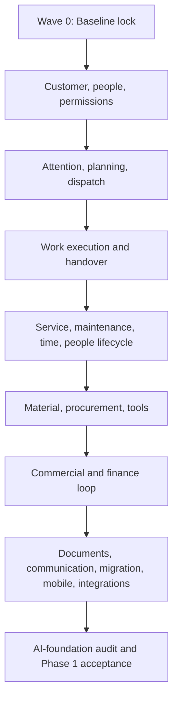

# Phase 1 Build Roadmap

Status: living — last reviewed 2026-09-03; the hot Phase 1 entry file, always read it fully

This is the living execution roadmap for building WerkFlow's **complete operational core**. It translates the durable product direction in [`product-capability-map.md`](../../product/product-capability-map.md) and the requirements in `docs/features/` into an ordered set of bounded vertical slices.

This file answers the implementation questions that the capability map intentionally does not:

1. What should be built next?
2. Which capabilities must exist before a slice starts?
3. Which feature owns each business rule?
4. What evidence is required before a slice is complete?
5. Which end-to-end scenarios must still work after related slices land?
6. How should agents keep the roadmap and feature documentation current?

This is a **living implementation index**, not a substitute for feature specifications, technical design, issue tracking, or acceptance evidence. Later slices may be split as discovery reveals safer boundaries, but their outcome, prerequisites, and coverage must not disappear silently.

> **Roadmap established:** 4 August 2026  
> **Current phase:** Phase 1 — Complete Operational Core  
> **Formally accepted roadmap slices:** 26 of 56 (`P1-00` and `P1-00a` through `P1-54`)  
> **Phase 2 implementation:** Not authorized by this roadmap
>
> The current position lives in the **Current Checkpoint** table below — one home, updated on every status change.

This entry file stays small and must always be read fully. The rest of the Phase 1 set lives beside it:

- [protocol.md](protocol.md) — the durable execution protocol: authority order, required reading, vocabulary, status model, execution checklists, invariants, templates, update protocol, acceptance rules.
- [gates.md](gates.md) — golden scenario gate definitions `GG-00` through `GG-16` and run-record requirements.
- [coverage.md](coverage.md) — starting-foundation snapshot and feature-to-slice routing matrices.
- [log.md](log.md) — the append-only progress log.
- `slices/` — one record per accepted slice; the canonical home for acceptance evidence.

## Current Checkpoint

The current app already has meaningful foundations in organizations and roles, customers, jobs/projects, calendar, time tracking, document management, and Inventory V1. Those foundations predate this roadmap and are summarized in the feature documents' **Current Product Baseline** sections.

They do not make later roadmap slices complete automatically. `P1-00` verified the baseline against code, generated types, live Supabase state, and regression tests (accepted 2026-08-04; see [slices/p1-00-baseline-lock.md](slices/p1-00-baseline-lock.md)). The table below carries the current position.

| Field                        | Current value                                                                                                                                                                                                                                                                 |
| ---------------------------- | ----------------------------------------------------------------------------------------------------------------------------------------------------------------------------------------------------------------------------------------------------------------------------- |
| Active slice                 | None; Wave 2 closed with `P1-24` on 2026-09-02                                                                                                                                                                                                                                                |
| Task / branch owner          | Codex on local `main`, publishing only to `partner-preview`                                                                                                                                                                                                                   |
| Slice gate                   | None (no active slice)                                                                                                                                                                                        |
| Next slice                   | `P1-25` — inventory catalog and supplier master data                                                                                                                                                                                                                              |
| Other ready slices           | None; `P1-26` through `P1-34` still have incomplete prerequisites                                                                                                                                                                                             |
| Current implementation wave  | Between waves: Wave 2 slices are all accepted, Wave 3 has not started                                                                                                                                                                                                                                                         |
| Latest completed golden gate | `GG-07`: focused rerun 8/8 (`2026-09-02T142023379Z-4453e4`) and complete local Golden 142/142 (`2026-09-02T142405848Z-0f71ea`) on source fingerprint `b0be4201…7c4e`, 2026-09-02 ([golden-gate-log.md](../golden-gate-log.md))                                      |
| Latest platform proof        | P1-24 accepted 2026-09-02: final focused audit 2/2 (`2026-09-02T141923283Z-ef7516`), focused P1-24 Golden 4/4 (`2026-09-02T142239588Z-b1f4bc`), `GG-07` 8/8, affected Wave 1 A1/A3/A4/A5 43/43, full local Golden 142/142 and DEV canary 9/9 (`2026-09-02T145603394Z-e62632`); closing fingerprint `b0be4201…7c4e` |
| Known execution blocker      | The Wave 2 wave-end certification gate (full local Golden and full audit battery on one build, catalog-to-ledger set equality, cloud battery per decision 0006 D11) has not been run or recorded; see [wave-2-audit.md](../wave-2-audit.md)                                                                                                                                                                                                                                                                          |
| Last roadmap review          | 3 September 2026                                                                                                                                                                                                                                                               |

Agents must update this table whenever a slice enters `in_progress`, `verification`, `complete`, or `decision_blocked`.

## Dependency Overview

The detailed master index controls; this diagram shows the main dependency spine.

Some independent slices may run in parallel after `P1-00`, but only when their direct dependencies are complete and they do not modify the same ownership boundary, schema, permission vocabulary, or shared UI primitive without explicit coordination.

## Master Slice Index

The dependency column lists direct prerequisites. All transitive prerequisites also apply.

### Wave 0 — Baseline And Execution Control

| ID       | Status     | Bounded outcome                                                                                                                                                                                                                                                                                                                                                                                                                                          | Direct dependencies | Primary / connected specs                                                                                  | Exit evidence and gate                                                                                          |
| -------- | ---------- | -------------------------------------------------------------------------------------------------------------------------------------------------------------------------------------------------------------------------------------------------------------------------------------------------------------------------------------------------------------------------------------------------------------------------------------------------------- | ------------------- | ---------------------------------------------------------------------------------------------------------- | --------------------------------------------------------------------------------------------------------------- |
| `P1-00`  | `complete` | Lock the documentation baseline, verify every current feature baseline against code/generated types/live Supabase, establish regression coverage, and record the first accepted implementation checkpoint. Includes the infrastructure hygiene items from [decision 0001](../../decisions/0001-infrastructure-stack.md): regenerate stale Supabase types, reconcile Realtime subscriptions with published tables, verify/pin the Vercel Frankfurt region | None                | All feature specs; technical architecture/data model                                                       | **Accepted `complete` 2026-08-04.** Full acceptance evidence: [P1-00 record](slices/p1-00-baseline-lock.md)     |
| `P1-00a` | `complete` | Migrate file bytes to Cloudflare R2 (EU) behind a provider-neutral storage interface with direct signed uploads/downloads, fixing the current production failure where Server-Action-buffered uploads exceed Vercel's ~4.5 MB body limit. Migrate existing objects, keep Postgres as the metadata source of truth                                                                                                                                        | `P1-00`             | Document management; technical architecture; [decision 0001](../../decisions/0001-infrastructure-stack.md) | **Accepted `complete` 2026-08-04.** Full acceptance evidence: [P1-00a record](slices/p1-00a-r2-file-storage.md) |

### Wave 1 — Customer, People, Planning, And Shared Coordination

| ID      | Status     | Bounded outcome                                                                                                                                                                                                             | Direct dependencies                | Primary / connected specs                                   | Exit evidence and gate                                                                                                       |
| ------- | ---------- | --------------------------------------------------------------------------------------------------------------------------------------------------------------------------------------------------------------------------- | ---------------------------------- | ----------------------------------------------------------- | ---------------------------------------------------------------------------------------------------------------------------- |
| `P1-01` | `complete` | Admin/Büro can maintain stable customer identity/classification, customer numbers, multiple contacts, address purposes, and durable work sites; work references the correct site/contact without duplicate customer records | `P1-00`                            | Customers/CRM; jobs; calendar; documents                    | **Accepted `complete` 2026-08-04.** Full acceptance evidence: [P1-01 record](slices/p1-01-customer-contacts-and-sites.md)    |
| `P1-02` | `complete` | Admin/Büro can capture an operational request and deliberately convert it into a job/project without re-entering customer, contact, site, summary, urgency, attachments, or commitments                                     | `P1-00a`, `P1-01`                  | Customers/CRM; jobs; calendar; documents                    | **Accepted `complete` 2026-08-05.** Full acceptance evidence: [P1-02 record](slices/p1-02-client-requests.md)                |
| `P1-03` | `complete` | Admin/Büro can maintain a stable employee/personnel identity with date-effective employment conditions without changing historical work/time meaning                                                                        | `P1-00`                            | Employee management; time; documents                        | **Accepted `complete` 2026-08-05.** Full acceptance evidence: [P1-03 record](slices/p1-03-employee-records.md)               |
| `P1-04` | `complete` | Authorized users can define date-effective work schedules and regional holiday/closure context; calendar capacity and time targets use them instead of a fixed eight-hour assumption                                        | `P1-03`                            | Employee management; calendar; time                         | **Accepted `complete` 2026-08-05.** Full acceptance evidence: [P1-04 record](slices/p1-04-work-schedules-and-holidays.md)    |
| `P1-05` | `complete` | Default roles gain clear scoped responsibilities, approvers, substitutes, and date-effective delegation without exposing a generic unsafe role builder                                                                      | `P1-03`                            | Employee management; time; calendar; all approval consumers | **Accepted `complete` 2026-08-06.** Full acceptance evidence: [P1-05 record](slices/p1-05-scoped-responsibilities.md)        |
| `P1-06` | `complete` | Employees can request/withdraw vacation; authorized approvers can decide it; approved absence updates entitlement, availability, calendar conflicts, target time, and history consistently                                  | `P1-04`, `P1-05`                   | Employee management; calendar; time                         | **Accepted `complete` 2026-08-06.** Full acceptance evidence: [P1-06 record](slices/p1-06-vacation.md)                       |
| `P1-07` | `complete` | WerkFlow provides one role-aware task, approval, notification, failure, and exception pattern first used by requests and leave instead of separate inboxes per feature                                                      | `P1-02`, `P1-05`, `P1-06`          | AI foundations; employee; CRM; time; jobs                   | **Accepted `complete` 2026-08-07.** Full acceptance evidence: [P1-07 record](slices/p1-07-attention-pattern.md)              |
| `P1-08` | `complete` | Employees can report sickness/privacy-sensitive absence; authorized users manage evidence and operational availability without exposing diagnosis or unnecessary detail                                                     | `P1-04`, `P1-05`, `P1-07`          | Employee management; time; calendar; documents              | **Accepted `complete` 2026-08-08.** Full acceptance evidence: [P1-08 record](slices/p1-08-sickness.md)                       |
| `P1-09` | `complete` | Authorized users can maintain teams, skills, certifications, validity, evidence, and operational eligibility; planning can explain qualification coverage                                                                   | `P1-03`, `P1-05`                   | Employee management; calendar; jobs; documents              | **Accepted `complete` 2026-08-09.** Full acceptance evidence: [P1-09 record](slices/p1-09-teams-and-qualifications.md)       |
| `P1-10` | `complete` | Office users get a customer relationship timeline with owned manual follow-ups and communication preferences that points to source records rather than duplicating them                                                     | `P1-01`, `P1-02`, `P1-07`          | Customers/CRM; jobs; documents; communications contract     | **Accepted `complete` 2026-08-10.** Full acceptance evidence: [P1-10 record](slices/p1-10-customer-relationship-timeline.md) |
| `P1-11` | `complete` | Planners can create recurring, multi-day, and multi-visit work/internal entries using employee schedules, absence, skills, teams, and capacity with understandable series exceptions                                        | `P1-04`, `P1-06`, `P1-08`, `P1-09` | Calendar; employee; jobs; service                           | **Accepted `complete` 2026-08-13.** Full acceptance evidence: [P1-11 record](slices/p1-11-planning-occurrences.md)           |
| `P1-12` | `complete` | Office users can dispatch scheduled/unscheduled work, batch reschedule, evaluate site/travel feasibility and available readiness signals, track acknowledgement, and distinguish internal plans from customer commitments   | `P1-02`, `P1-07`, `P1-11`          | Calendar; jobs; CRM; employee; inventory                    | **Accepted `complete` 2026-08-14.** Full acceptance evidence: [P1-12 record](slices/p1-12-dispatch.md)                       |

### Wave 2 — Work Execution, Service, Time, And People Lifecycle

| ID      | Status     | Bounded outcome                                                                                                                                                                                                                                         | Direct dependencies                         | Primary / connected specs                             | Exit evidence and gate                                                                                                                                           |
| ------- | ---------- | ------------------------------------------------------------------------------------------------------------------------------------------------------------------------------------------------------------------------------------------------------- | ------------------------------------------- | ----------------------------------------------------- | ---------------------------------------------------------------------------------------------------------------------------------------------------------------- |
| `P1-13` | `complete` | Organizations can create versioned SHK work templates that produce editable job/project tasks, checklists, required evidence, planned roles/material, and dependencies without committing stock or schedule                                             | `P1-02`, `P1-07`                            | Jobs/projects; documents; inventory; calendar         | **Accepted `complete` 2026-08-23.** Full acceptance evidence: [P1-13 record](slices/p1-13-work-templates.md)                                                     |
| `P1-14` | `complete` | Work exposes clear planned/ready/in-progress/interrupted/blocked/execution-complete/handover/cancelled states, blockers, owners, dependencies, and readiness gates                                                                                      | `P1-09`, `P1-11`, `P1-12`, `P1-13`          | Jobs/projects; calendar; inventory; documents         | **Accepted `complete` 2026-08-23.** Full acceptance evidence: [P1-14 record](slices/p1-14-work-lifecycle.md)                                                     |
| `P1-15` | `complete` | Field/office users can create structured site diaries, reports, measurements, defects, change-work evidence, approvals, and signatures linked to exact artifact versions                                                                                | `P1-07`, `P1-13`, `P1-14`                   | Jobs/projects; documents; commercial; service         | **Accepted `complete` 2026-08-24.** Full acceptance evidence: [P1-15 record](slices/p1-15-structured-site-evidence.md) |
| `P1-16` | `complete` | Assigned field workers receive one focused work pack and can execute tasks, capture progress/evidence, time/material context, and unresolved issues without office-only clutter                                                                         | `P1-01`, `P1-13`, `P1-14`, `P1-15`          | Jobs/projects; time; inventory; documents; calendar   | **Accepted `complete` 2026-08-25.** Full acceptance evidence: [P1-16 record](slices/p1-16-field-work-pack.md)                                                    |
| `P1-17` | `complete` | Field execution can become office-reviewed handover/commercial readiness with missing-item gates, customer-visible package, reasoned override, and traceable reopening                                                                                  | `P1-14`, `P1-15`, `P1-16`                   | Jobs/projects; documents; inventory; time; commercial | **Accepted `complete` 2026-08-28.** Full acceptance evidence: [P1-17 record](slices/p1-17-office-handover.md); `GG-04` passed                                    |
| `P1-18` | `complete` | Customer sites can hold installed equipment/components, identifiers, documents, warranty/commissioning data, installation origin, lifecycle state, and searchable service history                                                                       | `P1-01`, `P1-15`, `P1-17`                   | Service/maintenance; CRM; jobs; documents             | **Accepted complete 2026-08-29.** Full evidence: [P1-18 record](slices/p1-18-installed-equipment.md); no named Golden gate; dedicated `@P1-18` spec              |
| `P1-19` | `complete` | Office users can triage reactive service/warranty demand against customer, site, equipment, contract/charge context and dispatch a field-ready service visit                                                                                         | `P1-02`, `P1-12`, `P1-16`, `P1-18`          | Service/maintenance; CRM; jobs; calendar; inventory   | **Accepted `complete` 2026-08-30.** Full evidence: [P1-19 record](slices/p1-19-reactive-service.md); `GG-05` passed                                                                       |
| `P1-20` | `complete` | Authorized users can define maintenance plans and operational contract coverage that generate understandable due work, exceptions, visit evidence, next due dates, and renewal-risk signals                                                          | `P1-11`, `P1-18`, `P1-19`                   | Service/maintenance; calendar; commercial; jobs       | **Accepted `complete` 2026-08-31.** Full evidence: [P1-20 record](slices/p1-20-maintenance-plans.md); `GG-06` passed                       |
| `P1-21` | `complete` | Employees can capture and switch explicit work, travel, break, standby/on-call, call-out, and internal activity segments with job allocation and recoverable sequence validation                                                                     | `P1-04`, `P1-12`, `P1-16`                   | Time tracking; employee; jobs; calendar               | **Accepted complete 2026-09-01.** All 64 flows fully evidenced; local audit 117/117 and Golden 132/132. [Slice record](slices/p1-21-time-segments.md)              |
| `P1-22` | `complete` | Employees and managers can use one consistent correction/request/approval flow with before/after preview, four-eyes rules, withdrawal, delegation, and provisional totals                                                                            | `P1-07`, `P1-21`                            | Time tracking; employee; calendar                     | **Accepted complete 2026-09-01.** All 50 flows fully evidenced; full Golden 134/134 and DEV canary 9/9. [Slice record](slices/p1-22-time-corrections-and-approvals.md)  |
| `P1-23` | `complete` | Time accounts, overtime/supplement classifications, compliance warnings, exception review, period close, payroll-ready export, and correction/re-export are understandable and versioned                                                             | `P1-04`, `P1-06`, `P1-08`, `P1-21`, `P1-22` | Time tracking; employee; commercial                   | **Accepted `complete` 2026-09-01.** Full acceptance evidence: [P1-23 record](slices/p1-23-time-accounts-period-close-and-payroll-export.md); `GG-07` passed |
| `P1-24` | `complete` | Protected personnel documents, requirements, acknowledgements, onboarding templates, access activation, employment transitions, and offboarding responsibilities form one controlled people lifecycle; physical asset-return closure follows in `P1-33` | `P1-03`, `P1-05`, `P1-07`, `P1-09`, `P1-23` | Employee management; documents; time; jobs            | **Accepted `complete` 2026-09-02.** Full acceptance evidence: [P1-24 record](slices/p1-24-controlled-people-lifecycle.md) |

### Wave 3 — Material, Procurement, Inventory Control, And Assets

| ID      | Status    | Bounded outcome                                                                                                                                                                                 | Direct dependencies                         | Primary / connected specs                             | Exit evidence and gate                                                                                                                                                                                                                                                                                                                                                                                                                                                                                              |
| ------- | --------- | ----------------------------------------------------------------------------------------------------------------------------------------------------------------------------------------------- | ------------------------------------------- | ----------------------------------------------------- | ------------------------------------------------------------------------------------------------------------------------------------------------------------------------------------------------------------------------------------------------------------------------------------------------------------------------------------------------------------------------------------------------------------------------------------------------------------------------------------------------------------------- |
| `P1-25` | `ready`   | Office users can maintain catalog/supplier master data with multiple supplier references, pack/unit conversions, alternatives, versioned costs/prices, import updates, and historical snapshots | `P1-17`, `P1-20`, `P1-23`                   | Inventory; commercial; documents                      | Import/reconciliation, unit conversion, stale price, archive/successor, and history tests pass                                                                                                                                                                                                                                                                                                                                                                                                                      |
| `P1-26` | `planned` | Planners can approve and reserve complete/partial stock for job/project demand, release/reallocate it, and see availability/shortage/readiness without changing physical stock                  | `P1-14`, `P1-25`                            | Inventory; jobs; calendar                             | Concurrent reservation, partial coverage, shortage, release, reallocation, and readiness tests pass                                                                                                                                                                                                                                                                                                                                                                                                                 |
| `P1-27` | `planned` | Field/office users can pick, take, consume/install, return, scrap/damage, correct, and review billable versus cost quantities with full attribution                                             | `P1-16`, `P1-17`, `P1-26`                   | Inventory; jobs; commercial; time                     | Partial/multi-location/unplanned/over-return/correction/warranty/goodwill cases pass; `GG-08` passes                                                                                                                                                                                                                                                                                                                                                                                                                |
| `P1-28` | `planned` | Users can perform paired immediate or in-transit transfers with source/destination custody, partial receipt, discrepancy, cancellation, and vehicle/location visibility                         | `P1-25`, `P1-26`, `P1-27`                   | Inventory; calendar; employee                         | Atomic paired effects, in-transit availability, loss/correction, and audit tests pass                                                                                                                                                                                                                                                                                                                                                                                                                               |
| `P1-29` | `planned` | Office users can consolidate shortages/reorder demand, compare suppliers, request approval, and create/revise purchase orders without duplicate buying                                          | `P1-07`, `P1-25`, `P1-26`, `P1-28`          | Inventory; jobs; commercial; documents                | Demand consolidation, pack/lead-time logic, approval, duplicate order, backorder, and manual fallback pass                                                                                                                                                                                                                                                                                                                                                                                                          |
| `P1-30` | `planned` | Office/warehouse users can receive partial/direct deliveries, record discrepancies, create stock only from confirmed receipt, and manage supplier returns/expected credit                       | `P1-29`                                     | Inventory; documents; commercial                      | Order-receipt-movement linkage, direct-to-job, damage/short/excess/substitute/reject/return cases pass; `GG-09` passes                                                                                                                                                                                                                                                                                                                                                                                              |
| `P1-31` | `planned` | Authorized users can run full/cycle/spot counts, review discrepancies, correct stock audibly, and view operational valuation/slow-moving/waste/variance insights                                | `P1-25`, `P1-28`, `P1-30`                   | Inventory; commercial                                 | Blind/assigned/paused/second counts, movement-during-count policy, approval, snapshot, and drill-down pass                                                                                                                                                                                                                                                                                                                                                                                                          |
| `P1-32` | `planned` | Individually tracked tools/assets support identification, custody, job allocation, return, condition, maintenance/inspection, loss, and retirement                                              | `P1-09`, `P1-24`, `P1-25`, `P1-28`          | Inventory; employee; jobs; documents; calendar        | Chain of custody, unsafe/inspection-due, reassignment, loss, documents, and history tests pass                                                                                                                                                                                                                                                                                                                                                                                                                      |
| `P1-33` | `planned` | Employee offboarding completes outstanding time/leave, work/approval reassignment, access revocation, asset/tool/vehicle return, exports, and retained historical identity                      | `P1-23`, `P1-24`, `P1-32`                   | Employee management; inventory; time; jobs; documents | Planned/immediate/reversed exit, later correction, asset exception, last-admin, and history tests pass. **Known baseline defect this slice MUST fix** (Wave 1 audit `A1-07`, owner-deferred here 2026-08-15): destructive member removal today auto-clocks the person out and then **hard-deletes their entire organization time-entry history** — P1-33 replaces this with retained (or explicitly anonymized) history per its retained-historical-identity outcome; its history tests must cover the removal path |
| `P1-34` | `planned` | Manual and barcode/QR inventory actions share one domain path; supported wholesale master/transaction standards have explicit versions, directions, errors, and fallback                        | `P1-25`, `P1-29`, `P1-30`, `P1-31`, `P1-32` | Inventory; integrations; documents                    | Identifier collision, label, scan parity, DATANORM/IDS/UGL/Open Masterdata/SHK Connect scoped acceptance, fallback, and export tests pass; `GG-10` passes                                                                                                                                                                                                                                                                                                                                                           |

### Wave 4 — Commercial And Finance Loop

| ID      | Status    | Bounded outcome                                                                                                                                                                                                    | Direct dependencies                                  | Primary / connected specs                            | Exit evidence and gate                                                                                                                          |
| ------- | --------- | ------------------------------------------------------------------------------------------------------------------------------------------------------------------------------------------------------------------ | ---------------------------------------------------- | ---------------------------------------------------- | ----------------------------------------------------------------------------------------------------------------------------------------------- |
| `P1-35` | `planned` | Authorized office users can maintain versioned labor/service/material/commercial positions, rate cards, cost/price/tax/markup/discount logic, templates, and margin controls                                       | `P1-23`, `P1-25`, `P1-31`                            | Commercial/finance; inventory; employee              | Inventory link without conflation, effective prices, net/gross/rounding, approval threshold, and history tests pass                             |
| `P1-36` | `planned` | Office users can calculate, version, preview, deliver, revise, expire, and record acceptance/rejection/partial acceptance of structured offers                                                                     | `P1-01`, `P1-02`, `P1-07`, `P1-35`                   | Commercial/finance; CRM; documents; jobs             | Customer-facing/internal separation, exact version acceptance, options, delivery evidence, supersession, and audit pass                         |
| `P1-37` | `planned` | Accepted scope becomes an immutable order/contract baseline; approved/rejected change orders preserve scope, price, schedule, evidence, and deliberate operational handoff                                         | `P1-13`, `P1-15`, `P1-17`, `P1-36`                   | Commercial/finance; jobs; inventory; calendar        | Original-plus-change view, unapproved work warning, customer evidence, and no-silent-work mutation pass; `GG-11` passes                         |
| `P1-38` | `planned` | Office users can reconcile contract positions, measurements, approved time/travel, net material, external cost, previous billing, and exceptions into a reviewed billable-work set                                 | `P1-17`, `P1-23`, `P1-27`, `P1-30`, `P1-37`          | Commercial/finance; jobs; time; inventory; service   | Source drill-down, quantity/unit/price/tax, partial/cumulative, warranty/goodwill/rework/dispute, and approval pass                             |
| `P1-39` | `planned` | Authorized users can create, check, issue, send, correct/credit, and track standard/deposit/partial/cumulative/final invoices with controlled number ranges and immutable issued content                           | `P1-07`, `P1-38`                                     | Commercial/finance; CRM; documents                   | Recipient/performance/tax/total preview, uniqueness, correction chain, delivery evidence, payment-state boundary, and audit pass                |
| `P1-40` | `planned` | WerkFlow can generate/import/validate the explicitly supported XRechnung and ZUGFeRD profiles while preserving exact files, validation results, readable preview, and fallback                                     | `P1-39`                                              | Commercial/finance; documents; integrations          | Version/profile conformance fixtures, invalid input, original/generated relation, delivery failure, and fallback pass; `GG-12` passes           |
| `P1-41` | `planned` | Incoming bills and employee expenses can be captured, duplicate-checked, matched/allocated to PO/receipt/job/cost, reviewed, disputed, credited, and made accounting-ready without creating stock/payment silently | `P1-07`, `P1-30`, `P1-35`, `P1-40`                   | Commercial/finance; inventory; documents; employee   | Duplicate, no-order, partial/variance, split allocation, tax/source-vs-approved, expense, and approval cases pass                               |
| `P1-42` | `planned` | Authorized office users can manage open items, import/connect bank transactions, propose/review/reverse payment allocations, handle partial/combined/overpayments, and run controlled dunning                      | `P1-39`, `P1-41`                                     | Commercial/finance; CRM; communications; documents   | Ambiguous matching, reversible allocation, dispute/hold, reminder preview/delivery, aging, and audit pass                                       |
| `P1-43` | `planned` | Owners/office users can inspect source-linked job/project/service post-calculation and export versioned accountant-ready records with mapping preflight, control totals, rejection, correction, and re-export      | `P1-23`, `P1-31`, `P1-38`, `P1-39`, `P1-41`, `P1-42` | Commercial/finance; jobs; inventory; time; documents | Planned/actual revenue/labor/material/external cost, variance drill-down, missing-source warnings, export/reject/re-export pass; `GG-13` passes |

### Wave 5 — Evidence, Communication, Portability, Mobile, And Interoperability

| ID      | Status    | Bounded outcome                                                                                                                                                                                                                                                                                                                                                                                               | Direct dependencies                                                             | Primary / connected specs                                               | Exit evidence and gate                                                                                                                                                       |
| ------- | --------- | ------------------------------------------------------------------------------------------------------------------------------------------------------------------------------------------------------------------------------------------------------------------------------------------------------------------------------------------------------------------------------------------------------------- | ------------------------------------------------------------------------------- | ----------------------------------------------------------------------- | ---------------------------------------------------------------------------------------------------------------------------------------------------------------------------- |
| `P1-44` | `planned` | Documents enter through supported web/share/email/integration paths and a reusable capture contract with duplicate/version review, processing state, thumbnails, OCR/full-text search, and metadata smart views; mobile camera delivery follows in `P1-49`. OCR/thumbnail/indexing processing is the expected first Railway worker workload per [decision 0001](../../decisions/0001-infrastructure-stack.md) | `P1-15`, `P1-18`, `P1-30`, `P1-39`, `P1-41`                                     | Documents; CRM; jobs; service; commercial; inventory                    | Failed/retry/duplicate/version/OCR/index/search/performance cases pass; extracted data remains untrusted until review                                                        |
| `P1-45` | `planned` | Document review, replacement/supersession, retention/legal-hold controls, granular personnel/finance access, approved sharing, revocation, and organization export preserve files, versions, links, and audit. Includes designing the independent immutable retention archive (S3 Object Lock, per-category German retention periods) per [decision 0001](../../decisions/0001-infrastructure-stack.md)       | `P1-07`, `P1-15`, `P1-24`, `P1-39`, `P1-44`                                     | Documents; employee; commercial; technical security                     | Permission matrix, external revocation/expiry, deletion block, restore, export/re-import integrity, and no compliance-overclaim pass                                         |
| `P1-46` | `planned` | Office users can log inbound interactions and send reviewed appointment, delay, completion, report, offer, invoice, reminder, and follow-up messages through selected channels with recipient preference, delivery state, failure, and audit                                                                                                                                                                  | `P1-10`, `P1-12`, `P1-17`, `P1-19`, `P1-36`, `P1-39`, `P1-42`, `P1-45`          | CRM; calendar; jobs; service; commercial; documents                     | Manual-note-vs-delivery distinction, preference/consent, template preview, retry/deduplication, wrong-recipient prevention, and audit pass; `GG-14` passes                   |
| `P1-47` | `planned` | Assisted/self-service migration, duplicate review, archive/deletion/anonymization, and usable export work coherently across customer/contact/site, employee, work, inventory, supplier, commercial, and document records                                                                                                                                                                                      | `P1-33`, `P1-34`, `P1-43`, `P1-45`                                              | All operational specs; data model                                       | Preview, stable identifiers, created/matched/updated/skipped/invalid report, reconciliation, rollback/recovery, archive constraints, and relationship-preserving export pass |
| `P1-48` | `planned` | Role-aware global search, navigation, saved views, dashboards, and one action/exception cockpit let users find customers, sites, work, equipment, people, items, documents, commercial records, and owned next actions                                                                                                                                                                                        | `P1-07`, `P1-10`, `P1-14`, `P1-17`, `P1-20`, `P1-23`, `P1-31`, `P1-43`, `P1-44` | Capability map cross-cutting foundations; all primary specs             | Permission-aware results, source deep links, action ownership, deduplication, realistic-volume response, and no second source of truth pass                                  |
| `P1-49` | `planned` | One role-aware employee mobile shell supports assigned schedule/work, time, absence, documents/photos/forms, service equipment, and inventory actions with workflow-specific offline queues and visible sync/recovery                                                                                                                                                                                         | `P1-12`, `P1-16`, `P1-19`, `P1-21`, `P1-27`, `P1-32`, `P1-44`, `P1-46`          | Jobs; calendar; time; employee; documents; inventory; service           | Fresh install/offline/restart/reconnect/conflict/reassignment/period-close/attachment/duplicate-action and low-connectivity field tests pass                                 |
| `P1-50` | `planned` | Approved calendar, accounting, wholesale, messaging, and other connectors have explicit ownership, scopes, versions, credentials, sync, deduplication, retry, revocation, support, and manual fallback                                                                                                                                                                                                        | `P1-34`, `P1-40`, `P1-43`, `P1-46`, `P1-49`                                     | Calendar; inventory; commercial; AI foundations; technical architecture | Connector-specific contract and sandbox/fixture tests, revoked credential, partial failure, replay, duplicate, offboarding, and fallback pass                                |
| `P1-51` | `planned` | The complete operational graph is hardened for realistic organization size, concurrent use, privacy/security, audit volume, caching/Realtime correctness, backup/recovery, observability, and supportable failure handling                                                                                                                                                                                    | `P1-45`, `P1-47`, `P1-48`, `P1-49`, `P1-50`                                     | Technical docs; all feature specs                                       | Load/volume profile, permission/RLS suite, concurrency, cache freshness, recovery exercise, PII-safe logs, export, and failure ownership pass                                |
| `P1-52` | `planned` | Customers can adopt and leave WerkFlow through clear setup, permission configuration, data validation, workshops, video learning, contextual help, support/escalation, packaging boundaries, and data exit                                                                                                                                                                                                    | `P1-47`, `P1-49`, `P1-50`, `P1-51`                                              | Product offer; acquisition/avatar; all feature onboarding sections      | Representative onboarding rehearsal, training coverage, support handoff, scenario pricing/entitlement clarity, and complete exit rehearsal pass; `GG-15` passes              |

### Wave 6 — Phase 1 Closure And Phase 2 Readiness

| ID      | Status    | Bounded outcome                                                                                                                                                                                                                       | Direct dependencies                                  | Primary / connected specs                                   | Exit evidence and gate                                                                                                                      |
| ------- | --------- | ------------------------------------------------------------------------------------------------------------------------------------------------------------------------------------------------------------------------------------- | ---------------------------------------------------- | ----------------------------------------------------------- | ------------------------------------------------------------------------------------------------------------------------------------------- |
| `P1-53` | `planned` | Every stable Phase 1 domain exposes understandable events and validated product actions with organization/role checks, idempotency, preview/draft, audit, source visibility, correction, and failure ownership                        | `P1-07`, `P1-43`, `P1-45`, `P1-46`, `P1-50`, `P1-51` | AI automations; all owning features; technical architecture | Event/action inventory, permission matrix, replay/idempotency, source/audit, failure/recovery, and no-Phase-2 behavior audit pass           |
| `P1-54` | `planned` | Phase 1 is accepted as one coherent product through all golden scenarios, open-decision review, documentation reconciliation, migration/exit evidence, performance/security review, and explicit deferral of remaining decision gates | `P1-52`, `P1-53` and every prior slice               | Capability map; all feature/product/technical docs          | Every required golden gate passes on the release candidate; no critical unresolved issue; Phase 1 acceptance record created; `GG-16` passes |
