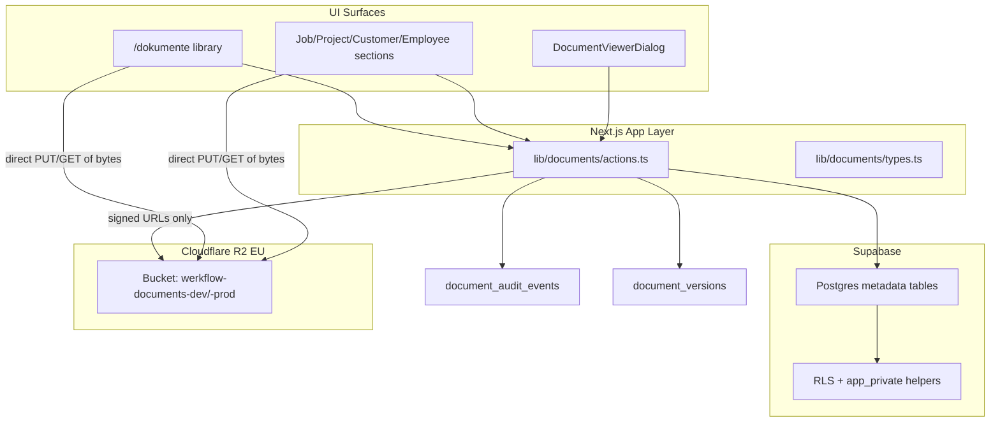

# Document Storage And Access

Status: living — last reviewed 2026-09-03

This is the implementation reference for WerkFlow's document system: where bytes and metadata live, how the signed upload and download flow works, how authorization splits between server actions and RLS, which operations exist and what they change, the audit vocabulary, the Realtime and caching contract, and the code map. What users can do, the role split in product terms, planned scope, and open decisions live in the feature spec [document-management.md](../features/document-management.md). For exact schema details, prefer live Supabase inspection and `lib/supabase/database.types.ts` over this file.

## Storage Model



Postgres holds organization, folder structure, links, categories, trash state, versions, and audit events. Cloudflare R2 holds bytes. The two are joined by immutable storage paths on document and version rows. File bytes never pass through server compute: server actions authorize and sign URLs, and the browser transfers bytes directly through `lib/storage/r2.ts`. The provider choice and the reasons for it are [decision 0001](../decisions/0001-infrastructure-stack.md); the runtime placement is in [architecture.md](architecture.md).

- **Provider:** Cloudflare R2, EU jurisdiction, private bucket selected via `R2_BUCKET_NAME`. Since the 2026-08-18 environment split ([decision 0003](../decisions/0003-dev-prod-environment-split.md)), each database has its own bucket: the production database pairs with `werkflow-documents-prod`, and the dev database, which serves local dev and the test harness, pairs with `werkflow-documents-dev`. Metadata rows and bytes always live in the same environment. `documents.storage_bucket` keeps the logical value `organization-documents`; the physical bucket comes from the environment. Project IDs and the tool-access matrix live in [environments.md](environments.md).
- **Path pattern:** `{organizationId}/{documentId}/{sanitizedFileName}`
- **Version path pattern:** `{organizationId}/{documentId}/versions/{versionNumber}-{sanitizedFileName}`
- **Environment variables:** `R2_ACCOUNT_ID`, `R2_ACCESS_KEY_ID`, `R2_SECRET_ACCESS_KEY`, `R2_BUCKET_NAME` (plus optional `R2_JURISDICTION`, default `eu`).
- **Bucket CORS** must allow `GET`, `PUT`, `HEAD` with the `content-type` header from the app origins (see `scripts/setup-r2-cors.ts`; applying it needs a bucket-admin token or the dashboard, the runtime object token deliberately cannot change bucket settings).
- Orphaned uploads (PUT succeeded, finalize never ran) are invisible to users and are reconciled through the storage-cleanup report, which lists R2 objects against metadata.

### Immutable storage paths

When a document is uploaded, its storage path is tied to `documentId` and does not change when the user renames the display name or moves the document between folders.

**Why:** Renames and folder moves stay cheap metadata updates. Avoids broken links, race conditions, and expensive storage copy/delete cycles.

**Upsides:** Fast rename/move; simpler audit; safer concurrent edits.

**Downsides:** Display names can diverge from stored filenames; orphaned paths possible if metadata gets out of sync (mitigated by the cleanup report).

### Signed URL access

Access uses short-lived signed URLs:

- View URLs: inline preview, no forced download.
- Download URLs: include the download filename.

### Migration history

File bytes moved from Supabase Storage to R2 with direct uploads in [P1-00a](../plans/phase-1/slices/p1-00a-r2-file-storage.md) on 2026-08-04. All pre-existing objects were copied to R2 under unchanged paths and verified; the old Supabase `organization-documents` bucket is retained untouched as a temporary fallback and can be emptied once the R2 path has proven itself in production. Retention-relevant categories will additionally get copies in an independent immutable archive; the product direction is in the spec's Governance section, the infrastructure decision in [decision 0001](../decisions/0001-infrastructure-stack.md).

## Signed Upload And Download Flow

- **Upload flow (direct, two-phase):** `createDocumentUploadTicket` authorizes (user, organization, target, folder) and returns a document id plus a short-lived signed PUT URL with the content type pinned into the signature. The browser PUTs the bytes directly to R2. `finalizeDocumentUpload` re-authorizes, recomputes the storage path server-side (a client can never register a foreign key), verifies the object via HEAD (existence, size limit, content type), then inserts metadata, links, and audit events. Failed finalizes delete the uploaded object. Versions use the same pattern with a version-number conflict check.
- **Client side:** uploads go directly from the browser to R2 via `lib/documents/upload-client.ts` (ticket → XHR PUT with real progress → finalize); file bytes never pass through Server Actions, so no body-size workaround exists or is needed.
- **Size limit:** 50 MB (`DOCUMENT_MAX_FILE_SIZE_BYTES`), enforced at ticket creation and re-verified against the actual object size at finalize.
- **Contextual uploads from the field work pack** retain completed files across the metadata step, synchronize renames, and expire abandoned retained uploads after 60 seconds ([P1-16](../plans/phase-1/slices/p1-16-field-work-pack.md)).
- **Protected personnel upload:** `createPersonnelDocumentUploadTicket` and `finalizePersonnelDocumentUpload` reuse the same signed PUT, HEAD verification, bucket and path pattern ([P1-24](../plans/phase-1/slices/p1-24-controlled-people-lifecycle.md)). A short-lived signed cleanup capability binds actor, organization, personnel owner, document, filename, class and operation so a failed finalize can remove only its own orphan. The storage-cleanup report remains the recovery path for an interrupted browser that never returns.
- **Handover package rendering:** the server renders the deterministic customer-safe HTML file and uploads those bytes directly to the organization-scoped EU R2 path through the storage adapter; a guarded database RPC then registers document metadata, release facts and the lifecycle transition ([P1-17](../plans/phase-1/slices/p1-17-office-handover.md)). Source document bytes are referenced by exact identity, never copied. A failed post-upload registration deletes the object only after proving no committed document or release references it.

## Data Model

### Core tables

| Table                   | Purpose                                                                                                         |
| ----------------------- | --------------------------------------------------------------------------------------------------------------- |
| `document_folders`      | Manual folder tree per organization (`parent_folder_id`, soft-delete via `deleted_at`)                          |
| `documents`             | Current document metadata + latest file pointer                                                                 |
| `document_links`        | Links a document to exactly one of `client_id`, `employee_id`, `equipment_id`, `job_id`, `maintenance_coverage_id`, `project_id`, `request_id`, or `service_case_id` |
| `document_audit_events` | Append-only operational history                                                                                 |
| `document_versions`     | Previous file revisions for versioned business documents                                                        |
| `work_artifact_revision_documents` | Relates one exact work-artifact revision to a document as evidence, closure proof, signature mark or rendered export ([P1-15](../plans/phase-1/slices/p1-15-structured-site-evidence.md)) |
| `personnel_documents`   | Protected class, document type, evidence state, validity, and stable personnel owner ([P1-24](../plans/phase-1/slices/p1-24-controlled-people-lifecycle.md)) |
| `personnel_document_releases` | Exact document-version releases to the affected person, including revocation ([P1-24](../plans/phase-1/slices/p1-24-controlled-people-lifecycle.md)) |

### Important `documents` columns

- `folder_id`: optional manual library folder (independent of job/project/customer/employee).
- `category`: `photo`, `contract`, `invoice`, `offer`, `report`, `other`.
- `display_name`: user-facing name (may differ from original filename).
- `storage_path`: immutable storage object path for the current version.
- `current_version_number`: latest version counter (starts at 1).
- `deleted_at`, `deleted_by`, `delete_reason`: trash semantics.
- `copied_from_document_id`: lineage when copying in the library.

### Link model

`document_links` enforces exactly one target via check constraint, last widened in `supabase/migrations/20260830210613_integrate_p1_20_maintenance_documents.sql`:

```sql
constraint document_links_exactly_one_target_check check (
  num_nonnulls(
    job_id, project_id, client_id, employee_id, request_id,
    equipment_id, service_case_id, maintenance_coverage_id
  ) = 1
)
```

A document can have multiple links (e.g. linked to both a job and a project) by having multiple `document_links` rows. Each row still points to one target type. Links are metadata only. They do not move storage objects or change `folder_id`.

Link targets by owning slice:

- **Requests** ([P1-02](../plans/phase-1/slices/p1-02-client-requests.md)): uploading on a request detail creates a `request_id` link; converting the request adds a second link to the created job or project. Same file, no copies. Request-linked documents are manager-only, like the request surface itself. Attach-existing from the library targets jobs, projects, customers, and employees only.
- **Work-template evidence expectations** ([P1-13](../plans/phase-1/slices/p1-13-work-templates.md)): a template item may declare an expected evidence description and one existing document category. Application copies that expectation onto the work instruction item; it does not create a file, folder, document link, approval, artifact revision or signature.
- **Work-artifact revisions** ([P1-15](../plans/phase-1/slices/p1-15-structured-site-evidence.md)): an existing document can be deliberately related to one exact work-artifact revision as supporting evidence, closure proof, signature mark or rendered export. The structured record and the document metadata remain separate sources of truth connected by that relation; ordinary uploads never become evidence automatically. Instruction evidence is fulfilled only by an explicit document or artifact-revision relation and can be removed only with an attributable reason. Deterministic HTML exports retain the revision, renderer and content hash.
- **Handover packages** ([P1-17](../plans/phase-1/slices/p1-17-office-handover.md)): a release freezes document ID, version number and storage path for each selected source, renders one deterministic customer-safe UTF-8 HTML file into the organization-scoped EU R2 path, and registers it as an ordinary document linked to the exact target. Source bytes are neither copied nor exposed implicitly. Old package documents remain addressable across withdrawal and successor release.
- **Installed equipment** ([P1-18](../plans/phase-1/slices/p1-18-installed-equipment.md)): a document may link to one installed-equipment record. The link does not copy R2 bytes or grant an employee document access. Once an equipment-history event depends on that link, ordinary unlink and permanent document deletion are rejected so the immutable history cannot be erased; organization teardown remains a narrowly guarded exception.
- **Service cases** ([P1-19](../plans/phase-1/slices/p1-19-reactive-service.md)): a document may link to one reactive service case through the typed `DocumentUploadTarget` kind `service_case`. Existing files attach without copying bytes; direct uploads keep the private signed R2 path. The case link grants an assigned employee no document access; the employee still reaches only documents linked to the exact assigned job.
- **Maintenance coverage** ([P1-20](../plans/phase-1/slices/p1-20-maintenance-plans.md)): a document may link to one operational maintenance-coverage root through the same typed `DocumentUploadTarget`. The coverage link does not grant an assigned employee access to coverage terms, renewal dates, internal notes or the manager document library.
- **Protected personnel documents** ([P1-24](../plans/phase-1/slices/p1-24-controlled-people-lifecycle.md)): a protected personnel file is one existing `documents` row plus `personnel_documents` metadata keyed to `employee_records.id`. It is deliberately absent from `ordinary_documents`, cannot carry an ordinary `document_links` row or folder, and therefore supports a future starter without a login. Exact-version releases and acknowledgements let the affected employee access only expressly released content. Operational consumers receive status rather than bytes. Existing employee links were not reclassified.

The conceptual view of these domains is in [data-model.md](data-model.md).

## Permissions And RLS

Authorization is enforced at two layers:

1. **Server actions** in `lib/documents/actions.ts` (`requireManager`, `ensureJobAccess`, and similar helpers).
2. **Postgres RLS** using `app_private` helpers such as `is_document_manager` and `can_access_document`.

### Role behavior

| Action                                               | `admin` / `buero`                                  | `employee` (Handwerker/in)        |
| ---------------------------------------------------- | -------------------------------------------------- | --------------------------------- |
| View `/dokumente` library                            | Yes                                                | No (redirect)                     |
| Browse all org folders/files                         | Yes                                                | No                                |
| Upload to library folder                             | Yes                                                | No                                |
| Upload on assigned job page                          | Yes                                                | Yes (if assigned)                 |
| Upload on project/customer/employee page             | Yes                                                | No                                |
| View document on assigned job                        | Yes                                                | Yes                               |
| View document not linked to assigned job             | Yes                                                | No                                |
| Rename/move/copy/delete in library                   | Yes                                                | No                                |
| Attach existing doc to job/project/customer/employee | Yes                                                | No                                |
| Unlink from context                                  | Yes                                                | No                                |
| Trash restore / permanent delete                     | Yes                                                | No                                |
| Upload new version                                   | Yes                                                | No                                |
| View audit history / versions in details             | Yes (library)                                      | No (not exposed in contextual UI) |
| Storage cleanup helpers                              | Server-side maintenance only; no normal library UI | No                                |

### Contextual sections by page

Reusable component: `ContextualDocumentsSection`.

| Context                  | Route integration    | Who can upload                | Who can manage links/metadata |
| ------------------------ | -------------------- | ----------------------------- | ----------------------------- |
| Job (`Auftrag`)          | Job detail page      | Assigned employees + managers | Managers only                 |
| Project (`Projekt`)      | Project detail page  | Managers only                 | Managers only                 |
| Customer (`Kunde`)       | Customer detail page | Managers only                 | Managers only                 |
| Employee (`Mitarbeiter`) | Employee detail page | Managers only                 | Managers only                 |

The `/dokumente` sidebar entry is gated by `managerOrAbove` in `app-shell.tsx`; employees are redirected away from the route. Since [P1-16](../plans/phase-1/slices/p1-16-field-work-pack.md), assigned employees reach contextual documents from the focused job work pack only. View, download and direct signed R2 upload remain the same document operations; the pack does not expose the central library, attach-existing, trash, version governance or audit history and creates no duplicate file.

### Employee access path

Field employees access documents only when:

1. A `document_links.job_id` exists for the document, and
2. The employee has a row in `job_assignments` for that job.

Project-only, customer-only, or employee-only links do not grant field-worker access. Employee links are manager-facing records on employee detail pages; field access stays aligned with assigned work rather than broad org visibility.

### Protected personnel access path

Protected personnel access is a separate path ([P1-24](../plans/phase-1/slices/p1-24-controlled-people-lifecycle.md)). The affected employee may read a current version only through an unrevoked exact-version release, or upload requested own health evidence through the bounded onboarding surface. Job assignment, planning authority, ordinary document access and scoped approval responsibility never broaden this access. Admin may read all protected classes; Büro may manage only `personnel_standard` and cannot read `admin_restricted` or `health_evidence` bytes. Standard, Admin-only and health-evidence classes have separate server-action and RLS checks.

## Design Decisions

### One document row, many views, no auto physical mirroring

Documents exist once in `documents`. Contextual pages show documents linked to that job/project/customer/employee. The library shows org documents through manual folders, `Alle Dateien`, search, category filters, and link filters.

Upload from a job page:

1. Creates the `documents` row (+ storage upload).
2. Inserts a `document_links` row with `job_id`.
3. Optionally sets `folder_id` if uploaded from library context.

The same file immediately appears in the job's contextual section (via link) and in the central library, where it can be found through `Alle Dateien`, search, category filters, and link filters.

**Why:** Avoids duplicate storage objects and sync bugs. Matches how users think: "this photo belongs to Auftrag 123" is a relationship, not a second file.

**Upsides:** Single source of truth; attach-existing reuse; simpler trash/restore/versioning.

**Downsides:** A file can be "unorganized" in folder terms while still linked to a job; users must understand folders vs links.

### No automatic folder creation

When a job, project, customer, or employee is created, WerkFlow could automatically create a matching folder in `/dokumente` (either in Postgres, storage, or both). It does not. Organization uses manual folders (office-created structure) and metadata-driven views and filters for linked targets, including the `Verknüpfungen` overview for Aufträge, Projekte, Kunden, and Mitarbeiter.

Why auto folders were deferred:

1. **Naming collisions and renames:** Job titles, project names, customer names, and employee names change. Physical/auto folders go stale or require sync jobs.
2. **Storage vs logical folders:** Physical storage folder creation adds cleanup complexity on entity delete/rename and complicates multi-link documents.
3. **Different mental models:** Office staff may want their own taxonomy ("2026 Angebote", "Großkunden") unrelated to job numbering.
4. **Metadata filters are safer:** Link/category filters stay correct as long as links exist; no orphan folder maintenance.

Upsides of the current approach: less magic and fewer surprise folders; renaming a job/project/customer/employee does not break folder paths; attach-existing plus links cover cross-context reuse cleanly.

Downsides and open product questions: some users expect a ready-made folder per Auftrag; `Alle Dateien` may grow large if office staff never adopts manual folders or filters; onboarding may need guidance on "upload on the job page" vs "organize in library".

Optional logical auto-views (not physical folders) per Auftrag/Projekt/Kunde/Mitarbeiter were the preferred direction. The `Verknüpfungen` overview groups linked documents by project, job, customer, and employee without creating folders. Physical storage folders should only be considered if there is a hard operational need.

### Decision summary

| Decision                                               | Why                                        | Upsides                                         | Downsides                                                |
| ------------------------------------------------------ | ------------------------------------------ | ----------------------------------------------- | -------------------------------------------------------- |
| Metadata links instead of duplicate files per context  | Single source of truth                     | Attach-existing, consistent trash/version/audit | Users must learn links vs folders                        |
| No auto folder on job/project/customer/employee create | Avoid rename/sync pain                     | Flexible office taxonomy; less magic            | No default per-Auftrag folder                            |
| Manual folders separate from links                     | Office structure ≠ operational links       | Cross-link same file to multiple contexts       | `Alle Dateien` can grow without folder/filter discipline |
| Employees: job-context only, no library                | Least privilege for Handwerker/in          | Simple field UX; fewer permission bugs          | Employees cannot browse org library                      |
| Soft delete before storage delete                      | Recoverability                             | Papierkorb, audit trail                         | Storage used until permanent delete                      |
| Versioning only for business categories                | Focus on contracts/invoices/offers/reports | Less noise for photos                           | Inconsistent versioning UX across categories             |
| Signed URL viewer vs forced download                   | Professional inspection workflow           | Better UX for PDFs/photos                       | URLs expire; re-fetch on reopen                          |
| Server actions + admin client + RLS                    | Matches existing WerkFlow patterns         | Consistent auth; RLS defense in depth           | Must keep action checks aligned with RLS                 |

## Categories

Categories (`photo`, `contract`, `invoice`, `offer`, `report`, `other`) are stored on `documents.category`.

- Default inference on upload from filename/MIME (`inferDocumentCategory`).
- Managers can reclassify in the details dialog.
- Library/category filters are available in the central manager library; contextual sections intentionally show the linked documents directly without category tabs.
- Authorized links to `/dokumente?document=<document-id>` load that exact document and open the existing viewer, so source-linked customer timeline entries ([P1-10](../plans/phase-1/slices/p1-10-customer-relationship-timeline.md)) resolve to the authoritative library record instead of a copied document event.

Categories are organizational labels, not separate database entities. There is no structured invoice/contract schema yet.

## Operations Reference

### Library table interactions

- Drive-like library header with `Dokumente`, `Verknüpfungen`, `Alle Dateien`, a separated `Papierkorb`, and compact category/link filters.
- Search; table sorting happens from sortable table headers (name, uploader/creator, date, size, type, linked target).
- Upload files or entire folders from the top-right `Hochladen oder Erstellen` action (with progress modal). This action is disabled in `Verknüpfungen`; `Alle Dateien` supports file/folder upload to the root library, while manual folder creation is only offered in `Dokumente`.
- SharePoint/Drive-style desktop table interactions: single row click selects, double-click opens, name click opens directly, selection circles stay visible for selected rows, Ctrl/Cmd-click adds to selection, Shift-click adds the range to the nearest selected row, and lasso selection works from empty table/body space.
- Right-click does not change selection. For unselected/single rows it opens row-specific actions; for a selected row within a multi-selection, the context menu applies to all selected rows and exposes `Verschieben`, `Kopieren`, and `Löschen`. Opening a row's 3-dot menu on a selected multi-selection preserves that selection for move/copy so those actions can expand to the selected batch; opening it on an unselected row applies actions only to that row.
- Move/copy uses a miniature folder browser modal with breadcrumbs, invalid target disabling for selected folders/their descendants, and on-the-fly folder creation via the same create-folder dialog as the main library.
- Details dialog: metadata, links, category edit, versions, audit history.

### Upload

- Upload dialog shows per-file progress and errors.
- Folder upload creates nested folders when allowed (`allowFolderCreation`).
- OS drag/drop supports single files, multiple files, folders, and mixed file/folder drops. Dropping on `Dokumente` uploads into the current folder; dropping on `Alle Dateien` uploads to the root library. The manager table also supports dragging existing files/folders onto folders, breadcrumb path pills, or `Papierkorb`. Existing-file DnD uses a custom drag pill and suppresses the browser's native dashed drag ghost.

### Folder CRUD

Managers only. Deleting a folder soft-deletes contained documents (trash), records audit events, and does not immediately delete storage objects.

### Move / copy

Move is a metadata operation for files and folders. Moving files updates `documents.folder_id`; moving folders updates `document_folders.parent_folder_id`. Moving/copying folders into themselves or their own descendants is blocked in both UI validation and server actions.

Copy creates new rows and does not copy links automatically:

- File copy creates a new `documents` row and copies the R2 object server-side (S3 `CopyObject`; no bytes travel through the app).
- Folder copy creates a copied folder tree and copied document rows for contained files, with the same server-side object copy for each copied file.
- Copied file and folder display names are prefixed with `Kopie von ` and still pass through collision-safe name generation in the target folder.

### Link / unlink

- `linkDocumentToJob/Project/Client/Employee`: attach an existing library file to a context (single-link helpers; batch flows prefer the actions below).
- `updateDocumentLinks()`: batch add/remove links for one document from the **Verknüpfungen verwalten** modal (Aufträge, Projekte, Kunden, Mitarbeiter tabs; toggle off to remove).
- `linkDocumentsToTarget()`: batch attach multiple library files to one job, project, client, or employee from contextual detail pages.
- In `/dokumente`, managers use file row actions (**Verknüpfungen verwalten**) to add or remove links in one modal. Already linked targets are shown; deselecting removes the link on save.
- On job/project/customer/employee detail pages, **Verknüpfungen verwalten** uses the same modal; **Verknüpfung entfernen** only removes the link on that page (file stays in the library). **In Papierkorb verschieben** deletes the file everywhere.
- Project detail pages group **Projektdateien** and per-Auftrag document sections via `getProjectDocumentsOverview()`. The `/dokumente` `Verknüpfungen` tab groups linked files by projects/jobs, customers, and employees.
- `unlinkDocument`: removes one link row; does not delete the document unless a manager deletes separately. Equipment-history and service-case guards reject an unlink that would erase an immutable history reference (see the link targets above).

### Delete / trash / restore

- Normal delete → soft delete (`deleted_at`, `deleted_by`, `delete_reason`); storage retained.
- Papierkorb view → restore or permanent delete. Restoring a document keeps its folder when that folder still exists; if the original folder was deleted, restore moves the file to the root library and resolves display-name collisions there.
- Permanent delete → removes storage objects (current + version paths) and the document row. Rejected while an equipment-history event depends on one of the document's links.

### Versioning

Supported categories: `contract`, `invoice`, `offer`, `report`.

Uploading a new version:

1. Moves current file metadata into `document_versions`.
2. Uploads new bytes to the version path.
3. Updates the `documents` row as the latest pointer.
4. Records an audit event.

Previous versions: download via signed URL. Rollback UI not implemented (optional future).

### Viewer

`DocumentViewerDialog`:

- Images: inline preview in a large app overlay.
- PDFs: embedded iframe preview in a large app overlay.
- Other types: metadata + download.
- Viewer actions include compact/fullscreen sizing, open in new tab when previewable, and download.

### Storage cleanup

Server-side maintenance helpers `getDocumentStorageCleanupReport` and `deleteOrphanedStorageObjects` compare:

- Orphaned storage objects (bytes without metadata reference).
- Missing storage objects (metadata without bytes).
- Deleted document paths still in storage (Papierkorb candidates).

Orphan deletion only deletes paths validated as orphaned by the report. These helpers are not exposed in the normal `/dokumente` user interface; add a dedicated admin/maintenance surface before using them as a product feature.

## Audit History

`document_audit_events` records:

`uploaded`, `renamed`, `moved`, `copied`, `category_changed`, `linked`, `unlinked`, `deleted`, `restored`, `version_uploaded`, `permanently_deleted`, `storage_cleanup`

Each event stores `actor_id`, optional `document_id`/`folder_id`, and JSON `event_payload`.

Managers see org-wide relevant events; employees see events only for documents they can access (via assigned jobs).

Audit is exposed in the manager details dialog (not in the field-worker contextual UI).

## Realtime, Caching, And Freshness

- Realtime subscriptions: `document_folders`, `documents`, `document_links`, `document_audit_events`, `document_versions`.
- Cache tag: `CACHE_TAGS.documents(orgId)` invalidated via `updateTag` + `revalidatePath` in mutations.
- UI uses `useRealtimeRouterRefresh` for live updates after remote changes.

The shared transport posture, debounce, dialog suspension and catch-up rules are in [realtime-and-caching.md](realtime-and-caching.md); this document does not repeat them.

## Developer Reference

### Primary code locations

| Path                                                    | Role                                                     |
| ------------------------------------------------------- | -------------------------------------------------------- |
| `app/(app)/dokumente/page.tsx`                          | Manager library page                                     |
| `components/dokumente/document-library-content.tsx`     | Library UI                                               |
| `components/dokumente/document-library-table.tsx`       | Sortable/selectable manager table                        |
| `components/dokumente/contextual-documents-section.tsx` | Job/project/customer/employee sections                   |
| `components/dokumente/document-upload-dialog.tsx`       | Upload progress modal                                    |
| `components/dokumente/document-viewer-dialog.tsx`       | In-app viewer                                            |
| `components/dokumente/attach-document-dialog.tsx`       | Attach existing file                                     |
| `components/dokumente/document-link-dialog.tsx`         | Link a library file to jobs/projects/customers/employees |
| `components/dokumente/document-row-actions.tsx`         | Shared 3-dot and right-click row actions                 |
| `lib/documents/actions.ts`                              | Server actions, auth, mutations, audit                   |
| `lib/documents/types.ts`                                | Domain types and labels                                  |
| `lib/documents/upload-client.ts`                        | Browser-side ticket → PUT → finalize flow                |
| `lib/storage/r2.ts`                                     | R2 adapter, signed URLs                                  |
| `lib/supabase/database.types.ts`                        | Generated DB types                                       |
| `lib/data/cached.ts`                                    | `CACHE_TAGS.documents`                                   |
| `components/realtime/realtime-provider.tsx`             | Realtime table subscriptions                             |
| `components/sidebar/app-shell.tsx`                      | Sidebar nav (`/dokumente`, manager-only)                 |
| `proxy.ts`                                              | Auth gate for protected routes including `/dokumente`    |

### Contextual integrations

- `app/(app)/auftraege/[jobNumber]/page.tsx` → `getJobDocuments`
- `app/(app)/auftraege/projekt/[projectNumber]/page.tsx` → `getProjectDocumentsOverview`
- `app/(app)/kunden/[clientId]/page.tsx` → `getClientDocuments`
- `app/(app)/mitarbeiter/[userId]/page.tsx` → `getEmployeeDocuments`

## Maintenance Notes

- Treat live Supabase schema and generated types as the source of truth for column-level details.
- When changing permissions, update both server actions and RLS helpers.
- When adding document mutations, record audit events via `recordDocumentAuditEvent`.
- Prefer German UI copy; keep code/comments in English.
- Before auto folder creation or AI extraction, update the feature spec with the decided UX and this document with the data model.
